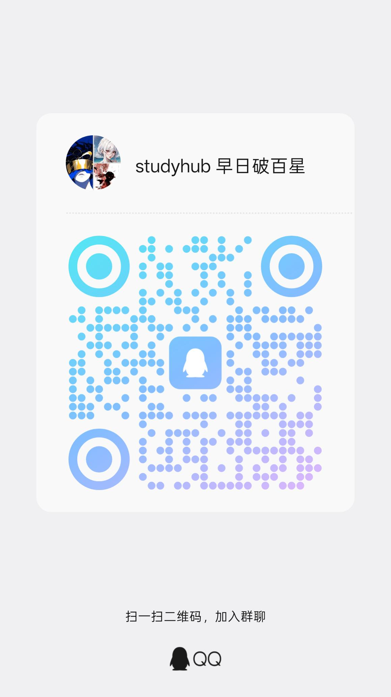

# StudyHub（DSH 学习插件）

[English](README.md) · 中文

StudyHub 把你的课程资料变成能追溯原文的练习题。导入 PDF、PPT、讲义笔记或课堂录音后，StudyHub 生成的每道题都会标明出自原文哪一段。你检查草稿后发布，之后由 SM-2 间隔重复按时安排复习（Anki 经典调度用的也是这个算法）。学习库保存在你自己的电脑上，界面支持中文和 English。

StudyHub 是 [DeepSeek Harness（DSH）](https://www.deepseek.com/en/harness/)的插件。DSH 是 AI 助手应用，可以装成桌面版，也可以在自己电脑上以网页版运行；StudyHub 就在 DSH 里打开使用。

[在线体验](https://daily-flashcard-demo.ziangw1358.chatgpt.site) · [安装指南](docs/install.zh-CN.md) · [发布页](https://github.com/EricWang1358/dsh-web-studyhub/releases/tag/v2.5.13) · [更新日志](CHANGELOG.zh-CN.md)

在线体验直接在浏览器里打开，用示例题和预置的 AI 回复演示，不用安装，也不用 Key；体验进度只保存在当前浏览器。

## 开始前先知道

- **适合谁**：用课件、PDF、讲义和课堂录音学习的学生，中文、英文资料都可以。
- **要花钱吗**：StudyHub 本身免费开源（MIT）。浏览资料、做题和安排复习都免费，不调用模型。出题和 AI 讲解按你的模型服务商计费。每次出题前，StudyHub 会显示预计 Token 用量，出题后显示实际用量；「统计」里还能看近 7 天或近 30 天的合计。
- **网络与费用**：可用地区、免费额度和收费规则以各服务商的当前说明为准。从 GitHub 地址装不上插件时，见[快速上手](#快速上手)后面的备用办法。
- **什么电脑能用**：下方提供 Windows 64 位和 Apple 芯片 Mac 的 DSH 安装入口。其他系统请查看 DSH 官方支持情况，或使用需要 Node.js 22.19 或以上的网页版。
- **版本要求**：需要 DSH 0.2（0.2.0-rc.2 或以上，低于 0.3）。StudyHub 当前版本是 [2.5.13](https://github.com/EricWang1358/dsh-web-studyhub/releases/tag/v2.5.13)。
- **资料会上传吗**：学习库是你电脑上的一个文件夹。只有用到相应功能时，所选内容才会发给对应的服务，详见[数据与隐私](#数据与隐私)。

## 能做什么

- **用自己的资料出题**：按页或按章节选资料，生成闪卡、单选、多选、开放问答或填空题。每道题都标明引用的原文，你检查草稿后再发布。
- **题目和原文互相跳转**：点引用就回到原文段落；资料里的段落、表格角标能打开关联的题目和讲解。
- **练习与复习**：在「学习库」开始今日学习，或进入「学习流」先讲后练；任何一道题都能点「帮我弄懂」；SM-2 会把到期的题按时推给你。
- **找出薄弱点**：用「错题与待巩固」「统计」和「模拟考试」。模拟考试有选择题笔试、案例分析卷和口头面试三种形式。
- **录音转文字**：导入课堂录音，或用「课堂实录」边上课边转写，得到中英对照的讲稿，可以直接拿来出题。
- **阅读与整理**：阅读器有目录、搜索、「翻译本页」和「做这几页的题」；课程、「学习笔记」「待办」和「知识骨架」帮你把一学期的内容管起来。

## 快速上手

| 你想做的 | 需要什么 | 费用 |
| --- | --- | --- |
| 看示例课程和功能导览、浏览资料、练习已有题目 | 装好插件即可 | 免费，不调用模型 |
| 用资料出题、看讲解、用「帮我弄懂」 | 一个模型服务商的 API Key，填在 DSH 的「设置 › 模型」 | 按服务商计费，例如 [DeepSeek API](https://platform.deepseek.com/) |
| 录音转文字 | 一个转写服务密钥，填在 StudyHub 的「设置 › 音频转写」 | 硅基流动 SenseVoice 支持录音转写；Gemini、Groq 可用地区和额度由服务商决定 |

1. **安装 DSH**（已装可跳过）：下载官方的 [Windows 64 位安装器（.exe）](https://download.deepseek.com/desktop/dsh-latest-windows-x64.exe)或 [macOS Apple 芯片安装器（.dmg）](https://download.deepseek.com/desktop/dsh-latest-macos-arm64.dmg)。其他电脑先安装 Node.js 22.19 或以上，再运行 `npx @deepseek-ai/dsh web` 启动网页版。
2. **安装 StudyHub**：在 DSH 打开「插件」，点「添加插件」，粘贴下面的地址，装好后点「启用」：

   ```text
   https://github.com/EricWang1358/dsh-web-studyhub/releases/download/v2.5.13/ericwang1358-dsh-daily-flashcard-2.5.13.tgz
   ```

   确认包名是 `@ericwang1358/dsh-daily-flashcard`、版本是 2.5.13。启用后 StudyHub 会自动打开；以后从 DSH 左栏的「StudyHub」进入（会话里的「StudyHub」标签和右侧栏也可以），不需要先发消息。
3. **看一遍示例（可选，约 3 分钟）**：在欢迎页点「载入示例并开始导览」。21 步导览会依次带你看资料、出题、练习、错题、考试和统计，直接指向真实的按钮。示例不调用模型，可以一键移除。
4. **配置模型**：在 DSH 的「设置 › 模型」粘贴 API Key，再在会话里选一个模型。配置好之前，凡是需要模型的步骤，StudyHub 都会先显示「打开模型设置」，不会让你点了之后再失败。
5. **用自己的资料开始**：点「添加资料」，一次拖入多个 PDF、PPT 或笔记，然后「用资料出题」→ 检查草稿 → 发布 → 开始练习。

安装补充说明：

- **已经在用 DSH**：只装插件即可。桌面版或网页版、原来的 profile、模型设置和工作区都不用动。
- **GitHub 地址装不上**：先用浏览器从[发布页](https://github.com/EricWang1358/dsh-web-studyhub/releases/tag/v2.5.13)下载 `.tgz`，再在「添加插件」里填它的绝对路径。文件必须放在运行 DSH 的那台电脑或服务器上。
- **发布页文件很多，下哪个**：只需要完整包 `ericwang1358-dsh-daily-flashcard-<版本号>.tgz`，而且一般不用下载，按第 2 步粘贴地址就行。其余文件是 6 个可单独安装的组件、检索扩展（点「安装检索扩展」时由 StudyHub 安装）、校验值清单和两份安装引导。
- 命令行安装等更多方式见[安装与模型配置](docs/install.zh-CN.md)。也可以下载能在浏览器里打开的[安装引导](https://github.com/EricWang1358/dsh-web-studyhub/releases/download/v2.5.13/StudyHub-2.5.13-Setup.zh-CN.html)（[English](https://github.com/EricWang1358/dsh-web-studyhub/releases/download/v2.5.13/StudyHub-2.5.13-Setup.html)）。DSH 本身只从第 1 步的官方渠道获取。

## 使用 StudyHub

### 添加资料

点「添加资料」，先选课程，再一次拖入多个文件，或粘贴文本；录音在同一窗口的「音频 / 录音」标签导入。

| 格式 | 上限 | 说明 |
| --- | --- | --- |
| PDF | 8 MB、200 页 | 每个 PDF 保存为一份文档，可展开到页；更大的书见下文 |
| Word（.docx）、PowerPoint（.pptx） | 40 MB | 只读取文字：图片、图表和 SmartArt 不读，Word 的文本框、页眉页脚也不读。PPT 按幻灯片分页，并带上演讲者备注 |
| Markdown、HTML、TXT | 8 MB | |
| JSON 题组 | 2 MB | 你已有的题目，或在别处（例如其他 AI）生成的题（[格式说明](docs/json-import.zh-CN.md)） |
| 字幕（.srt、.vtt） | 8 MB | 需要启用音频组件 |
| 音频（MP3、WAV、M4A、AAC、OGG、FLAC、OPUS、WEBM、AIFF） | 512 MB、8 小时 | 见[录音转文字](#录音转文字) |

旧版 .doc、.ppt（以及 .wps、.key、.pages）不能直接读取，请先另存为 .docx、.pptx 或 PDF。

**大教材**（超过 8 MB 或 200 页）：

- 在导入窗口点「用 MinerU 解析」。PDF 最大 800 MB，转换后作为一份分页文档导入，可以按章节选择。
- 优先使用本地 `mineru`：先安装，再在设置中下载并启用解析模型，PDF 不上传。**云端暂不可用，优先使用本地模型。** 云端入口保留供恢复后手动选择；使用时需要你自己的 MinerU 令牌和上传确认。
- 想整本书出题，可以用检索扩展，或在「创建题组」用「分步生成路径」。

详见[大教材](docs/large-documents.zh-CN.md)和[用 MinerU 转换 PDF](docs/mineru-conversion.zh-CN.md)。

也可以在「添加资料」查看 [Marker 外部转换指南](docs/marker-external.zh-CN.md)，下载转换脚本自行运行，再选择生成的分页 Markdown 导入。Marker 和模型需自行安装；代码与模型许可分别适用。

### 出题

1. 打开「创建题组」，在「用资料出题」标签按文档（大教材可按章节）选资料，再选题型、题数和难度。不确定练什么，可以点「帮我想想」：它只根据资料标题和目录推荐主题，不发送全文。
2. 点「生成并检查题组」。任务在后台运行，你可以继续学习。
3. 检查草稿和引用，然后发布。发布时会再逐题检查，有问题的题留在草稿里。草稿和已发布的题目分开保存。

想补进已有题组，就选那个题组：审核通过的题会加进去，原有题目和复习进度都保留。已经有现成的题目，就用「导入 JSON 题组」标签导入。

<details>
<summary>出题怎样检查题目</summary>

- 每批题只做一轮独立审核：通过的题保留，没补足的数量会明确告诉你。2.5.8 曾加入一次引文修复；当前流程先核验知识点和答案，必要时纠正这两个准备步骤，再写题和独立审核，不循环修复候选题。
- 补入已有题组时，预算到点也会保存已审核的部分，不需要再次确认发布。
- 引用和题目结构由代码检查，但内容仍可能有模型错误，请认真看草稿。详见[出题与质量检查](docs/assessment-quality.zh-CN.md)。
- 资料里的文字只作为证据交给模型，不会被当成要执行的指令。
- 课程是资料和题组的归属标签，文件夹只用来分组展示题组。出题和练习只使用你明确选中的课程、资料和题组。

</details>

默认题型、题数、内容语言、难度和侧重点可在「设置 › 出题偏好」保存；新建出题仍可单次调整。每批题数、并行批次和运行时限也在这里，初始为 5 题、3 批、20 分钟。已经开始的任务和继续补齐的原草稿保留原设置。详见[生成安排](docs/generation-agents-sidebar.zh-CN.md#出题任务怎么做)。

### 练习与复习

- 作答后看讲解；还不懂就点「帮我弄懂」，让助教围绕这道题讲。
- 闪卡和开放问答按 0–5 分自评，SM-2 据此安排下次复习。作答和复习调度都不调用模型。
- 「错题与待巩固」按主题归类错题，还能「生成变式」；「模拟考试」和「统计」帮你看清哪里还要加强。

<details>
<summary>「帮我弄懂」怎样延续上下文</summary>

在支持本地子代理的 DSH 中，同一道题连续使用「帮我弄懂」，会尽量延续同一个助教和它的问答上下文；同时提交的追问按顺序回答。切到别的题、修改题目或切换模型后重新开始。助教空闲 2 分钟或完成 8 轮后释放，新助教会带上最近 3 条有效问答。已有解答一直保存在题目里。

</details>

### 阅读资料

- 资料保留原文件和历史版本，可以全屏预览。
- 「看原页」显示引用对应的 PDF 原页，「翻译本页」给当前页加上译文，「做这几页的题」（快捷键 P）让你马上练刚读完的内容。
- 选中一段文字，可以提问，或生成候选题、检查后加入已有题组。
- 只保存了文字的旧资料，可以用「补全原文件」补上原件，不必重新导入。
- 资料更新后，如果某个关联位置不再确定，StudyHub 会请你重新定位，而不是猜测。
- 讲解、笔记、「待办」和「信箱」里的内容都能跳回对应的题目或资料；可以借助阅读器和题目关联返回当前题目。
- 按 `?` 查看全部快捷键。

## 选择模型

生成、讲解和学习帮助默认使用 DSH 会话当前的模型。想让 StudyHub 固定用另一个模型，打开「设置 › 学习库与模型」，把「生成模型」从「跟随当前会话」改成指定模型。模型凭据由 DSH 保存。

- **日常使用**：推荐 [DeepSeek 官方 API](https://platform.deepseek.com/)。
- **用量较大**：可以考虑 Coding Plan，但前提是它提供 API Key，并允许在 DSH 和学习用途下使用。购买前确认适用工具、用途、专用 API 地址、模型、并发和额度规则；能创建 Key 不代表套餐允许任意应用调用。
- **订阅不能当 Key 用**：Claude Pro／Max、ChatGPT／Codex 订阅不能直接作为 DSH 的 API Key 或套餐额度。Anthropic 与 OpenAI 单独付费的 API 可以作为第三方服务商添加；这条限制只针对订阅，不是不能用它们的 API 模型。

配置步骤见[配置模型服务商](docs/install.zh-CN.md#配置模型服务商)。每个功能大概用多少 Token，见 [Token 用量与估算](docs/token-usage.md)。

## 录音转文字

1. 打开「设置 › 音频转写」填一个密钥。推荐硅基流动 SenseVoice（支持录音转写）；也支持 Gemini（Google AI Studio）和 Groq，它们可用地区和额度由服务商决定。
2. 打开「音频转写」，点「添加音频」，再点「开始导入」。没配好转写服务之前，不会开始上传。
3. 转写好的讲稿保存为一份资料，可以像其他资料一样出题。

这些密钥只用于转写。校对和翻译默认用你在 DSH 里选的模型，这部分 Token 按模型服务商计费，并计入「统计」里的「模型用量」。「课堂实录」的实时转写只支持 Gemini。

<details>
<summary>音频的更多细节</summary>

- 有多个密钥时，按 Gemini 免费 → 硅基流动 → Groq → Gemini 付费的顺序尝试；单次导入可以选择只用付费密钥。
- 超过 1 小时的 M4A 录音可以一键无损分段转写。
- 多份录音逐个处理；同一份录音内，2–3 个校对、翻译窗口并行。已完成的窗口会保存检查点，重试时直接复用。
- 「校正与翻译策略」面板可以分别为校对和翻译选择推理程度：「低 · 更快」「中 · 均衡」「高 · 更精细」或「跟随模型」。档位越高通常越慢，但不保证更准；模型不支持该档位时使用默认设置。只有高置信度、并通过原文定位检查的校对才会改写正文，其余建议留给你查看。
- 「音频转写」页下方的「用量控制台」记录本插件发给转写服务的请求（包括失败和重试）、Token 和转写时长，分开显示免费和付费密钥，有近 7 日趋势，记录保留 31 天。Groq 的每日剩余额度取自它的有效响应；Gemini 可以填入 AI Studio 里当前模型的每日上限，查看按本插件记录估算的余量。其他应用的调用、课堂实时音频流和 DSH 模型 Token 都不计入这里。
- 密钥保存在 DSH 主目录下的 `study/audio.json`（默认 `~/.dsh/study/audio.json`），不在学习库里。界面只显示是否已配置和末 4 位，密钥不会进入学习库导出或对话。没有保存密钥时，会读取环境变量 `GEMINI_FREE_API_KEY`、`GEMINI_PAID_API_KEY`、`GROQ_API_KEY` 或 `SILICONFLOW_API_KEY`。

</details>

详见[音频导入](docs/audio-import.zh-CN.md)和[课堂实录](docs/live-class.zh-CN.md)。

## 在 DSH 对话里使用

- **学习模式预设**：新建会话时选择「学习模式 · StudyHub」预设。助手会把“资料”“我的笔记”“这节课”理解为 StudyHub 学习库里的内容，拿不准时先问你，也不会运行命令或改动你的文件。
- **在主对话里查询学习库**：见[在主对话里查询资料与题组](docs/main-session-queries.zh-CN.md)。
- **把不会的问题存成题**：在 DSH 对话里输入 `/study-spar <你不会的问题>`，StudyHub 会把它归入题库，默认存为闪卡。加“写成 MQ”存为单选题，加“写成多选题”存为多选题；以“前置”开头，就作为正在做的题的前置题。
- **查看后台任务**：出题等后台任务显示在 DSH 侧栏，见[后台任务与侧栏](docs/generation-agents-sidebar.zh-CN.md)。

## 更新 StudyHub

DSH 插件不会自动更新，只重启 DSH 也不会换成新版本。

- **2.1.2 及以后**：StudyHub 最多每 12 小时向 GitHub 查询一次新版本。有新版本时，侧栏会出现「有新版本 x.y.z」（x.y.z 为新版本号）。点它，再点「一键升级到 x.y.z」和「确认升级」：StudyHub 会下载安装包，按发布页的 `SHA256SUMS-x.y.z.txt` 核对后交给 DSH 插件管理安装。有后台任务在运行时，可以点「停止任务并升级」，已完成的部分会保留。检查更新不发送任何学习数据，可在「设置 › 关于与更新」关闭。
- **更早的版本，或不支持在应用内安装插件的 DSH**：先等后台任务完成或取消，在「插件」里卸载 StudyHub，再点「添加插件」粘贴新版本的安装包地址。

装好后重启 DSH：桌面版完全退出（包括托盘图标）后重新打开；网页版用原来的 profile 重启服务，再刷新页面。只刷新浏览器不会加载新的插件代码。学习库和设置都会保留。

## 数据与隐私

**留在你电脑上的**

- 学习库：资料及原文件、题组、作答和复习计划，分片保存。默认在 DSH 会话的工作区文件夹里，可在「设置 › 学习库与模型」换到别的文件夹。
- 转写密钥和 MinerU 令牌：保存在 DSH 主目录下的 `study/`（默认 `~/.dsh/study/`），不会进入学习库、导出或备份。模型 Key 由 DSH 保存。
- 使用频率记录：默认关闭，在「设置 › 使用频率记录」打开后才记录；StudyHub 不会把它发送到任何地方（[说明](docs/usage-frequency.zh-CN.md)）。

**只有用到相应功能时才会发出去的**

- 出题或请求讲解时，所选资料的文字会经 DSH 发给你配置的模型服务商；「帮我想想」只发送标题和目录。
- 录音发给你配置的转写服务；MinerU 云端解析在你同意后把 PDF 上传到 MinerU。
- 检查更新只向 GitHub 查询最新版本，不发送学习数据。

**备份与旧版学习库**

- 在「设置 › 导入、计划与备份」的「数据备份与恢复」导出一个 JSON 备份，包含资料、题组、复习进度和作答记录。复制进学习库的原文件会一起备份；按引用关联的原文件只记录位置，不打包。
- 恢复备份前，会先把当前学习库另存到 `backups/`；出题任务运行时不能恢复。
- 旧版学习库在首次写入时迁移，并保留原文件备份；缺少新字段的旧库仍可读取和学习。插件暂时卸载后，它的扩展数据仍随学习库保存。
- 从旧工具 `study-lib-spar` 导入：在同一个设置分类里，选择包含 `study-lib.json`、`nodes/` 和 `quizzes/` 的学习库目录（不是工具的源码目录）。导入只读取原文件，保留能解析的到期时间、间隔和来源；重复导入不会覆盖已有进度。
- 清理已结束的任务卡，不影响已生成的资料和题目。音频用量记录和密钥不在学习库备份里。

## 界面语言

浏览器首选语言是中文时，界面默认中文，否则默认英文。用侧栏底部的「语言」切换中文 / EN，StudyHub 会记住你的选择。按钮、报错、后台进度、通知、交给对话的内容和新生成的 AI 讲解都跟随界面语言。

切换界面语言不会翻译已保存的内容：资料、文件名、题目、笔记和服务商的回复都保持原文。新出的题默认用界面语言，也可以在「创建题组」的「语言」里另选。练习时想在中文题目下方看英文，点练习工具条上的「EN」（见[题目英文对照](docs/translate-en.zh-CN.md)）。音频的中英对照讲稿保留各自的原文和译文语言。

## 选择组件

完整包会安装 7 个组件，在 DSH 自带的插件管理器里显示为「StudyHub」（主包）、「StudyHub · 核心」「StudyHub · 资料」「StudyHub · 题库」「StudyHub · 出题」「StudyHub · 练习与复习」和「StudyHub · 音频转写」。可以在那里分别启用或停用；停用期间，已保存的数据保留。

- 「创建题组」需要资料、题库和出题；练习、「错题与待巩固」「模拟考试」和「统计」需要题库和练习与复习。
- 组件停用后，对应页面会隐藏，或提示功能已停用。
- 同一个组件有多个安装来源时，要全部停用才会完全关闭。
- 发布页也提供每个组件的单独安装包。

详细说明和安全删除资料见[自定义组件](docs/install.zh-CN.md#自定义组件)；命令行安装见[用命令行安装](docs/install.zh-CN.md#用命令行安装)。

## 开发与验证

StudyHub 是基于 Cordis 的 ES 模块 DSH 插件，界面用 React 编写、由 esbuild 打包；7 个组件通过公开的插件 API 协作，见[架构与扩展](docs/architecture.md)。包名是 `@ericwang1358/dsh-daily-flashcard`，产品名是 StudyHub。

```sh
npm install --legacy-peer-deps
npm run verify         # lint、测试和构建
npm run dev            # 本地预览 http://127.0.0.1:4178（需先构建）
npm run build:demo     # 静态体验版，输出到 output/static-demo-site/dist
npm run release:pack   # 全部发布包和 SHA256SUMS-<版本号>.txt，输出到 output/release-<版本号>
```

- `npm run dev` 读取 `dist/`，所以要先运行 `npm run build`（或 `npm run verify`）。它默认使用临时学习库 `output/preview-library`，全局学习文件放在 `output/preview-home`，不会读写 `~/.dsh`。加 `-- --library=<目录>` 可以打开其他学习库；设置环境变量 `STUDY_FAKE_MODEL=1` 可以使用输出固定的假模型。
- `npm run release:pack` 不会构建，请先运行 `npm run verify`。
- DSH SDK `@deepseek-ai/dsh-tools` 与 `@deepseek-ai/dsh-llm`（可选 peer 依赖，`>=0.2.0-rc.2 <0.3`）由 DSH 提供；缺少时，依赖它们的测试会明确跳过。
- CI 在 Node 22 上（Ubuntu 和 Windows）对每个 PR 运行 `npm ci --legacy-peer-deps` 和 `npm run verify`。
- [静态体验版](docs/static-demo.md)加载真实界面，使用公开示例和预置回复，不调用真实模型。

## 文档

- **安装**：[安装与模型配置](docs/install.zh-CN.md)
- **资料**：[PDF 出测验与闪卡](docs/pdf-workflow.zh-CN.md) · [大教材](docs/large-documents.zh-CN.md) · [用 MinerU 转换 PDF](docs/mineru-conversion.zh-CN.md) · [JSON 题组导入](docs/json-import.zh-CN.md)
- **科学工具与媒体**：[公式、图片与计算工具设置](docs/science-settings.md) · [图片与公式显示](docs/images-latex.zh-CN.md) · [计算题逐步引导](docs/calculation-guidance.md)
- **题目**：[出题与质量检查](docs/assessment-quality.zh-CN.md) · [自己的参考样题](docs/reference-questions.zh-CN.md) · [向已有题组补题](docs/supplementation.zh-CN.md) · [斩题](docs/slay.zh-CN.md) · [题目英文对照](docs/translate-en.zh-CN.md) · [Token 用量与估算](docs/token-usage.md)
- **学习**：[学习流](docs/study-workflows.zh-CN.md) · [陪学、自动驾驶与定制题](docs/coach.zh-CN.md) · [讲解追问](docs/followup.zh-CN.md)
- **音频**：[音频导入](docs/audio-import.zh-CN.md) · [课堂实录](docs/live-class.zh-CN.md)
- **对话与任务**：[在主对话里查询资料与题组](docs/main-session-queries.zh-CN.md) · [后台任务与侧栏](docs/generation-agents-sidebar.zh-CN.md)
- **可选功能**：[使用频率记录](docs/usage-frequency.zh-CN.md) · [Jev 决策层（实验性，英文）](docs/jev-experimental.md)
- **开发者**：[架构与扩展](docs/architecture.md) · [开发验证记录（英文）](docs/verification.md) · [SM-2 复习调度](references/sm2-scheduling.md) · [旧版 study-lib-spar 数据格式](references/library-schema.md)

## 参与项目

对 StudyHub 的开发、测试、文档或使用反馈感兴趣，欢迎加入 QQ 群交流。用 QQ 扫描下方二维码；也可以[打开原图](docs/assets/studyhub-qq-group.jpg)后扫码。



## 反馈与许可证

遇到问题或有建议，请在 [GitHub Issues](https://github.com/EricWang1358/dsh-web-studyhub/issues) 提出。

MIT License，见 [LICENSE](LICENSE)。沿用的学习质量、复习调度和数据结构参考资料在 [`references/`](references/)。
