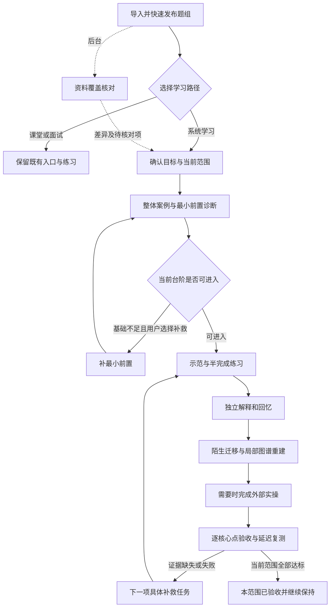
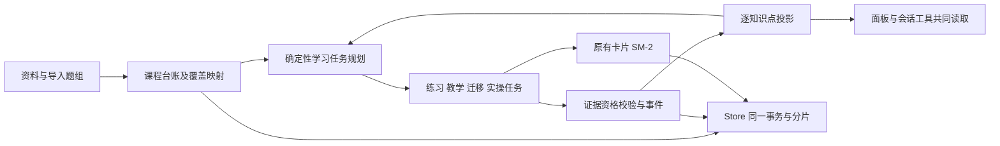
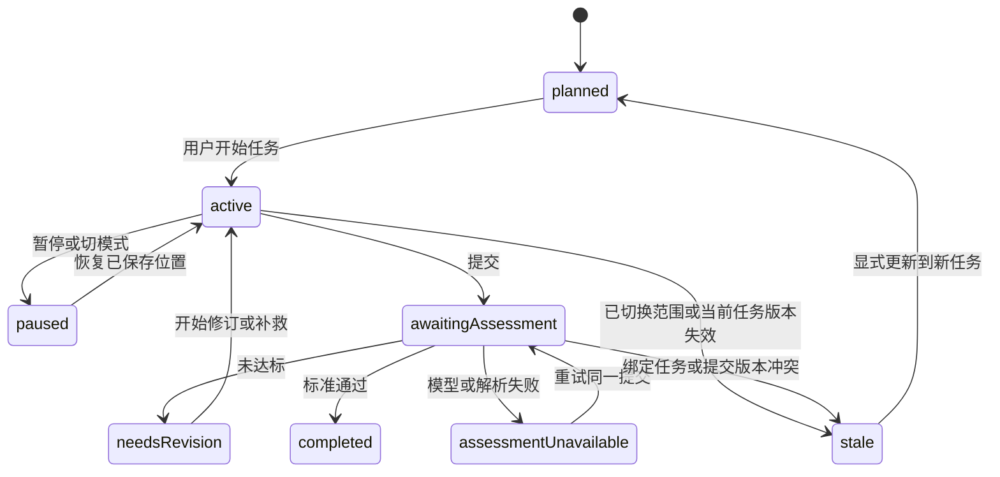

# Evidence-based Learning Workflow

## Goal Capsule

- **Objective:** 接近零基础的学习者在导入课程题组后，能沿可理解的路径学习，知道每个必学核心点还缺什么，并用独立回答、陌生问题和实际成果检验学习结果。
- **Means:** 在现有题库、SM-2 和原生 DSH 工作区上增加课程知识点台账及分维度证据，提供系统学习路径，首版连接外部实操成果（KTD1、KTD2、KTD7）。
- **Authority:** 用户当前需求及后续修订优先；本文件 Product Contract 定义新行为；`docs/user-feedback-intake.md` 中既有决策仍生效，冲突按 R1 解决。其他文档为入口、流程解释或历史记录。
- **Execution profile:** 本次交付设计、计划与 handoff；生产功能尚未实现。本文件描述后续代码工作，不代表本次已经授权提交、发布、部署或启动长期目标。
- **Stop conditions:** 如果实现需要改变已确认的外部实操边界、强制发布前审阅、清除旧进度或默认执行学习者命令，应重新解决产品范围。缺少五份真实 PDF/JSON 不阻止基础设施开发，但阻止宣称实际课程覆盖完整或教学效果已验证。
- **Delivery:** 后续实现按 U-ID 依赖分阶段交付，以 Verification Contract 和 Definition of Done 验收；提交与发布方式服从当时用户授权。

---

## Product Contract

### Summary

增加“系统学习”路径，把原来的“导入题组—逐题练习—复习”扩展为八步学习循环：范围核对、前置诊断、整体认识、示范理解、主动回忆、迁移验证、外部实操、综合与延迟验收。
五个题组是材料组织方式，学习单元按概念与依赖组织；同一概念跨题组复用身份，不要求合并题组。
既有课堂与面试入口继续可用，快速发布保持畅通。

### Problem Frame

用户描述的学习者接近零基础，已导入五份 PDF 生成的五个 JSON；用户要求核心知识点不能漏，并关注举一反三、实际应用、前置补救和直观记忆。
当前系统擅长题目调度、讲解和整理，但题目数量及复习间隔无法充分证明课程覆盖与能力达标。
本次没有拿到真实五份资料；所有课程案例均为流程样例，不是对那五份资料的内容审计。

| 当前证据 | 已核实行为 | 对新设计的约束 |
| --- | --- | --- |
| `lib/mastery.js` / `cardLevel`、`deckProgress` | 间隔 ≥21 天可归为 mastered；4 张 mastered + 1 张 new 可得 80%/done | 估计熟练度不得当作逐核心点验收 |
| `lib/service.js` / `creditPrerequisites` | 正确答题可给两层前置题写 implicit grade=4 并推进 SM-2 | 间接证据必须可识别，不能获得能力验证资格 |
| `lib/focus.js` / `freshCardsForDecks` | 当前课程按最近新增题优先；mode 当前只有 class/interview | 保留课堂语义；新路径应独立选择 |
| `lib/json-import.js` / `prepareJsonImport` | 固定字段白名单、新 card ID；引用只唯一匹配已有来源；不导入 requires | 不能假设 JSON 已携带有效概念身份或前置图 |
| `ui/Draft.jsx` / `draft.publish.quick` | 当前默认快速发布，不逐题等待模型复审 | 后台查漏不能变成强制发布门槛 |
| `lib/skeleton.js` / `skeletonContext` | 根据所选卡片及引用窗口构图，存在选题和节点上限 | 图谱不能替代原始材料覆盖核对 |
| `lib/coach.js` / `cognitiveLevel` | 默认按题干词汇推断认知层次 | “应用题”标签不能证明迁移能力 |
| `lib/oral-exam-service.js` / `assess` | 参考答案与回答交给模型评估，再映射 SM-2 | 保留表达训练，但增加逐标准依据与失败状态 |
| `lib/store.js` | v2 manifest + shards、事务锁、按分片写入、导出/恢复 | 新持久数据必须进入同一事务与备份体系 |

### Key Decisions

- **首版外部实操与成果验收。** (session-settled: user-directed — chosen over 首版内置可执行实验环境: 先由学习者在自己的环境完成实验，插件提供任务和验收。) Governs R10, R14.
- **保留低摩擦课堂使用。** 继承 `docs/user-feedback-intake.md` 的 F-003/F-004/F-005/F-008/F-009/F-011/F-012：快速发布、最近课程优先、主动补前置、手动续轮、少按钮、合并须确认。Governs R1, R5, R6, R12.
- **不以题目平均分替代逐核心点证据。** 本次设计选择，源于用户“核心知识点不能少”的目标；具体阈值是可版本化产品规则，不宣称为科学界统一标准。Governs R2, R3, R8, R11.

### Requirements

**课程范围与覆盖**

- R1. 新增可主动选择的系统学习路径；旧课堂和面试的默认入口、快速发布、10 道新题及手动续轮继续保留。快速发布后的去向沿用当前模式：课堂仍开启最多 10 道新题；已选择系统学习时回到其当前任务或入门入口，不额外开启课堂轮次。原有错误后自动插入前置的实现与“主动触发”偏好不一致，系统学习队列必须遵守 R5，旧路径差异不得被误写成新行为已经存在。
- R2. 为课程维护独立于题目的必学知识点清单，每项含可观察目标、核心/选修属性、来源位置、需要的证据维度和前置关系。完整性声明只针对明确且有版本的范围；五份资料不自动代表整个 Platform Engineering 领域。
- R3. 后台核对“资料片段→知识点→教学/评估任务”的覆盖。每个资料片段应有已映射、非教学内容（附理由）、待核对之一；重要图表/扫描页不得因文本提取不足被当作已覆盖。没有原始 PDF 时显示“范围待核对”，允许正常学习。
- R4. 跨题组概念合并采用稳定知识点 ID、别名和来源映射；题组合并/拆分不改变知识点身份。核心点移出范围、新增或改义均产生新范围版本及差异，不能借暂停/斩题或删掉难题提高覆盖率。

**首次学习与记忆**

- R5. 系统学习以具体任务诊断最小前置，允许“我不会”和“稍后”；未诊断不能记失败。补前置只在用户选择系统推荐任务或主动请求时开始，局部教学完成后恢复原题/原任务及位置，不在答错后突然插入。
- R6. 每个新单元采用“具体例子→解释关系→半完成练习→独立检查”，逐步减少帮助；已通过入门诊断的学习者可以直接检查。模型失败时仍可复习已保存内容，不编造讲解或通过记录。
- R7. 初始独立检查之后安排主动回忆和延迟复测；SM-2 负责卡片复习时间，能力证据单独判断。提示、揭晓答案、重试和自评均有独立标记；当天重复正确不能充当延迟保持证据。
- R8. 每个必学核心点按要求逐维度验收，缺证据、较新失败或复测到期均不得显示当前已验收。一次选对、自评高分、父题推断、题目间隔较长和生成了笔记均不足以单独证明核心点掌握。

**迁移、图谱与实操**

- R9. 为需迁移的目标准备改变条件、反例、故障或跨主题组合的未见任务；要求先作答、说明原因，再展示反馈。题面换词或同一任务重复不算新迁移证据；口头表达按明确评分标准留下结论与依据。
- R10. 实操任务绑定知识点、环境前提、操作目标和逐项验收标准。学习者在外部完成后主动提交成果；系统区分自述、提交物审阅和实际复现，缺少可验证结果时不得标成“运行验证通过”。允许修订并重交。
- R11. 图谱既供阅读，也支持隐藏节点/关系、流程排序、故障追踪和由案例重建局部结构；按需将结果映射到目标证据，不能只凭图谱浏览行为发放掌握记录。

**交互、兼容与能力边界**

- R12. 首页只强调当前一个推荐任务及理由，同时能查看“本轮推进什么、为什么卡住、还缺什么”。用户可以切换任务、退出系统路径或继续旧题组，不强制先审完题库、回答长问卷或查看全图。
- R13. 新增领域行为由服务层提供，UI 与会话工具使用同一能力；开始、暂停、返回、提交和重试可恢复且幂等。后台任务分批保存并显示部分完成/失败状态，不因模型调用失败阻塞已发布题目学习。
- R14. 首版不嵌入执行器，不自动运行提交物中的命令或访问任意路径/网址；只处理学习者明确提交的允许格式内容。保存最小必要成果与评价，允许删除提交原文并保留不含原文的结论；删除后的复查能力必须如实说明。
- R15. 迁移保留旧题、ID、历史尝试、SM-2、笔记、前置与未完成练习；旧记录只作为 legacy/supporting，缺少新维度信息时一律视作未验证，不能自动补成高置信掌握。
- R16. 技术测试与教学验证分开报告。课程试点必须核对真实五份材料，抽查题质和模型判分，并观察零基础者独立完成情况；合成测试通过不能替代这些证据。

### Actors and Flows

- A1. 学习者：选择路线、作答、请求补救、提交外部成果、修订课程范围。
- A2. DSH 主会话助手：检索课程和当前任务，经服务操作同一学习状态，生成解释与候选资料映射。
- A3. 领域服务：验证引用/身份/版本、决定任务和证据资格、保存状态；模型无权直接指定最终掌握状态。

八步流程、原/新对比、每天使用与零基础示例见 [学习流程](../study-workflows.md#proposed-system-learning)。该文档是本 Product Contract 的用户流程解释，R-ID 是规则依据。

### Acceptance Examples

| ID | Given / When | Then | Covers |
| --- | --- | --- | --- |
| AE1 | 只有五个 JSON，没有原 PDF，发布后进入学习 | 能立即练习；范围状态为待核对，不显示“核心已全覆盖” | R1–R3 |
| AE2 | 资料某核心点没有题，或某图表无法可靠读取 | 核心点/资料片段仍在分母，分别显示缺任务/待核对 | R2–R4 |
| AE3 | 同一主题四点已验收，一点从未学过 | 主题显示 4/5 已验收并指出缺项，不显示全部完成 | R8 |
| AE4 | 选对综合题并触发旧 implicit 前置记录 | 新能力证据只接收支持性推断，不把前置直接验收 | R7、R8、R15 |
| AE5 | 提示或答案已打开后正确作答，或原题队尾重试成功 | 记录辅助/重试；不计为独立回忆、陌生迁移或延迟通过 | R7、R9 |
| AE6 | 用户主动补前置后中途退出再打开 | 回到该补救位置；完成后回原任务，原回答与顺序不丢 | R5、R13 |
| AE7 | 基础诊断选择“不知道”或跳过，模型随后不可用 | 区分基础缺口与未诊断；已保存任务可继续，不能伪造评估 | R5、R6 |
| AE8 | 原题换业务名，但关键条件和解法完全相同 | 可作练习，不获得新的陌生迁移资格 | R9 |
| AE9 | 学习者称“部署成功”或只提交一张成功截图 | 保留自述/提交物审阅级别；要求不足项，不称已复现 | R10、R14 |
| AE10 | 任务提交后同一请求重发、网页刷新或模型重试 | 一份提交、一个有效结论；不重复增加证据或推进 SM-2 | R13 |
| AE11 | 题目合并/拆分/斩题后重新看进度 | 稳定知识点与证据仍关联；缺失评估任务显式出现，分母不暗减 | R4、R15 |
| AE12 | 资料或目标发生实质变更，生成任务仍返回旧结果 | 保存为过期候选或拒绝接入当前版本；不覆盖现行清单 | R3、R4、R13 |
| AE13 | 图谱关系填写正确，但节点定义未检查 | 只记录本次实际验证的目标维度，不连带全部掌握 | R8、R11 |
| AE14 | 同一学习日反复刷题；次日无提示复测失败 | 不把当天重刷当延迟证据；失败后相应维度重新待巩固 | R7、R8 |
| AE15 | 导入 v2 库并迁移，再导出、恢复 | 历史与新记录可往返；旧版应用拒读新库；迁移失败原库可用 | R15 |
| AE16 | 未完成课堂练习时切换系统学习，又切回 | 各自恢复原位置；下一轮仍需手动开始，不自动补前置 | R1、R12、R13 |

### Scope Boundaries

本期包含新路径、台账、证据、覆盖核对、诊断教学、迁移、主动图谱与外部成果验收；可分阶段启用，完整八步需所有阶段完成。
不做：重写所有旧题、强制重置进度、将五个题组合并成一个、发布前强制审阅、未经允许的命令执行、依据总分颁发能力证明。
后续另案：内置实验环境、自动部署与复现、外部课程平台同步、跨课程全局本体、大规模自适应模型训练。暂不引入图数据库或另一个知识库服务。

---

## Planning Contract

### Key Technical Decisions

- KTD1. **课程概念独立建模。** 新增课程台账和稳定 knowledgePointId，题目仅作为关联任务。继续使用现有库，不迁往独立图数据库；当前需求是可追溯映射与有向依赖，现有事务存储足够，另建系统会增加一致性成本。Governs R2–R4.
- KTD2. **证据与调度双轨。** 保留卡片 SM-2，另用确定性规则投影知识点各维度；不把一个 mastery 数字扩展成万能分数。所有模型结果都是待验证的判分输入。Governs R7、R8、R15.
- KTD3. **启用时迁移到存储 v3。** 扩展当前 manifest/shards 和 Store 事务；旧二进制不能可靠保存未知分片，所以不能只加字段仍称 v2。未启用新功能的库继续原格式，首次启用在锁内备份并迁移。Governs R13、R15.
- KTD4. **系统学习为 focus 的第三种模式。** 显式增加 system；课堂排序不改。学习会话单独保存活动任务、返回栈和题目轮次引用，复用现有渲染而非复制练习引擎。Governs R1、R5、R12.
- KTD5. **后台覆盖作业不占发布关键路径。** 显式关联原始资料后分段抽取、合并、核对，按内容指纹保存检查点；候选清单可供学习，完整性声明仍受范围审阅状态限制。Governs R3、R13.
- KTD6. **评估资格由服务端决定。** 保存任务族、版本、提示/答案暴露和提交时机；UI 不传“已独立完成/未见”的可信布尔值。离线或外部未知暴露只能称库内未展示。Governs R7–R9.
- KTD7. **外部成果采用版本化提交与逐标准评阅。** 复用服务模型路由和本地存储，首版无执行器；“提交物审阅通过”与“运行复现通过”永久分开。实现用户已选的外部实操边界，见 R10、R14。 (session-settled: user-directed — chosen over 首版内置实验执行器: 用户已选择在自己的环境实操并提交成果。)
- KTD8. **服务与会话工具同步。** 新只读投影和变更操作都进入 `StudyService.call`，再同步工具说明、能力列表和面板导航；不把知识点验收逻辑写在 React 里。Governs R13.

### Evidence Policy

默认 policy-v1 是产品起始规则，随真实试点校准；阈值变化形成版本，不能静默追溯改变已发出的历史报告。

| 维度 | 初始通过依据 | 不能作为独立通过依据 |
| --- | --- | --- |
| 理解 understand | 无提示解释机制及适用边界，目标专属 rubric 必需项逐项通过 | 只背名词、只选对、自评“懂了” |
| 回忆 recall | 一次无提示提取，再于该目标最近相关学习/作答至少 24 小时后开始另一轮无提示提取；记录基准事件与真实间隔 | 把安排到 21 天后复习当作已保持 21 天；当天重试；隔天刚重讲后立刻换题 |
| 迁移 transfer | 针对该目标的未见任务族，关键约束改变，说明理由并通过 rubric | 同题换词、预先看解析、仅关键词分类为 apply |
| 实操 practice | 对当前目标，提交物足以覆盖并通过该目标对应的全部必需标准；结论注明 reviewer 和观察级别 | “我做完了”、无上下文截图、仅模型口头认可 |
| 结构 structure | 只在该目标需要时，独立重建关键关系/流程并解释 | 浏览图谱、点击节点、节点颜色 |

所有核心点至少要求理解与回忆；是否要求迁移、实操、结构由目标类型在范围确定时指定，不要求每个名词单独做实验。同一综合实验可覆盖多个目标，但必须逐目标判定。
延迟资格按知识点追踪，不能靠换题重置。相关讲解、提示/答案展示及练习作答都会更新该目标的最近学习事件；只打开进度页或看到未作答题干不更新。开始复测时冻结此前的时间基准，本次作答后再更新记录。刚复习后答对可提供当前独立表现，但不提供延迟保持证据；外部未知学习只能标明不在库内观察范围。
维度状态使用 unverified / supporting / verified / needs-review。invalid/stale 是证据资格，不是把失败删除。较新的有效独立失败使相应维度 needs-review；辅助练习失误只触发复查建议，不自动抹掉先前独立证据。
到期后显示“曾通过，需复测”；记录历史报告与当前有效状态。回忆复测默认复用知识点关联核心卡片的最早有效到期日；纯实操目标按任务中显式复测日，否则在目标/环境版本改变时复查，不凭空生成时间保证。
核心验收数 = 当前范围内所有必需维度均有效的核心点数；分母 = 该范围版本全部必学核心点数。空范围显示“未建立范围”，不能显示 100%。选修单列，跳过仍在核心分母内。
若只有模型候选范围或存在未核对材料，则文案为“当前候选范围 X/Y 已验收，资料覆盖待核对”；只有范围完成审阅且每个核心点有效通过时显示“本范围当前已验收”。这不是永久掌握或领域完整性的保证。

### Domain and Persistence

以下是拟新增的数据职责，不是当前 schema。具体辅助函数命名由实现决定。

| 记录 | 最小字段与关系 | 生命周期与存储 |
| --- | --- | --- |
| curriculum | 稳定课程 ID、关联现有 course 名及 deck IDs、范围版本、目标、来源指纹、reviewState | 每课程分片；课程名变更不换 ID；发布新范围保留差异 |
| knowledge point | 稳定 ID、别名、目标及版本、核心属性、requiredDimensions、来源定位、card refs | 随 curriculum；无卡也存在；合并 ID 保留 alias/redirect |
| prerequisite edge | 前置/依赖目标 ID、硬/软关系、理由、来源、候选/有效 | 图校验拒绝自环和硬依赖循环；可撤销；与现有 card.requires 分别维护 |
| coverage record | source ID + fingerprint + 页/节定位、片段处置、映射知识点、遗漏/不确定原因 | 随 curriculum 检查点；缺失材料保留待核对占位 |
| learning session | 模式、课程/范围版本、当前 task、状态、return stack、review run ref、revision | 每会话分片；不靠浏览器存储维持恢复 |
| assessment task | 目标及版本、dimension、rubric、family ID、任务内容版本、任务来源 | 现有 card 可作练习任务；验收内容独立保存，答案按阶段隔离 |
| evidence event | 唯一 event ID、幂等 key、目标/任务版本、attempt/submission ref、source、assistance、result、时间、rubric 结论、延迟检查的基准事件与间隔 | 追加分块；投影可重算；纠错/撤销追加事件；学习/暴露事件关联知识点以计算最近学习时间 |
| practical task/submission | 环境前提、验收项、学习者提交内容/明确引用、版本、观察等级、评语和重交关系 | 每任务分片；大附件不进入轮询 snapshot，删除原文保留必要结论 |

证据 source 至少区分 self-report、implicit、direct、delayed、oral、artifact-review、legacy；这些是来源而非自动可信排名。口头/模型审阅只有 rubric 完整且资格满足才可升级对应维度。
已经持久化的旧 implicit/自评不得回写为 direct；旧普通选择题可贡献支持性记录，但没有 task/rubric/exposure 信息时不能补出迁移或实操通过。
源文、题目和目标内容发生实质变化后，受影响证据按指纹/版本失效；措辞修复不重置能力的判定沿用内容修订语义并记录原因。题目删除或斩题不删除知识点，显示缺少后续评估任务。

### State and Transaction Rules

作答/揭晓在服务器上记录暴露状态。实际给过提示但保存失败时，界面不得假装未暴露；未知暴露按有帮助保守处理。
课程发布新范围时，当前会话保留原范围与任务快照，不自动丢弃回答；界面提示版本差异，用户显式切换或下一轮采用新范围。原版本任务仍有效时可继续完成，但结果只进入原版本报告，不能直接为新范围补证据；当前任务本身被撤销/实质修订，或用户已切换版本时才进入 stale，保留原回答供查看并提供新任务入口。
模型调用在事务外完成，写回时核对任务版本、提交 ID 和库 revision；过期结果不得作用于新任务。一次有效提交的证据、会话推进和适用的 SM-2 更新同一事务提交。
系统学习中的新能力评估不自动连带更新前置的 SM-2；旧课堂 implicit 仍作为历史兼容行为，但 UI 必须标为推断且不进入验收计数。
重试、重复点击、两个面板同时提交及宿主重启均靠持久幂等 key 和 expected revision 防重。宿主重启后未完成覆盖/判分作业标为可恢复中断；已保存结果保留，用户重试不重复生成已完成部分。

### Action and UI Contract

以下动作名为规划中的 API；实现时统一登记并更新宿主公开说明。每个变更均检查已绑定学习库和版本。

| 能力 | 拟议动作族 | UI 对应入口 |
| --- | --- | --- |
| 范围与覆盖 | curriculum.get、curriculum.audit、curriculum.accept、curriculum.revise | 当前课程的“学习范围”；后台状态在信箱 |
| 目标证据 | knowledge.get、knowledge.progress、evidence.list | 已验收数与缺口详情 |
| 系统任务 | learning.plan、learning.start、learning.pause、learning.resume、learning.submit | “继续系统学习”、一个当前推荐任务 |
| 帮助与返回 | learning.help、learning.return | “帮我弄懂”、回原任务；复用 Guide/Review |
| 图谱检查 | structure.start、structure.submit | 骨架上的“凭记忆补全” |
| 外部实操 | practice.get、practice.submit、practice.review、practice.revise | 任务说明、提交成果、逐项反馈 |

禁止开放可任意写“掌握=true”的工具；模型和 UI 都提交证据，由领域层判定。返回体区分未建立范围、未验证、处理中、失败、过期与真实通过。
`panel.navigate` 及当前题上下文需要扩展到 learningSession/task；后台通知只提供可恢复入口，不自动切走正在学习的页面。
旧 `map`/`stats` 的兼容字段保留并明确为估计指标；增加按范围的 verified/required/missing，前端、会话回答不得将旧 mastery 当成新验收结果。

### Migration and Rollout

1. 先提供只读知识点证据投影与 feature flag。旧库默认路线不切换，不批量重写题目。
2. 首次启用系统学习时，在 Store 锁内保留完整备份，迁移 v2→v3，注册全部新增字段的归一化、分片读写、导出和恢复。v1 先经过现有 v2 路径。
3. 验证新库可完整回读后提交 manifest；失败保留旧 manifest。进行中的旧 review run 保留，mode 切换仅暂停显示。
4. 功能开关关闭只停止新入口，不丢记录；旧版本运行必须使用启用前备份或升级，不能自动降版并丢弃新证据。不能用只恢复旧 manifest 的方式引用已被清理的旧分片。
5. 覆盖审计的材料关联是显式选择；JSON 导入和普通发布不自动触发大规模模型作业。已有备题同意不默认为同意新的全资料审计，首次启用说明范围并提供开始入口。

### Assumptions and Deferred Questions

- 学习者目标按“理解并能独立应用”设计；入门诊断长度默认一轮不超过 5 个检查，单个局部补救最多 3 个台阶。这是设计起点，试点后调整，不再让用户在规划阶段猜测数值。
- 系统单轮默认最多 5 个学习任务，或遇到一个预计 10–20 分钟的实操任务后结束；预计时长是提示而非强制计时。保留手动继续和随时暂停。
- 系统队列优先恢复未完成任务，其次到期核心复测/当前单元阻塞点，再选最早未覆盖核心点；每日默认至少留一个新学习入口，不能被复习债无限占满。用户可覆盖建议，未做项不消失。
- 覆盖清单由 AI 提议，系统核对引用与片段处置；用户可一次确认范围，不强制逐点审核。只有模型结果而未完成范围审阅时仍标候选，不能包装成事实保证。
- 实操首版允许明确提交的文本、结构化结果及附件引用。支持的具体文件大小/类型在实现时按现有宿主接口确定；不可用的附件只保留引用并注明未读取，不阻塞基础文本提交。
- 无开发启动阻塞项。真实五份材料、真人可用性与判分质量是试点验收依赖；拿不到时如实保留限制，不虚构课程覆盖结论。

---

## Implementation Units

### U1. Evidence policy and truthful progress

**Goal:** 明确题目熟练度与知识点验收的区别，落地可独立测试的证据资格和聚合规则。

**Requirements:** R7、R8、R15；AE3–AE5、AE14。

**Dependencies:** 无。

**Files:** 新建 `lib/learning-evidence.js`、`tests/learning-evidence.test.mjs`；修改 `lib/mastery.js`、`lib/insights.js`、`ui/StudyMap.jsx`、`tests/mastery.test.mjs`（若当前不存在则新建）。

**Approach:** 按 KTD2 定义维度/证据资格；现有 mastery 保留计算兼容性但前端称“估计熟练度”，new 核心项不能经平均值变成全部完成。新增 verified 投影不读取 UI 的自报掌握状态。

**Patterns:** `latestOutcomes`、`deckProgress`、`reviewedCardFingerprint`。

**Test scenarios:**

1. Covers AE3. 四项通过一项未学仍显示缺一项；空分母不出 100%。
2. Covers AE4/AE5. implicit、自评、揭晓后正确和尾部重试不提供独立资格。
3. Covers AE14. 延迟未达到 24 小时不通过；到期或较新独立失败仅影响对应维度。
4. 同一事件重复、撤销事件和目标版本更新得到可重复的投影。

**Verification:** 规则例子全部通过，旧 SM-2 参数和题目历史没有变化。

### U2. Durable curriculum and evidence storage

**Goal:** 将台账、会话和证据纳入现有事务、备份与工具边界。

**Requirements:** R2、R4、R13、R15；AE10、AE11、AE15。

**Dependencies:** U1。

**Files:** 新建 `lib/curriculum.js`、`lib/learning-service.js`、`tests/curriculum.test.mjs`、`tests/learning-store.test.mjs`；修改 `lib/store.js`、`lib/service.js`、`lib/index.js`、`tests/store.test.mjs`、`tests/tool-prompt.test.mjs`。

**Approach:** 按 KTD1/KTD3 扩展分片；证据采用追加分块而非每次重写整个集合。稳定课程/知识点身份、范围版本、幂等 key 和只读摘要统一放服务层。新的大对象不进入常规全量 snapshot。

**Patterns:** Store 的 FIELDS/PER_ITEM/WHOLE、attempt chunks、normalizeState、restoreState 和变化集合追踪。

**Execution note:** 先固定 v1/v2、旧未完成 run 和导出备份的保留行为，再接入新记录。

**Test scenarios:**

1. Covers AE15. v1→v2→v3、首次启用备份、新版完整导出恢复、旧版拒绝新版本。
2. 原子替换失败、缺分片和不合法引用均不损坏已提交库。
3. Covers AE10. 两个调用提交相同证据只有一条；冲突时不重复推进会话。
4. Covers AE11. 题组合并拆分及卡片迁移后，概念引用和历史证据仍正确。
5. 标量归一化、变化集合与恢复校验覆盖每一个新增集合，未知字段不能默默丢失。

**Verification:** 新旧数据往返等价，新增证据只写必要分片，面板和工具读同一状态。

### U3. Source coverage audit

**Goal:** 从明确选择的资料建立覆盖台账，显示遗漏及不确定性。

**Requirements:** R2–R4、R13；AE1、AE2、AE12。

**Dependencies:** U2。

**Files:** 新建 `lib/coverage.js`、`tests/coverage.test.mjs`；修改 `lib/json-import.js`、`lib/source-provenance.js`、`lib/assessment-quality.js`、`lib/service.js`、`ui/Generate.jsx`、`ui/StudyMap.jsx`、`tests/json-import.test.mjs`。

**Approach:** 资料→分段目标清单→跨资料别名合并→卡片/任务匹配→差异审阅；各步都带内容指纹和批次检查点。旧 JSON 格式保持兼容，不要求伪造引用或稳定外部 ID；内部映射独立建立。材料页数与题数不当作覆盖率。

**Patterns:** 现有 generation job 阶段/取消、引用匹配、独立内容审阅与 inbox；覆盖作业不进入 quick publish 等待链。

**Test scenarios:**

1. Covers AE1/AE2. JSON-only、扫描页、遗漏核心点和纯目录页分别得到正确处置。
2. 同义词、多义词、跨五个题组重复概念：有依据才归并，不以名称相似强合并。
3. Covers AE12. 处理中资料修改、取消、部分失败、宿主重启、恢复批次不覆盖新版本。
4. 题组快速发布在模型不可用或审计未完成时照常完成。
5. 斩题/归档不会减少 curriculum 核心分母；用户更改范围生成新版本与历史差异。

**Verification:** 合成资料清单能够定位到每个遗漏/不确定片段；真实 PDF 覆盖另行人工抽查。

### U4. System learning planner and prerequisite diagnosis

**Goal:** 提供可暂停、可回原题的零基础路线，并保留原模式。

**Requirements:** R1、R5、R12、R13；AE6、AE7、AE16。

**Dependencies:** U2、U3。

**Files:** 新建 `lib/learning-path.js`、`ui/SystemLearning.jsx`、`tests/learning-path.test.mjs`、`tests/system-learning.test.mjs`；修改 `lib/focus.js`、`lib/prereq.js`、`lib/panel-bridge.js`、`lib/host.js`、`lib/index.js`、`ui/App.jsx`、`ui/Draft.jsx`、`ui/StudyMap.jsx`、`tests/focus.test.mjs`、`tests/panel-bridge.test.mjs`（核对现有路径后复用）。

**Approach:** 增加 system focus；使用 knowledge point 前置图和证据生成任务，不按最近 PDF 顺序硬推。软前置可提示，硬前置诊断缺口提供补救；只有点击开始才进入，保留 return stack。与旧 card.requires 的维护边界明确，不盲目双向同步。

**Patterns:** focusView/setFocus、review.start 的 returnTo、panel.navigate。

**Test scenarios:**

1. 五题组上传顺序打乱，系统路径按依赖；课堂仍最近内容优先。发布后按当前模式返回，系统学习不会另开课堂轮次。
2. Covers AE6/AE16. 补救、暂停、切模式、重启后回原位置。
3. Covers AE7. 不知道、跳过、无模型、前置缺任务分别有可解释下一步。
4. 循环/丢失依赖不能无限递归；超过局部预算建议独立基础单元。
5. 到期任务很多仍有可选新学入口，未完成项目不被丢弃；代理操作与 UI 路线一致。
6. 新范围发布不切走旧会话；旧任务结果不计入新范围，已撤销任务转 stale 并保留原回答。

**Verification:** 主会话与面板均能开始、定位、暂停、恢复同一任务，无答错后强制跳转。

### U5. Guided learning and delayed retrieval

**Goal:** 将讲解变成有独立检查的小单元，明确帮助使用和延迟证据。

**Requirements:** R5–R8、R13；AE5–AE7、AE14。

**Dependencies:** U1、U2、U4。

**Files:** 修改 `lib/teaching.js`、`lib/coach.js`、`lib/learning-service.js`、`lib/service.js`、`ui/Guide.jsx`、`ui/Review.jsx`、`ui/CoachPanel.jsx`；新建 `tests/guided-learning.test.mjs`、`tests/retrieval-evidence.test.mjs`。

**Approach:** 复用讲解阶梯和重讲缓存，增加示范/半完成/独立阶段。帮助先由服务记录再展示；同一任务揭晓后的独立检查必须换有效任务，但知识点级最近学习时间不会随换题清除。根据知识点而非题目数量选择延迟保持检查，不能把生成讲解的成功当作学习成功。

**Patterns:** startTeaching/answerTeaching、followup 缓存、review-integrity。

**Test scenarios:**

1. Covers AE5. 提示、答案、口头追问泄漏和浏览器刷新都保留暴露状态。
2. Covers AE7. 讲解请求失败可重试，已发布题照常可学；评分 JSON 缺标准则未评估。
3. Covers AE14. 可控时钟验证 24 小时边界和较新失败；前次检查虽已超过 24 小时、刚重讲后换题正确仍无延迟资格，重新安排保持检查。无需现实等待。
4. 旧自评题继续原调度；系统独立检查不触发前置间接调度。

**Verification:** 新单元能从示范到独立检查完成，辅助表现与独立表现可解释地分开。

### U6. Transfer and oral assessment

**Goal:** 为核心目标提供陌生任务与有依据的表达评价。

**Requirements:** R8、R9、R13；AE5、AE8、AE10。

**Dependencies:** U1、U2、U5。

**Files:** 新建 `lib/transfer.js`、`tests/transfer.test.mjs`；修改 `lib/coach.js`、`lib/assessment-quality.js`、`lib/oral-exam.js`、`lib/oral-exam-service.js`、`ui/OralExam.jsx`、`tests/oral-exam.test.mjs`。

**Approach:** 练习题与验收任务池区分；任务族记录关键约束与目标，结合生成审阅排除同义改写。rubric 逐项给出回答证据、缺口与结论；语句关键词只用于候选分类。保留口头整场结束再反馈。

**Patterns:** prepared variants、assessment-quality、normalizedOralAssessment。

**Test scenarios:**

1. Covers AE8. 换名称不算陌生迁移；改约束但答案仍是定义复述被拒为验收任务。
2. Covers AE5. 同一任务族提前暴露、重复考试和回答中复制答案只提供练习记录。
3. 替代合理答案按 rubric 得分；流利但缺关键条件不能通过。
4. 缺标准、缺证据或模型超时记录未评估，不以 0 分冒充知识缺口。

**Verification:** 每个迁移通过能回溯任务族、标准与回答证据；真实模型判分另做盲样评阅。

### U7. Active knowledge-map retrieval

**Goal:** 在已有骨架内检验关系记忆，并保持大图可读。

**Requirements:** R2、R8、R11、R12；AE2、AE13。

**Dependencies:** U2、U4、U5。

**Files:** 修改 `lib/skeleton.js`、`ui/Skeleton.jsx`、`ui/SkeletonSpine.jsx`、`ui/SkeletonCanvas.jsx`；新建 `lib/structure-practice.js`、`tests/structure-practice.test.mjs`，扩展 `tests/skeleton.test.mjs` 或现有对应布局测试。

**Approach:** 骨架映射到知识点，可显示无题核心点；局部任务隐藏节点/关系、排序流程或追踪故障。验证只覆盖本次实际询问的目标；键盘与文字替代输入同样可完成任务。

**Patterns:** 现有节点 card refs、局部聚焦、窄屏脉络、时序 step。

**Test scenarios:**

1. Covers AE2/AE13. 无题知识点可见；完成关系题不连带定义/实践维度。
2. 揭晓后作答和来回切换阅读/测验不会绕过暴露记录。
3. 大图拆成多个局部任务仍保留课程分母，不因现有 200 卡/80 节点限制截断课程。
4. 窄屏、键盘、暂停恢复和错误回原图节点可用。

**Verification:** 阅读与回忆任务清楚分开，关系检查结果可回到知识点证据。

### U8. External practice and artifact review

**Goal:** 在用户已有环境中完成实验，插件提供可解释的成果验收。

**Requirements:** R10、R13、R14；AE9、AE10、AE12；KTD7。

**Dependencies:** U2、U4、U6。

**Files:** 新建 `lib/practice.js`、`lib/practice-service.js`、`ui/PracticeTask.jsx`、`tests/practice.test.mjs`、`tests/practice-service.test.mjs`；修改 `lib/store.js`、`lib/service.js`、`lib/index.js`、`ui/App.jsx`、`ui/Settings.jsx`。

**Approach:** 每任务有先修、环境说明、成功/失败案例与 rubric。允许文本/结构化结果及明确附件引用；先检查提交完整性，再在事务外模型审阅，核对版本后写回。逐项附依据与不确定性，支持重交和删除原文。

**Patterns:** oralAction 的提交版本保护、现有长任务通知、Store 分片和小摘要。

**Test scenarios:**

1. Covers AE9. 自述和截图不足不能得到实际复现状态；结果、配置与说明齐备可得提交物审阅通过。
2. Covers AE10/AE12. 重交、重复点击、评分期间修改及宿主重启没有重复证据或旧结果覆盖。
3. 提交物含命令/路径/网页/指令只作为数据，不能触发执行或任意读取。
4. 删除提交原文后不再出现在快照、导出新备份或模型请求中；已有历史备份的保留规则在 UI 说明。
5. 一个实验覆盖多个点，部分 rubric 失败只阻塞相应目标。

**Verification:** 用户能看到每项实操标准为何通过或失败，系统不声称已在本机运行用户成果。

### U9. Integrated completion, pilot and documentation

**Goal:** 联通八步路径和逐核心点报告，并验证真实使用效果。

**Requirements:** R1–R16；AE1–AE16。

**Dependencies:** U3、U5、U6、U7、U8。

**Files:** 修改 `lib/insights.js`、`lib/learning-service.js`、`lib/host.js`、`lib/index.js`、`ui/StudyMap.jsx`、`ui/Dashboard.jsx`、`ui/App.jsx` 和本计划 Documentation Impact 列出的文档；新建 `tests/learning-journey.test.mjs`、`tests/learning-ui.test.mjs`、`docs/learning-pilot.md`（实施时创建）。

**Approach:** 首页显示一个任务和原因；结果页先给逐核心点缺口与下一项行动，详细维度折叠。校验普通练习、考试、口头、图谱和实操如何进入同一证据投影；feature flag 分阶段开放，完整范围报告只在全部依赖就绪后提供。人工盲评确认的实质误通过必须定位到任务、rubric 或评分路径，修复后以原失败样本及独立样本复核；未解决的受影响路径只能给候选/支持性结果，不得发放 verified 或据此完成范围验收。复核记录绑定模型/评分规则版本，变更后重新核对受影响样本。

**Test scenarios:**

1. 五题组合成完整旅程，从无 PDF 到补原资料、建立范围、补前置、迁移、实操、延迟复测。
2. 模型不可用、部分覆盖、过期证据、未验收核心点均不显示完整通过。
3. 主会话和窄面板操作同一会话，返回原题、提示暴露及完成报告一致。
4. 原课堂/面试、10 道轮次、快速发布、EN/反馈、错题和笔记关联无回归。
5. 人工确认评分路径存在未解决的实质误通过时，即使输出字段完整也不能生成有效验收证据；修复并复核后才恢复该路径。

**Verification:** 全部 AE 有自动化或明确人工证据；真实课程核对与学习者试点结果单独记录，未完成就明确列出。

---

## Verification Contract

| 检查 | 实施阶段的验证方式 | 通过标准 |
| --- | --- | --- |
| 领域与事务 | 针对 U1–U8 的单元/集成测试，然后 `npm test` | AE 对应行为和失败路径通过，旧记录保持 |
| 静态与构建 | `npm run lint`、`npm run build`，最终 `npm run verify` | 不把既有无关失败归为本改动通过；记录基线与本次失败 |
| 存储兼容 | v1/v2 库副本、未完成 run、导出/恢复、写失败夹具 | 原库可恢复，v3 新证据往返不丢，旧客户端拒读 |
| 原生交互 | DSH 会话工具、面板、主对话直控与重启恢复；桌面及 390px 窄屏 | 同一任务与位置一致，错误可恢复，无横向溢出 |
| 课程覆盖 | 真实五份 PDF/JSON，由人工核对必学点和重要图表 | 资料范围与未覆盖项可追溯；未知不算已覆盖 |
| 模型评估质量 | 选正确、部分正确、流利错误、反例和证据不足样本作盲评 | 逐条记录分歧、误通过、误拒绝；确认的实质误通过修复并用原失败及独立样本复核。未解决时禁止受影响路径发放 verified；不以记录工作完成冒充质量通过 |
| 零基础可用性 | 至少一名符合画像者完成一个单元、一个变式及一个小实验 | 记录独立完成、帮助次数、卡点和延迟结果；不宣称小样本证明普适效果 |

本次文档规划不运行生产测试或构建，也不修改实现。技术验收与教学试点不能互相代替。

---

## Definition of Done

- 课程每个必学点都有来源/范围依据、目标维度和可回溯证据；缺失与未验证显式存在。
- AE1–AE16 已有验证证据，五题组旅程可完整恢复；失败、并发、暴露和版本变更不会产生假通过。
- 课堂与面试原入口保持可用；新路径启用可控，退出不丢进度。
- 外部实操能提交、审阅、修订、删除原文；不存在隐式命令执行或冒称复现。
- 迁移、导出和恢复通过；所有新增能力有服务与会话工具入口。
- 真实材料与真人试点未完成时，只能交付功能能力，不称“该课程已完整覆盖/学习者已掌握”。
- 已知实质误通过未解决的评估路径保持辅助反馈状态；盲评样本通过也不宣称模型对所有答案绝对正确。
- 废弃试验代码和重复状态源清理；Documentation Impact 中的文档随实际交付更新，计划状态不冒充实现状态。

---

## Delivery and Documentation Impact

| 阶段 | 单元 | 用户可见价值 | 阶段退出条件 |
| --- | --- | --- | --- |
| P0：可核对的进度 | U1–U3 | 题目熟练度与验收分开，能看到核心遗漏和待核对范围 | 迁移与覆盖可靠；此时尚无完整八步产品承诺 |
| P1：零基础学习循环 | U4–U7 | 诊断、示范、回忆、迁移和图谱练习串起来 | 一个单元可学、可补救、可暂停恢复 |
| P2：应用与完整验收 | U8–U9 | 外部成果反馈和逐核心点综合报告 | 完整旅程及真实试点限制如实交付 |

跨阶段依赖：U1→U2→U3→U4→U5；U5 后 U6/U7 可分别推进；U8 依赖 U6，U9 汇合全部。不在本计划中作未经估算的工期承诺。

| 文档 | 本次更新职责 | 后续实施时职责 |
| --- | --- | --- |
| `README.md` | 给出拟议工作流、计划和 handoff 入口 | 功能落地后才更新发布说明 |
| `docs/study-workflows.md` | 保留当前流程，增加八步、新旧对比与日常使用 | 各阶段完成后调整能力标记 |
| `docs/user-feedback-intake.md` | 记录本次用户目标、实操选择与设计假设 | 实际用户验收后更新新增条目 |
| `docs/json-import.md` | 声明当前快速发布，说明规划中的覆盖边界 | 增补真实材料关联及审计操作 |
| `docs/assessment-quality.md` | 区分题质、覆盖、评估证据 | 更新任务族、rubric 和暴露校验 |
| `docs/coach.md` | 标注拟议诊断与阶段教学 | 描述实际入口、返回与低模型可用性流程 |
| `docs/uml-canvas.md` | 明确阅读图与未来主动回忆的区别 | 记录真实可用性与对应测试 |
| `references/library-schema.md` | 标明旧 Markdown 库参考与当前原生库边界 | 同步 v3 数据契约入口 |
| `references/sm2-scheduling.md` | 区分调度算法和能力验收 | 同步新证据与旧历史兼容说明 |
| `docs/verification.md` | 记录仅文档检查，不沿用历史测试为本方案背书 | 附新实现与真人试点证据 |
| `docs/handoffs/2026-09-27-learning-workflow-redesign.md` | 记录状态、已定选择、代码证据与下一次接续入口 | 保留本次快照，另建后续 handoff |

---

## Sources and Limits

- 用户 2026-09-27 两轮请求及起点回答“接近零基础”；本轮明确选择“先接入外部实操与成果验收”。其余流程细节是本次设计建议，可在后续使用反馈中调整。
- 本次检视的现有源码与 `docs/user-feedback-intake.md` 是当前行为与既有偏好的证据；旧版 README/历史 handoff 与源码不一致时不得照搬旧描述。
- [IES: Organizing Instruction and Study to Improve Student Learning](https://ies.ed.gov/ncee/wwc/PracticeGuide/1)：支持示范与练习交替、图文/具体抽象关联、提取和间隔学习；用于 R6/R7/R11 的方法选择，不证明本插件的效果，也不规定本计划的具体次数阈值。
- [CNCF Platforms White Paper](https://tag-app-delivery.cncf.io/whitepapers/platforms/)：实操应涉及平台使用者、自助能力与价值，而不只验证工具命令。用于 R10 的案例范围，不作为五份实际课程的替代课纲。
- 本次没有审阅五份实际资料，没有真实模型教学质量或真人学习效果验证；这些限制进入 R16 和最终试点门槛。
