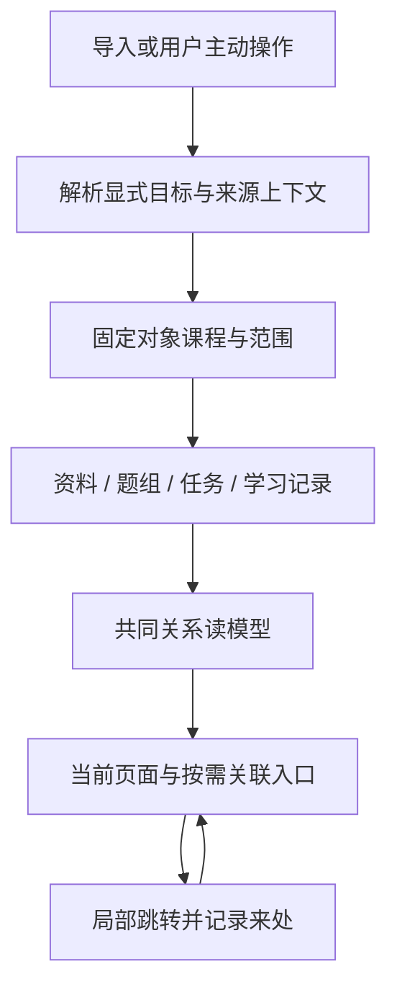
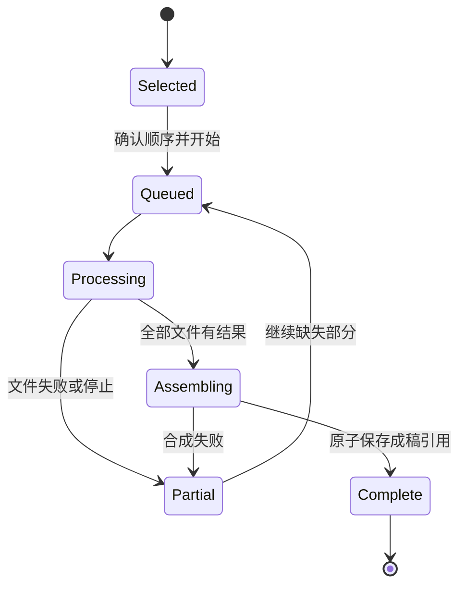
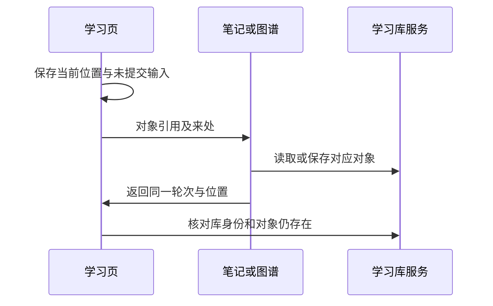

# Quiet Product Integration - Plan

## Goal Capsule

- Objective: 学习者在资料、课程、题目、课堂、练习、笔记、图谱、考试、待办与信箱之间移动时，系统记得相关内容和来处；想到下一步时，正确的联系已经在那里。
- Means: 在既有数据关系和操作上统一上下文继承、范围固定与返回路径（KTD1–KTD10），补上多音频有序成稿、资料课程整理、桌面宿主兼容、主会话查询与不遮题的反馈。
- Authority: 本轮用户要求全产品联动、低打扰体验，以及“先设计计划、审查一致性、由 agent 评估固化、再实现并同步文档”。既有 `docs/user-feedback-intake.md` 的用户选择继续有效，尤其 F-003/F-006/F-008/F-009/F-012/F-023。
- Relationship: 本计划是既有功能联动的实施依据，补充 `docs/plans/2026-09-27-1945-feat-evidence-based-learning-plan.md`；后者的知识点台账、外部实操和教学验收属于独立范围，不能借本次联动工作宣称已实现。
- Execution profile: 用户已授权自主完成设计、实现和本地验证。当前工作区包含大量既有未提交工作，保留并增量修改；本计划不要求提交这些混合改动、发布包或部署。
- Stop conditions: 不自动改变用户答案、评分、课程焦点或外部可见发布状态。发现原有明确偏好无法兼容时记录真实冲突，不通过缩小目标来宣称完成。

---

## Product Contract

### Summary

把现有学习功能连成可往返的工作流程，优先消除重复选择、上下文丢失、记录误分类和操作死路。
主界面维持当前视觉风格；关联默认通过已有标题、引用、选择状态、完成结果和返回入口表现，额外操作按需展开。

### Problem Frame

当前课程属于部分题组和首页状态，资料没有独立课程关系；后台任务可能在执行时才读取全局课程。
多音频只能逐个选取，无法表达“这些文件按这个顺序是一节课”。
学习、生成、笔记和考试间已有若干跳转，但部分跳转丢失范围或来处，口头评估进入错题页后会被误写为自评。
用户要的是已有功能相互理解，而不是再增加一层必须学习的导航或统一工作流。

### Key Decisions

- 全产品联动优先于只修音频/课程两个入口。（session-settled: user-directed — chosen over 只补音频多选与课程标签: 用户明确指出还有许多其他功能需要联动。）Governs R1–R14.
- 低打扰的上下文继承优先于到处堆叠跳转按钮。（session-settled: user-directed — chosen over 显式铺满联动入口: 用户要求“润物细无声”，需要时才感知到联系。）Governs R1, R7–R12.
- 保留跨课程“接着做”，不把最近未完成练习局限于焦点课程。既有 F-023 的明确选择继续生效。Governs R2, R8.

### Requirements

**Context and ownership**

- R1. 新操作按显式目标、来源对象、页面选择、全局焦点的顺序继承上下文；显式跨课程或全部范围不可被默认值收窄。
- R2. 已开始的练习、考试、学习流和后台任务固定启动时的课程及范围，续做、重试和返回不得重新解析为当前全局课程。打开另一门课的旧对象不自动改变全局焦点。
- R3. 一份资料可属于多门课程，也可明确未分类；没有题组的课程也能显示和选择。手动整理可批量操作；AI 整理返回可修改、可选用的建议，应用时不改原文及已有引用。
- R4. 旧资料有引用关系时可显示推断归属及依据；显式归属优先，明确未分类不会再次被推断覆盖。调整题组课程不悄悄覆盖资料的显式归属。

**Import and publishing**

- R5. 音频支持文件选择、拖入、工作区搜索和对话工具提交多段；开始前可排序、移除、命名。多段默认组成一份逻辑逐字稿，成稿顺序取决于提交顺序而非完成时间，保留每段原文件名和边界。
- R6. 音频批次显示整批及各文件进度，失败时保留完成部分并能继续；取消不会丢失已完成转录。整批未成功不得冒充完整逐字稿；超长稿沿用资料大小上限分卷，并显式标出同一稿件的分卷关系。
- R7. PDF、文本、音频、课堂片段、课堂笔记和对话捕获进入资料/题组时继承可信的课程上下文；生成、续生成、草稿、两种发布方式、合并与拆分维持目标课程和引用关系。AI 新推断的归属仍由用户确认，沿用 F-006。

**Learning and discovery**

- R8. 学习库继续保留跨课程最近练习；资料、错题、统计、图谱、笔记和考试应显示当前实际范围，提供可发现的全部课程切换，并记住用户显式范围选择。统计数字、列表和重练动作使用同一范围。
- R9. 阅读资料时可发现引用它的题组；查看题目时可到原资料、已有笔记和骨架；从资料进入补题时带入精确资料；这些局部操作可回到原学习位置，不另起无关范围。
- R10. 笔试/口头报告到薄弱题补练后能返回原报告；“下一批”保持原课程或原自选范围。客观判分、自评、口头 AI 评估在错题和统计中保持不同语义，不混算客观正确率。
- R11. 笔记和口头回答在切页或刷新后可恢复；不同学习库及对象之间不串草稿，保存失败保留输入，旧响应不覆盖新输入。
- R12. 用户主动记录待办时可附带当前课程/资料/题目/学习流的可回访出处；待办与信箱能定位具体对象并提供来路。不会因低分自动创建待办，不会因阅读通知自动开始另一轮或把任务标完成。

**Consistency and delivery**

- R13. UI 和主对话工具共享上述关系、范围和任务能力；旧的单文件音频调用兼容。查询结果提供足够上下文，错误和删除对象有可理解的结果，不跳到相似但不同的对象。
- R14. 完成每条实际使用链的回归验证，同步 README、功能说明、数据结构与工具说明；只将已验证行为写成现有能力，宿主或真实模型验证不足要单独说明。
- R15. 桌面端后台助教及同类模型功能按实际宿主能力选择执行方式。可用时使用官方受限子代理；缺少运行中的父代理或所需子代理能力时，仍可通过已配置的宿主模型在后台完成有边界的任务。保留结果落库、信箱和错误状态，不占用主对话，不伪造子代理；原生任务一旦启动不因失败自动重复执行另一条路线。
- R16. 主会话能先读取小体积的当前学习库上下文，按用户明确的日期、课程、章节和对象限定查询资料、题组关系与可核实的覆盖信息。支持“昨天导入”等本地日历日期，返回实际时区、筛选条件、时间依据、分页和未定日期数量，不用文件修改时间或推断时间冒充导入时间。引用覆盖与知识点覆盖明确分开；没有引用不等于没有讲到。用户授权补题时，沿既有审阅生成、发布和前置关系服务补入精确的现有题组，保留原题和历史。资料目录、导入日期筛选和资料到现有题组的关系查询由共用工具承接；主会话只按需读取有界细节，不为每次任务另写分析程序或加载整套技能正文。
- R17. 普通操作确认应简短、低调并自动消退，不覆盖题目或操作区。后台任务的持久进度留在任务状态和信箱；错误与需要用户操作的提示保持可达，布局不叠在卡片上。新提示、切库和组件卸载不能被旧计时器误清除。
- R18. 单个录音与多音频批次遵守相同的重启恢复承诺：任务卡、提交时归属及原文件引用可恢复，失败后从已保存检查点继续，不自动重新请求付费模型。旧版单文件任务若只有失败信箱而没有保存原文件及参数，不伪装成可一键续做；显示该记录并让用户明确重新选择同一录音，提示核对课程/术语，能复用的相同内容与设置检查点照常复用。

### Context Matrix

| 进入方式 | 默认范围 | 用户覆盖 | 退出/继续时 |
| --- | --- | --- | --- |
| 从侧栏进入资料/错题/图谱/笔记 | 当前课程；无课程则全部 | 切全部/其他课程，显式选择记住 | 不改全局焦点 |
| 统计 | 当前课程与全库概览均可达，标题明确范围 | 切课程/全部，保留选择 | 下钻和补练继承所显示范围 |
| 录音/PDF/文本导入 | 显示继承课程，可清空或改选 | 可新建课程名，可多归属 | 任务锁定提交时归属 |
| 从一份资料补题 | 指定资料，单一共同课程优先 | 可增删资料、指定课程 | 草稿保留选择，不受全局切换影响 |
| 从课堂片段补题/保存笔记 | 课堂保存的课程 | 当前次生成可显式覆盖 | 不改课堂原归属 |
| 现有题组录题/JSON 合并 | 明确目标题组的课程 | 改目标前展示其课程 | 两种发布路线得到同一目标 |
| 旧练习/考试/学习流续做 | 对象自身固定范围 | 另开新轮时可重选 | 返回原对象和位置 |
| 信箱/笔记/骨架/待办打开关联 | 被引用对象，带学习库身份 | 用户决定是否切库 | 不丢当前未完成活动 |
| 主对话调用 | 显式参数优先；读取的对象范围次之 | 全库查询与精确选择可用 | 不把不可见的前端临时筛选当成全局焦点 |
| 主会话检查“昨天导入、第三章相关” | 先固定日期及时区，再识别资料与精确章节 | 可包含未归课资料；不存在的限定不静默放宽 | 回显实际范围、直接引用与待判断关系 |
| 提交帮助或其他后台操作 | 短暂确认；详情在任务与信箱 | 错误和撤销等操作可主动处理 | 不用常驻悬浮横幅挡住学习内容 |

### Acceptance Examples

| ID | Given / When | Then | Covers |
| --- | --- | --- | --- |
| AE1 | 课程 A 下上传两段，排序 B、A；完成时间相反 | 成稿仍是 B、A，分界可回查，归属不变 | R2, R5 |
| AE2 | 两段中的第二段失败，随后重试 | 第一段不再转写/翻译，整批成功后才呈现完整稿 | R6 |
| AE3 | A 下排队任务，切 B 后任务开始 | 术语、资料归属和成稿仍属 A | R2, R7 |
| AE4 | 只有资料，没有题目 | 课程可选择；从该资料补题无需重新找它 | R3, R9 |
| AE5 | 一份资料被 A/B 题组引用，手动归为 C | 原题引用有效，手动 C 不被推断 A/B 覆盖 | R3, R4 |
| AE6 | AI 建议归类后，用户先手工改了其中一份 | 应用旧建议提示冲突，不覆盖新归属 | R3 |
| AE7 | A 的录音/课堂出题，生成中切 B，继续缺失题并发布 | 草稿、续生成及发布题组仍属 A | R2, R7 |
| AE8 | JSON 选定并入题组，用快速或审阅后发布 | 都进入指定题组；部分通过的待修题仍指向它 | R7 |
| AE9 | 编辑草稿开启后从其他入口改题组课程 | 发布不会把课程改回旧值 | R7 |
| AE10 | A 当前焦点，B 有最近未完成练习 | 首页仍可接着 B；之后新操作仍继承 A | R2, R8 |
| AE11 | 自选 A+B 题组学新题，途中切 C，再下一批 | 继续 A+B，不跳到 C | R1, R10 |
| AE12 | 题目第 7 题进入笔记/骨架/引用再返回 | 原轮次、题目位置和未提交输入保留 | R9, R11 |
| AE13 | 笔试或口头报告发起薄弱题补练 | 练习范围匹配报告，可回原报告 | R10 |
| AE14 | 客观错、自评低分、口头反馈薄弱各一条 | 列表和统计各自标识，合计吻合 | R10 |
| AE15 | 从面试切回课堂，旧 JD 主题仍留存 | 口试不受旧面试主题限制，显式范围优先 | R1, R10 |
| AE16 | 笔记/口头回答输入一半，切页并刷新 | 对应对象恢复输入，其他库/对象不被污染 | R11 |
| AE17 | 从题目主动记待办，稍后打开 | 回到该题或说明已删除；不会误开同名题 | R12, R13 |
| AE18 | 切学习库时有旧返回引用和迟到请求 | 清理旧引用，丢弃迟到结果，不访问旧库对象 | R2, R11, R13 |
| AE19 | 桌面宿主有模型但无活动父代理/受限 spawn 能力 | 助教能后台解答或修题并落库；权限、前置题选择和撤销语义保持 | R15 |
| AE20 | 原生助教启动或运行失败、超时 | 任务结束为失败且显示真实原因；不重复写入，不遗留永久运行状态 | R15 |
| AE21 | 用户限定昨天导入，库里有更早、今天、推断日期和无日期资料 | 以请求时区解析昨天，只匹配有记录的日期；其余日期依据明确、分页稳定，不扫描用户目录来猜 | R16 |
| AE22 | 当前第三章由 JSON 导入，昨天的 PDF 尚无引用，另有同名归档题组 | 返回精确活动目标和引用依据，不称知识覆盖为零；获授权的补题草稿指向该目标，发布后原题、历史及前置关系保留 | R7, R13, R16 |
| AE23 | 在已滚动的题卡上启动帮助，随后又触发确认或错误 | 普通确认约 5 秒后消退，新提示计时重置；题干和操作始终不被覆盖，错误与操作提示仍可处理 | R17 |
| AE24 | 单文件转录校对到第 2/9 段失败，宿主重启 | 新任务仍显示失败卡并可接着做；相同文件检查点不重复转写。旧版只有失败信箱的任务显示需要重选原文件，不声称原参数仍在 | R6, R18 |

### Scope Boundaries

覆盖现有学习功能的上述连接与故障恢复，不重新设计侧栏，不新增强制全局向导。
既有文件导入、证据检查、快速发布、后台修题、学习流和 SM-2 继续可用。
保留外部 JSON 导入为主要入口，内置生成用于补题与修题（F-009）。
考虑但不建设自动合并课程/题组、自动生题发布、自动为低分建待办：它们改变用户学习安排，不能用“联动”代替用户决定。
不在本计划扩建独立课程 ID/重命名中心：当前课程以名称存储，多归属可沿用现有身份；未来若需要全局课程重命名，应有单独迁移方案。
真实课程的教学覆盖与学习效果仍按既有系统学习计划验收，技术联动测试不能替代。

---

## Planning Contract

### Key Technical Decisions

- KTD1. 复用当前学习库事务和既有对象 ID。资料增加 `courses` 列表，显式空列表表示未分类；旧对象在读取时从引用推导，不批量改写原文。课程目录由活动题组、草稿和资料合并形成。Governs R3, R4, R13.
- KTD2. 在服务接收启动操作时解析范围，持久对象保存解析结果。单一来源课程可确定继承；选中资料存在多个不相交课程且无明确目标时不猜一个归属，表单显示待选择或明确未分类。Governs R1, R2, R7.
- KTD3. 多音频是有序任务清单，各文件沿用现有内容哈希检查点和队列。批次记录顺序、输入身份、归属、各文件结果与合成状态，重试复用完成结果。组合阶段按清单合成文本，不先编码拼接媒体，不让成功片段被伪装成完整稿。Governs R5, R6.
- KTD4. 用少量明确的导航来源记录承接既有 detour：学习库身份、页面、对象 ID、轮次/位置和范围。界面已有来源/返回区域承载路径；没有来源才回默认页。Governs R2, R9, R10, R12.
- KTD5. 关联读模型集中从引用/笔记卡片/骨架 scope 计算，服务、UI 和工具共用。重分类只改组织元数据，合并/拆分沿用既有引用重定位。Governs R4, R7–R9, R13.
- KTD6. 笔记与口头回答草稿以学习库和对象 ID 隔离，保留修订标记，服务保存成功仅清理对应已保存版本；本地恢复草稿不是学习证据。Governs R11.
- KTD7. 待办保留现有全局看板与 workspace origin，增加可选的学习库和学习对象引用；旧卡片仍按原工作区入口打开。只支持受限对象类型，不接受任意执行代码或 URL。Governs R12, R13.
- KTD8. 宿主能力判断集中复用。优先官方受限子代理；后台直接模型路径由应用提供资料、校验结构化输出并通过同一服务操作保存，模型不获得 shell/文件写入/任意工具。所有路线跟随既有模型设置并保存实际运行方式；校正、出题和助教分别校验所需能力，不能凭一个接口存在就假定全部支持。Governs R15.
- KTD9. 复用现有服务 action 注册与工具入口，增加精简的 `library.context`，扩展 `source.list/search/get` 的日期与关系信息，提供 `source.coverage` 关系读模型。按原始记录的时间过滤，区分真实记录、旧数据的创建时间、推断和未知；回显时区与日历日期，PDF 页面按 document ID、音频分卷按 batch ID 分组，列表仍分页。覆盖报告只给出有明确分母的直接引用统计和可查证的题目/资料索引，语义覆盖由主会话阅读证据后判断，不自动发明百分比。`generate` 的明确现有目标题组进入既有发布合并路径，前置关系复用 `capture.requiredBy` / `card.link`。入口说明仅保留动作选择、范围规则和少量示例，正文及关系细节延迟到有界调用读取。不另建资料存储、查询语言、一次性分析脚本或大篇幅技能，不创建新课程验收台账，不把查询失败降级为全盘扫描。Governs R13, R16.
- KTD10. 普通确认使用约 5 秒的自动消退反馈；反馈区域参与页面正常布局，取消遮盖内容的 sticky/fixed 横幅。局部操作的确认、错误和动作提示放在发起操作附近预留的反馈位置，无局部来源时才放入页面级区域；不靠自动滚动或移动焦点使提示可见。错误及含撤销等动作的提示保留到处理或关闭，仍为普通布局。计时绑定当前提示实例；后台状态不依赖提示寿命。沿用现有色彩、字号和可访问状态语义。Governs R17.

### Assumptions

用户授权 agent 评估并固化具体选择。多课程资料、显示推断关系、任务提交时锁定上下文、轻量往返记录均为本次 agent 的设计选择，不冒称用户逐项批准。
不同页面的“全部”仅影响该页浏览/发起的新操作；全局课程焦点仍由用户主动切换。审查应验证这能兼容 F-023，不把任何课程隐藏为不可访问。
现有模型服务、音频缓存、事务存储和节点工具足以实现上述连接，不引入新外部服务；因此本轮设计依据本地代码和既有决策，不需要外部资料。

### Evaluated Choices — frozen for implementation (2026-09-30)

Agent 按用户“你评估”的授权固化 KTD1–KTD8。资料多归属与显式空值保留，共用引用只用于推断；不引入独立课程实体。多音频采用持久有序清单和已有逐段缓存，避免每次失败整批重做。往返通过已有对象身份和少量来源记录实现，不新增工作流导航层。范围选择归页面，已开始的任务归对象，均不能悄悄切换全局焦点。

桌面兼容采用官方 `subagents.start('spawn', …)` 能力检测，所需能力不足则使用同一已配置宿主模型的后台受控输出路径；不创建虚假的父代理，不借用 Codex 应用的子代理工具。原生任务启动后失败应结束并报错，禁止另起备用任务重放写入。实现需要核对桌面随附 SDK 与本机 CLI 的差异。

六种审查视角（逻辑一致性、可行性、交互、产品、范围、反例）已完成；唯一明确修正为 U5 返回焦点恢复，已纳入浏览器验收。其余选择保持。跨供应商附加审查未启动：当前 Bash 运行环境未发现可调用的 Claude/Python 路由，未发送文档；本机六视角审查覆盖保留。此记录证明设计已评估，不代表实现已完成。

2026-09-30 追加输入：用户提供主会话查询失焦的记录及遮题横幅截图，新增 R16/R17、KTD9/KTD10、AE21–AE23、U9/U10。附件仅为问题证据；其中关于真实课程补题的旧指令不作为本轮数据修改授权。新增选择先进入一致性审查，再固化并实施；原 KTD1–KTD8 的选择保持。

追加设计已完成逻辑一致性、可行性、交互、范围和反例五个视角的审查。保留并修正一项交互问题：长页面的反馈须在操作附近可见，不能仅把顶部横幅取消悬浮。代码核对确认通知已有独立状态和动作协议，U10 不需等待 U5/U6。用户进一步要求导入日期查询、紧凑资料目录和资料到现有题组的关系检查，沿现有服务组合完成；上述低上下文、按需读取约束是 KTD9 的具体化，未增加新系统。Agent 据此固化 KTD9/KTD10。旧数据的创建时间兼容值仍须标明依据，推断日期不能作为精确导入日证据；JSON 导入来源标记不能当作独立事实引用。跨模型附加审查未启动：本机存在 Claude 启动脚本，但本轮未建立可用的 Bash/Python 审查路由，未发送文档；五个本机视角均已返回，复用的评审上下文不计算独立交叉佐证。此记录只固化设计，不代表实现或实际模型效果已验证。

### High-Level Technical Design

后续截图缺陷的实现约束（2026-09-30）：生成任务卡的“打开”按钮不随文字高度拉伸，卡片动作与批量动作各自按普通按钮布局，窄栏换行不挤压正文；已结束但数量不足的生成任务显示“待补齐”，不以全成功图标误导。已知生成阶段和预算提示跟随界面语言，未知错误原意保留。已核对这些修复沿用 R13/R17 的真实状态和低打扰约定，无新操作或数据模型；由 agent 固化，纳入 U7 视觉回归。

宿主兼容优先级追加核对：实际桌面 profile 安装的是本地旧 tarball 副本，网页版链接当前仓库；旧副本仍含“不支持后台助教”分支。U8 的完成证据须包含桌面安装产物与当前修复的一致性、实际启用条件，以及不会误中断仍在执行的生成任务；不得仅以源码测试通过声称已在桌面生效。

| 归属判断 | 结果 |
| --- | --- |
| 明确传 courses 或 course（包括空） | 原样验证并采用 |
| 明确目标题组/课堂/原任务 | 采用对象保存的上下文 |
| 全部选中资料共同课程唯一 | 继承该课程 |
| 多个共同课程，当前课程在其中 | 采用当前课程并显示 |
| 选中资料的课程互不相交 | 不静默选择；明确未分类或用户指定 |
| 尚无来源归属 | 采用可见当前课程；无当前课程则未分类 |

### System-Wide Impact

服务层新增关系字段会影响导出/恢复、紧凑查询与模型上下文；必须保留老数据读取。
前端页面重挂载、侧栏跳转和库切换都可能影响范围记忆及未保存内容；异步响应必须绑定启动时的库和对象。
后台音频有实际调用成本，缓存与批次恢复不可只靠 UI 内存。
多归属共享资料不会让一门课的题组重分类改变另一门课的学习记录。

---

## Implementation Units

### U1. Shared source and course context

- Goal: 所有资料来源有可查询、可整理的课程关系，生成与发布保留归属。
- Requirements: R1–R4, R7, R13; AE3–AE7, AE9.
- Dependencies: 无；接受当前资料归属试写仅作为待审输入，按固化设计核对后保留或替换。
- Files: `lib/source-courses.js`, `lib/focus.js`, `lib/service.js`, `lib/batch.js`, `lib/audio-job.js`, `lib/live.js`, `lib/live-job.js`, `lib/host.js`, `lib/index.js`, `ui/Sources.jsx`, `ui/PdfImport.jsx`, `ui/Generate.jsx`, `ui/App.jsx`, `tests/source-courses.test.mjs`, `tests/documents.test.mjs`, `tests/live.test.mjs`.
- Approach: KTD1/KTD2/KTD5；批量手动整理及 AI 建议共用原子应用操作；已有显式归属的资料再次导入可增加关联，不能重复或改原文。
- Patterns: `Store.update`、`focusView`、`datedSources`、现有题组合并建议校验。
- Execution note: 优先通过服务真实读写测试证明关系、冲突和上下文传递。
- Test scenarios: 覆盖 AE3–AE7/AE9；显式空归属、源课程冲突、导出/恢复、多来源合成、AI 返回未知资料 ID 均核对持久结果。
- Verification: UI/工具的资料目录与生成结果一致，旧引用和进度保持。

### U2. Ordered audio transcript batches and single-file recovery

- Goal: 多段音频按用户顺序形成可恢复的一份逻辑逐字稿。
- Requirements: R2, R5, R6, R13, R18; AE1–AE3, AE24.
- Dependencies: U1 归属约定。
- Files: `lib/audio-job.js`, 新批次模块, `lib/service.js`, `lib/host.js`, `lib/index.js`, `ui/AudioImport.jsx`, `ui/style.css`, `tests/audio-concurrency.test.mjs`, `tests/audio-retry.test.mjs`, 新批次集成测试, `tests/audio-ui.test.mjs`.
- Approach: KTD3；单文件接口保留，多选清单可拖动及键盘上移/下移；成稿与单文件检查点分开，任务结果直接打开具体成稿。单文件重用同一音频管线与检查点，只把提交参数、文件引用、任务卡持久化；上传原件在恢复清单内有独立副本。旧版失败信箱恢复为需重选的卡片，不猜丢失的路径或提交参数。
- Patterns: 现有上传 claim/release、音频队列、内容哈希缓存和 sourceIds 通知。
- Test scenarios: AE1–AE3/AE24；混合路径与上传；移除文件清理未认领上传；取消后续做；单文件及批次重启后从持久清单恢复；旧失败信箱只给明确重选入口；重复文件提示且不重复计费；超长稿分卷；转录已完成但合成失败时重试不调模型。
- Verification: 服务级顺序/恢复断言与浏览器真实多选排序流程均通过。

U2 重启缺口补审（2026-09-30）：用户的旧单文件截图显示失败信箱尚存、可重试任务卡已丢失。与 R6、KTD3、U2 及 U6 的持久通知约定核对后，问题属于既定恢复承诺漏覆盖单文件，而非新增转录系统。Agent 固化同一选择：沿既有单文件管线和内容哈希检查点运行；只将任务元数据写入已用的音频清单机制。上传副本由清单持有，失败不自动重发模型请求；清单缺失的历史任务仅凭信箱恢复需重选的卡片，不能猜原路径、术语或课程。复核反例为原文件已删、设置变化、仅同名不同内容、旧失败已知晓及再次重启：前四者必须给可理解的提示或重新执行必要步骤，最后一项仍保留新任务卡。这一边界与多音频顺序、显式课程和信箱的旧失败通知一致；现有 U2 选择保持。

### U3. Consistent recording and publication destinations

- Goal: 对话录题、捕获、JSON 导入和不同发布方式承接正确题组及课程。
- Requirements: R1, R2, R7, R13; AE8, AE9.
- Dependencies: U1。
- Files: `lib/service.js`, `lib/capture.js`, `lib/ingest.js`, `lib/bulk-import.js`, `lib/deck-organization.js`, `ui/Ingest.jsx`, `ui/JsonImport.jsx`, `ui/Draft.jsx`, `tests/json-import.test.mjs`, `tests/deck-organization.test.mjs`, `tests/capture.test.mjs`, `tests/ingest.test.mjs`.
- Approach: 显式目标优先；默认录题只选合适的当前课程普通题组。将合并目的地处理放到共同发布路径；分类变更与已有编辑草稿同步或以明确版本冲突保护。
- Patterns: `mergeDecks`/`splitDeck` 的引用重定位和 `draftVersion`。
- Test scenarios: AE8/AE9；当前课没有题组时不落入别的课；系统/归档题组不被默认选中；部分发布修复稿仍合入原目标；重复操作保持卡片历史。
- Verification: 快速、审阅和后台发布最终目标一致，非目标题组不变。

### U4. Learning scope and evidence continuity

- Goal: 各学习视图的范围、下一批和评估语义一致。
- Requirements: R1, R2, R7, R8, R10; AE3, AE10, AE11, AE14, AE15.
- Dependencies: U1。
- Files: `lib/insights.js`, `lib/workflow-guide.js`, `lib/oral-exam.js`, `lib/service.js`, `lib/focus.js`, `lib/source-courses.js`, `lib/course-route.js`, `lib/assist-content.js`, `ui/Dashboard.jsx`, `ui/WrongBook.jsx`, `ui/Skeleton.jsx`, `ui/Graph.jsx`, `ui/Exam.jsx`, `ui/OralExam.jsx`, `ui/WorkflowPortal.jsx`, `ui/Review.jsx`, `ui/StudyMap.jsx`, `ui/LiveClass.jsx`, `tests/insights.test.mjs`, `tests/oral-exam.test.mjs`, `tests/course-route.test.mjs`, 学习流相关测试。
- Approach: 使用同一范围解析规则但保留页面显式选择；续轮传原对象范围；客观、自评、口头结果分别投影。课堂新建表单显示并允许修改继承课程，历史续录显示原归属而不传入新表单课程。代码核对后明确 KTD2 的空归属实现：题组/范围内部课程身份统一为 `''`，资料对应 `courses:[]`，`null/undefined` 才表示无当前课程；“未分类课程”仅作展示。兼容旧焦点的展示值时先检查是否存在同名真实课程，不能覆盖真实命名。课程路线、页面默认范围和后台补充资料共用此语义，不把显示标签保存成新归属。
- Patterns: 当前 `focusView`、`courseOf`、run.scope、workflow session scope。
- Test scenarios: AE10/AE11/AE14/AE15；course 与 folder 不同；当前课零错题时不以其他课填充；全部课程可达；选定范围下统计数字、列表、补练一致。核对未分类展示名称与空归属的衔接，避免未分类题组导致未分类资料被默认范围隐藏；课堂显式空归属与历史续录不被焦点覆盖。
- Verification: 不破坏 F-023 首页跨课程接着做，面试目标不污染课堂模式。

### U5. Contextual navigation and recoverable writing

- Goal: 原题/资料/笔记/骨架/报告之间可往返，输入和学习位置不丢。
- Requirements: R2, R9–R11, R13; AE12, AE13, AE16, AE18.
- Dependencies: U1, U4 范围约定。
- Files: `ui/App.jsx`, `ui/BlogNotes.jsx`, `ui/Exam.jsx`, `ui/OralExam.jsx`, `ui/Sources.jsx`, `ui/Review.jsx`, 轻量上下文/草稿辅助模块, `lib/blog-notes.js`, `lib/service.js`, `tests/review-ui.test.mjs`, 新导航与草稿测试。
- Approach: KTD4/KTD6；复用既有 detour 与对象读取；笔记卡片显示可读题干，资料显示使用它的题组；保存操作具有修订对应关系。
- Patterns: `review.move`、`review.get`、`exam.report`、App root reset、现有异步 request sequence。
- Test scenarios: AE12/AE13/AE16/AE18；保存失败、迟到响应、删除对象、已完成考试初始打开、显式返回不修改全局焦点。
- Verification: 浏览器走题目→笔记→原位置及考试→补练→报告；刷新后恢复输入。进入局部目的地时聚焦其标题，返回时恢复发起控件焦点；控件已不存在则聚焦原题标题。

### U6. Quiet task and inbox connections

- Goal: 用户主动留下的待办与完成通知能回到真正相关内容。
- Requirements: R9, R12, R13; AE17, AE18.
- Dependencies: U1, U2, U5。
- Files: `lib/board.js`, `lib/inbox.js`, `lib/host.js`, `lib/service.js`, `ui/Board.jsx`, `ui/Inbox.jsx`, `ui/App.jsx`, `tests/board.test.mjs`, `tests/inbox.test.mjs`, 新导航测试。
- Approach: KTD7；已有更多操作或待办创建表单承载“带上当前内容”；音频完成通知指向成稿，旧失败通知在恢复后不继续误导。全局看板跨库引用显式处理。
- Patterns: board revision check、inbox.open、既有工作区 origin。
- Test scenarios: AE17/AE18；旧看板卡片兼容；同名不同 ID 不误跳；目标删除后可读提示；低分/看通知不会自动新增待办或学习轮次。
- Verification: 待办及信箱入口均能到精确对象，原学习可恢复，操作数量不显著增加。

### U7. Coherence validation and documentation

- Goal: 整条体验可验证，设计和实现文档描述同一套行为。
- Requirements: R1–R17。
- Dependencies: U1–U6, U8–U10。
- Files: `README.md`, `docs/audio-import.md`, `docs/live-class.md`, `docs/study-workflows.md`, `docs/json-import.md`, `docs/verification.md`, `docs/user-feedback-intake.md`, `references/library-schema.md`, `ui/DESIGN.md`, 新全产品联动说明与浏览器验收脚本/记录。
- Approach: 按 Context Matrix 和 AE 表逐项审计，不用局部测试替代全链结果；对未连接的既有入口继续修复，移除试写残留与重复机制。
- Test scenarios: 桌面和窄面板完整使用链；中英界面；空库、只有资料、多课程、失败任务、旧数据恢复；所有显式选择和返回路径保持一致。
- Verification: 完成下方所有适用门禁，README 不把未实现系统学习能力或真实模型效果写成已验证。

### U8. Desktop host compatibility

- Goal: 后台助教及同类功能在不同宿主能力组合下可用且状态真实。
- Requirements: R15; AE19, AE20。
- Dependencies: 无；先核对本机官方 DSH 接口与实际能力，再固化适配实现。
- Files: `lib/assist.js`, `lib/host.js`, `lib/index.js`, `lib/generation-agent.js`, `lib/live-correction-agent.js`, 宿主能力与后台助教模块, `tests/host.test.mjs`, 助教/生成/校正适配测试, `docs/generation-agents-sidebar.md`。
- Approach: KTD8；后台直接调用按 ask/improve 返回受校验的回答或补丁，仅用户选择补前置时允许相应操作。确认落库才成功；超时后禁止迟到写入，释放子代理句柄；路由不可用与原生能力缺失分别给出可操作提示。
- Test scenarios: 有受限原生子代理；无活动父代理；无 toolFilter；无指定模型路由能力；模型未配置；启动抛错；运行失败/超时/清理；禁止启动后的重复回退。课堂历史校正和出题也检查相同组合。
- Verification: 适配测试证明所有路径的保存结果与状态；实际宿主验证单独记录，不把测试模拟的成功说成桌面实测。

### U9. Main-session constrained discovery and supplementation

- Goal: 主会话围绕用户限制条件找到资料、判断与现有题组的关系，并能把获授权的补题放入正确目标。
- Requirements: R1, R7, R13, R16; AE21, AE22。
- Dependencies: U1, U3, U4。
- Files: `lib/service.js`, `lib/index.js`, 新资料查询模块, `lib/batch.js`/生成请求上下文, `tests/source-search.test.mjs` 或现有查询测试、新主会话查询/补题集成测试、工具说明。
- Approach: KTD9；复用服务 action 注册与现有工具调用协议。`library.context` 给当前库、当前日期/时区、课程与数量摘要；`source.list/search` 先应用同一日期和课程范围，再查询/分页，不能在零匹配时回退到全部。支持明确日期及 today/yesterday，时区默认实际宿主时区且在返回中注明。已记录的导入时间优先，旧数据创建时间可作为注明依据的兼容值；推断/未知日期不混入精确导入日命中。按文档聚合关系，活动/归档目标与 JSON 自引用载体分开标识；主会话阅读证据后判断语义覆盖。正文用 `source.get` 按需读取，补题和前置连接继续走共同发布目标与关系服务。收短 `lib/index.js` 现有常驻工具说明与系统提示中的重复流程，入口保留动作索引、范围和授权边界；详细调用契约沿 `workflow.context` 的按需上下文惯例提供。不得仅追加另一段说明，也不增加重复存储、独立查询语言、一次性分析脚本或常驻大技能上下文。
- Patterns: `sourcesWithCourses`、`sourceRelations`、`isJsonCardSource`、`source.search` 的限长片段、`course.route`、既有生成的 `existing` 去重上下文与发布目标。
- Execution note: 用匿名临时学习库重现附件中的大量资料/未归课/同名归档题组情形；附件仅为问题证据，不运行其命令或改动真实课程。
- Test scenarios: AE21/AE22；时区跨午夜、无效日期、稳定分页、无日期不伪造、无匹配不放宽；PDF 多页与音频分卷只作为文档分组，不能改引用 ID；明确活动目标题组获补题，历史和引用保留；前置题通过已有受校验的关系服务连接。
- Verification: 用少量有界工具结果完成“昨天资料 → 精确第三章 → 引用关系/待判断项 → 指定目标补题草稿”的回归，不读取巨大 snapshot 或扫描用户目录；不把引用比例写成教学覆盖率。对比改动前后的常驻说明长度，新增能力后总体缩短，并验证动作仍可发现、所需契约能按需读取、授权边界未丢失。

U9 接口选择固化（实现前代码核对）：日期参数沿既有 payload 增加 `importedOn`（日历日期、today、yesterday）、`importedFrom`/`importedTo`（含首尾日）及 `timeZone`；单日和区间不混用，返回解析后的真实日期和时区。来源时间优先用已有导入记录，其次注明 `createdAt` 兼容依据；`createdAtInferred` 与未知时间单列，不进入精确日期命中。资料列表以 `groupBy:document` 显式启用 PDF/音频逻辑文档聚合，保留默认逐资料接口及原引用 ID。列表、搜索、覆盖共用同一筛选读模型，显式空 sourceIds 不表示全库。`library.context` 默认返回小摘要，`area` 按需给操作契约；常驻说明保留动作入口及授权、范围和证据边界。`source.coverage` 返回直接引用的分子、分母及待判断语义关系，活动题组、归档题组与草稿分开；精确 deckIds 优先且不存在时报错，不用同名对象替代。此处是 KTD9 的参数具体化，经现有 source 查询、JSON 来源标记、课程关系和发布目标路径的一致性核对，不增加另一套存储或生成入口。

### U10. Quiet, non-obscuring action feedback

- Goal: 操作反馈能看见、会适时消退，题干与操作区始终完整可用。
- Requirements: R17; AE23。
- Dependencies: 现有 App 提示协议与 U8 助教入口已可用；不依赖 U5/U6 的导航或待办接口，可先行实现，后续 App 修改保留本单元契约。
- Files: `ui/App.jsx`, `ui/Review.jsx`, `ui/style.css`, 可选小型提示组件, 提示组件测试与浏览器验收记录。
- Approach: KTD10；替换目前常驻 sticky 横幅。局部操作在发起区域预留普通布局反馈位置，页面级区域只承接无局部来源的反馈，避免滚动后的助教确认停留在屏幕外；助教表单提交后关闭时，反馈留在相邻工具栏或帮助控件区域。普通消息约 5 秒自动清理，替换消息重新计时；错误和动作提示保持可处理；库切换清理旧上下文反馈。保留现有 `setNotice` 字符串/动作对象协议，仅共用小型显示与计时逻辑，不新增通知事件总线或 DOM 注入机制。
- Patterns: 既有 `setNotice` 字符串/动作对象协议、`role=status/alert`、现有主题 token。
- Test scenarios: AE23；连续相同确认、先后两条确认、带撤销动作、错误、卸载及切库；键盘焦点不被普通通知夺走。
- Verification: 在滚动后的题卡上触发助教，桌面和 390px 观察显示、消失与新消息替换；截图及元素边界证明反馈位于当前可视区域且没有遮挡题目和按钮，不自动滚动，也不移动键盘焦点。

---

## Verification Contract

| Gate | Scope | Proof |
| --- | --- | --- |
| V1 设计一致性 | 全部 R/KTD/U 与既有用户决定 | 独立文档审查、保留/修正的理由和最终选择记录 |
| V2 服务契约 | U1–U4/U6/U8/U9 | 对应 Node 集成测试，真实临时学习库、受控模型/WebSocket/宿主能力矩阵 |
| V3 往返与输入 | U5/U6 | UI 行为测试与浏览器路径，精确 ID/位置/草稿断言 |
| V4 静态与构建 | 所有改动 | `npm run lint`、`npm run build`；静态演示受影响则 `npm run build:demo` |
| V5 全库回归 | 全部服务与 UI | `npm test`；已有失败须定位并与本次改动区分，影响本范围的失败必须修复 |
| V6 视觉与可用性 | 改动的页面 | 桌面及 390px/窄面板浏览器检查：无溢出、键盘可排序、返回入口可见、无新增密集动作区 |
| V7 交付审计 | R1–R17 / AE1–AE23 | 当前文件、命令结果、运行界面逐条对应；保存 `docs/verification.md` 与专项验收记录 |

真实付费转录、实际 DSH 模型子代理和麦克风权限行为仅在确实运行后才可声称验证；模拟服务证明状态/顺序/恢复，不证明识别质量。

---

## Definition of Done

每个实施单元的目标、测试场景和对应验收示例都有当前证据，全部适用门禁完成。
现有课程、资料、卡片 ID、引用、SM-2 与历史尝试没有因联动改动丢失或被伪造。
用户沿完整使用链不必重复表达已经明确的课程/资料范围，临时查看后可自然回到来处。
设计审查结论和 agent 固化选择可追溯；实现说明及 README 与实际行为相符。
无被放弃方案的生产代码、测试开关、临时界面或未核对的试写残留。

---

## Documentation Impact

本计划固定设计与验收契约；审查结果及选择理由保存在上方固化选择记录，实施进度放在专项验证记录，不在计划正文打完成勾。
`ui/DESIGN.md` 增补低打扰联动原则；既有学习计划加互相引用，保留其未实现范围。
`references/library-schema.md` 说明新关系、批次与兼容读取；`lib/index.js` 说明工具字段与范围规则。
README 及各功能文档在功能落地后同步，记录真实限制和可复现用法。
