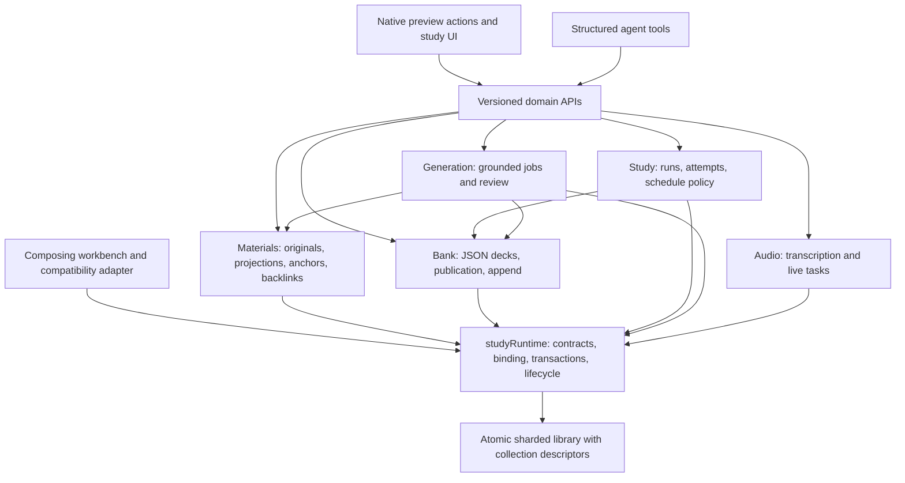
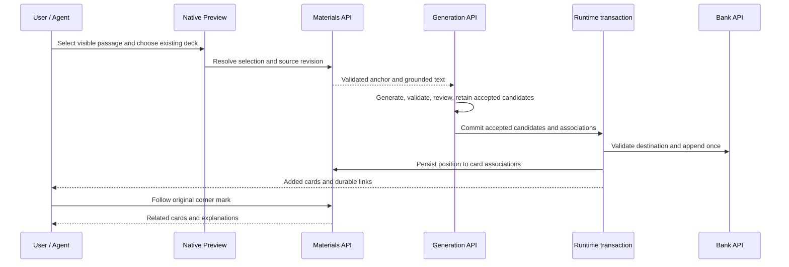
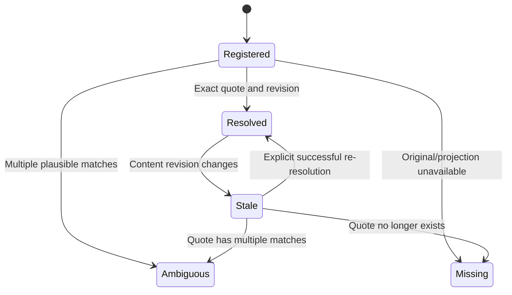

# StudyHub 2.0 Alpha Architecture - Plan

## Goal Capsule

- **Objective:** Users can read their existing learning libraries, learn from original documents, and add questions to existing decks while developers extend individual learning capabilities without changing unrelated features.
- **Means:** Independently loadable DSH plugins with owned domain operations, versioned public APIs, and a composing workbench (KTD1–KTD4).
- **Authority:** The user's architecture discussion and instruction to develop and publish `2.0.0-alpha.1` govern scope; this plan supplies implementation decisions. Preserve existing features during extraction.
- **Execution profile:** Autonomous implementation and release, with parallel agents where useful. The coordinating agent resolves technical choices and completes integration.
- **Stop conditions:** Stop a dependent change for demonstrated data-loss risk or a contradiction of the user's requirements; continue independent work. Missing optional plugins or model services are capability states, not startup failures.
- **Delivery:** A verified GitHub prerelease tagged `v2.0.0-alpha.1`, containing the workbench and independently installable plugin archives with checksums. Release notes identify actual alpha limitations. Existing unrelated untracked site/video work stays outside the release.

---

## Product Contract

### Summary

Turn the current learning workbench into a composition of independent DSH plugins. Promote original documents to learning entry points, retain JSON question decks, and support selected-text questions and incremental question generation with durable backlinks.

### Problem Frame

`lib/service.js` centralizes action dispatch, publication rules, jobs, state mutation, coaching, audio, and workflows. `lib/index.js` combines host integration and a broad agent tool contract. Adding a feature requires editing central files and understanding unrelated business state.

Materials currently contain extracted text inside JSON source records. PDF import discards original bytes and paths. This makes documents secondary outputs and prevents the existing DSH file preview from serving as the primary learning interface.

### Requirements

**Composition and boundaries**

- R1. Runtime, materials, question bank, study, generation, and audio are individually loadable Cordis plugins; the full workbench composes them.
- R2. Each bounded context owns its business operations and mutation rules, and communicates through documented versioned APIs rather than another context's internal files or storage objects.
- R3. Adding an extension with its own operations, tools, and state must not require editing the central dispatcher, core storage field arrays, or unrelated modules.
- R4. Available capabilities determine tools and UI actions; installing a read-only context must not require a model, and removing a context must release its registrations.

**Existing users and content**

- R5. Existing supported libraries, sources, JSON decks, card IDs, study runs, review schedules, and attempts remain usable without manual migration or loss of unknown additive fields.
- R6. Missing new metadata enables basic behavior immediately; agent enrichment can fill missing values without overwriting existing user content or inventing unsupported facts.
- R7. Current workbench features and routes continue to work through transition adapters in the complete installation.
- R8. JSON remains the authoritative format for question decks. New generated questions can be reviewed and appended to an existing deck without replacing existing questions or resetting their progress.

**Documents and learning**

- R9. PDF, Markdown, HTML, and TXT are first-class materials. New imports preserve original files and permit opening them through DSH's existing file preview.
- R10. Users can select visible document text, ask a source-grounded question, or generate questions into an existing JSON deck. Format-specific limitations must be visible instead of silently accepting an unresolved selection.
- R11. A selected position can have durable links to multiple cards and their explanations, including cards in different decks; users can navigate in both directions.
- R12. Document revisions do not silently retarget existing references. References distinguish resolved, ambiguous, stale, and unavailable positions.

**Delivery**

- R13. Evaluate the architecture critically at least twice, implement the chosen design, verify the complete integration, and publish the test release `2.0.0-alpha.1`.

### Key Decisions

- **Keep question JSON** (session-settled: user-directed — chosen over converting questions to Markdown: structured questions remain useful). Governs R8.
- **Compatibility is about user data** (session-settled: user-directed — chosen over permanent preservation of every old request contract: old content can lack new values and gain them through agent enrichment). Governs R5, R6.
- **Increment existing decks** (session-settled: user-directed — chosen over separate generated notes: selected material produces additions to an existing question group). Governs R8, R10, R11.
- **Reuse file preview** (session-settled: user-directed — chosen over a Markdown-only materials viewer: PDF, Markdown, HTML, and TXT all remain useful). Governs R9, R10.
- **Bounded contexts through APIs** (session-settled: user-directed — chosen over continued central ownership: implementation changes should not propagate across capability boundaries). Governs R1–R4.

### Key Flows

- F1. Existing-user upgrade: open the bound library → normalize supported older records → retain learning state → expose available new capabilities → enrich missing metadata when requested. Covers R5–R7.
- F2. Document learning: import an original file → open the DSH preview → resolve a selected quote and position → ask a grounded question or select a destination deck → generate and review → append accepted cards → display and follow backlinks. Covers R8–R12.
- F3. Independent extension: load a context with its declared dependencies → register its API and tools → exercise operations → unload → remove capabilities and resources without changing another context's internal implementation. Covers R1–R4.

### Acceptance Examples

- AE1. Given a v1 monolithic or v2/v3 sharded library without new document metadata, opening and studying retains every existing source, deck, card, attempt, and review schedule. Covers R5.
- AE2. Given an old extracted PDF source whose original file was never retained, it remains readable as extracted text and reports that an original attachment is unavailable. Covers R5, R9.
- AE3. Given an existing deck with reviewed cards, selecting a Markdown table cell and appending reviewed generated questions preserves the original card IDs and scheduling values, and shows links to the new cards at the selected position. Covers R8, R10, R11.
- AE4. Given the same append operation retried after a response is lost, cards and backlinks appear once. Covers R8, R11.
- AE5. Given only runtime and question-bank plugins with no model, users and agents can read and import question decks; generation is unavailable with an explicit capability result. Covers R1, R4.
- AE6. Given a changed document with repeated matching text, resolving a prior anchor reports ambiguity or staleness and does not silently choose a different passage. Covers R12.

### Scope Boundaries

The alpha includes real domain extraction and the complete document-to-existing-deck flow. A capability registry that forwards every operation into the unchanged mega-service does not satisfy R2 or R3.

Remaining specialized teaching, oral, coaching, notebook-publication, and workflow features may retain a named transition context during this alpha. Their UI behavior stays supported under R7, and their future extraction must use the new APIs.

#### Deferred to Follow-Up Work

- Publishing every context to the npm registry. Public subpath entry points and downloadable installer archives provide independent Cordis loading in this release.
- A new database engine, distributed services, HTTP service transport, collaboration, and automatic OCR. These do not deliver the requested local plugin boundary or restore original files already discarded by old imports.

#### Considered and Not Built

- A perpetual compatibility layer for every historical external request shape: the user explicitly narrowed compatibility to existing content and usable features.
- Unprompted background enrichment of all legacy materials: it would consume models and assign unsupported values. R6 supplies an explicit missing-field operation instead.
- Reconstructing original PDFs from extracted text: old storage has neither original bytes nor a reliable path, so reconstruction would misrepresent the source.

---

## Planning Contract

### Key Technical Decisions

- KTD1. **One runtime contribution per Cordis scope.** `studyRuntime` supplies library binding, model/request context, state transactions, capability registration, and disposal. Domain entry points inject it; the workbench loads only absent contributions. Cordis starts a new fiber for every `ctx.plugin` call, and duplicate service/tool registration is an error, so composition needs shared contribution identity and lifecycle ownership. Implements R1, R4.
- KTD2. **Versioned domain APIs with explicit data transfer objects.** Expose `materials.v1`, `bank.v1`, `study.v1`, `generation.v1`, and `audio.v1`. Describe operations, input/output schemas, dependencies, capability states, and errors from each owner. Do not expose a whole `Store`, `StudyService`, or another context's mutable models. Implements R2, R3.
- KTD3. **Keep atomic local persistence and register collection descriptors.** Extend `lib/store.js` with discoverable collection definitions and scoped transaction ports. Preserve unrecognized collection shards and scalar fields when a plugin is absent. A context owns its declared records; structural storage schema migration remains separate from optional domain enrichment. Existing content-hash shards, lock semantics, backup behavior, and atomic manifest replacement remain the persistence foundation. Implements R3, R5.
- KTD4. **Move domain operations physically.** Materials owns source/document operations; bank owns deck content, draft publication, card content changes, and append rules; study owns practice, attempts, review policy, and schedules; generation owns generation jobs and review orchestration; audio owns transcription/live jobs and cleanup. The compatibility facade maps historical UI requests to those owners. Core context files may not import `lib/service.js` or reach another context's internal action tables. Implements R2, R7.
- KTD5. **Separate ownership of content and learning policy.** Historical `card.review` remains readable in deck JSON. Study policy updates scheduling through an explicit bank schedule port or registered nested-field participant. Card edits retain existing open-run synchronization and revision-history rules. Domain ownership cannot be inferred solely from the top-level `decks` field. Implements R2, R5, R8.
- KTD6. **Coordinate card additions and links atomically.** A selection-generation commit uses registered bank and materials transaction participants through runtime coordination. Bank validates the destination version, accepted card content, and duplicate policy; materials validates document version and anchors. One operation ID prevents duplicate cards and links on retry. Public APIs do not accept raw transaction/store objects. Implements R8, R11, R12.
- KTD7. **Preserve originals and version extracted projections.** Materials tracks document identity, attachment reference, format, content revision, and extracted text projection. Old `sourceId + quote` citations resolve through legacy adapters; new positions carry quote context plus PDF page or text offsets. Markdown syntax and HTML markup are not treated as visible selected text. Implements R5, R9–R12.
- KTD8. **Extend the native preview at public extension points.** Use `sidebarRight.openResource` with the canonical session file resource address, and `sidebar.right.tab.document.actions` for learning actions. Capture text before click blur, scope it to the public focused-target identity, and revalidate source evidence in materials. The built-in HTML iframe is opaque; register an optional sanitized, inert `Study HTML` body through `documentPreviews`, using the host loader and chrome. Built-in HTML preview remains available. Implements R9, R10.
- KTD9. **Compact tools share the same API contracts as the UI.** Each context declares structured domain tools, operation discovery, and useful read context. Eliminate expansion of one giant `payload_json` description for new capabilities. The composing workbench registers the old broad tool once during transition, while core tools use registered API operations. Implements R3, R4, R6, R10.
- KTD10. **Optional model and integration dependencies.** Nested Cordis injection registers model-backed actions only when the model host is present. Audio can transcribe and retain its own results without the workbench; publishing audio-derived sources or questions uses materials/bank/generation services when installed. Snapshot projections compose installed contributors and do not assume all contexts are loaded. Implements R1, R4, R7.

### Assumptions

These implementation bets are recorded explicitly because the user authorized autonomous work and is unavailable for synchronous choices.

- `2.0.0-alpha.1` uses the existing package with independently loadable exported plugin entry points and separate downloadable installers. Registry publication is not required to satisfy this release.
- Existing complete-workbench behavior remains the default installation. A plugin configuration selects contexts independently, and UI controls reflect actual installed capabilities.
- Original attachments are retained in library-managed storage when imported; external document updates are detected and can refresh versioned projections rather than changing historical citation evidence in place. Automatic background reconciliation of external edits was not settled by the user.
- New APIs use major-version names with additive optional fields. Known older records gain deterministic defaults on read; genuinely damaged or future unsupported storage remains an explicit recoverable error.
- Native HTML selection uses a sanitized companion renderer because the current SDK does not expose selection from its sandboxed built-in HTML frame.

### Public API Checkpoint

The first implementation contract uses `lib/runtime.js` and a `StudyRuntime` with domain registration, action invocation, domain API discovery, manifests, capabilities, scoped persistence ports, and request-scoped services. The compatibility `StudyService` becomes a facade over registered owners. A runtime invocation carries library root, model completion capability, language, session identity, cancellation, and notification context without placing those values inside persisted domain records.

| Public action | Input contract | Result contract / owner |
|---|---|---|
| `materials.document.import` | Explicit path or uploaded bytes, filename/format, optional course metadata; existing import size bounds apply | Document descriptor, retained attachment, revision, projected source IDs, extraction warnings / materials |
| `materials.document.get` | Document ID or legacy source ID; optional refresh request | Original-preview resource descriptor, format, revision, sources, original availability and anchor capabilities / materials |
| `materials.document.list` | Optional course/query/pagination | Document summaries with attachment/revision/capability status / materials |
| `materials.selection.resolve` | Source/document identity, visible quote, prefix/suffix context, claimed revision; optional start/end and PDF page | Validated position with resolved/ambiguous/stale/missing status, normalized evidence and current revision / materials |
| `materials.selection.ask` | Validated selection identity and question; request-scoped model capability | Grounded answer with position/source references or explicit capability/position failure / materials orchestration through model port |
| `materials.links.list` | Document/source/position identity or card ID | Durable association summaries and current card/explanation link targets / materials |
| `generation.selection.supplement` | Validated selection, existing `deckId`, requested question type/count/focus, operation ID and expected destination version | Generation/review progress, accepted/rejected candidates, append receipt, resulting card IDs and associations / generation coordinates bank/materials |
| Bank append API | Existing deck ID, accepted validated cards, operation ID, expected deck version and position associations | Idempotent append receipt preserving pre-existing cards/progress / bank |

These are contract names and field responsibilities, not copy-ready implementation signatures. PDF documents may project to multiple page sources; document identity must not replace historic cited source identities. Selection-linked metadata may live directly in appended cards' additive citation extensions, allowing backlinks to be derived from committed card content without a second write; KTD6 permits that atomic implementation.

### High-Level Technical Design







### Output Structure

```text
lib/
  runtime/             capability contracts, lifecycle, transactions, compatibility routing
  plugins/             standalone Cordis entry points and workbench composition
  contexts/
    materials/         files, extraction, source APIs, positions, backlinks
    bank/              deck content, card changes, publication, append
    study/             runs, attempts, scheduling and learning APIs
    generation/        generation, review and job APIs
    audio/             transcription/live APIs and job ownership
    transition/        preserved specialized legacy workbench features
ui/
  document-preview/    native actions, safe HTML renderer and selection controls
tests/
  runtime-contracts.test.mjs
  plugin-composition.test.mjs
  materials-v2.test.mjs
  bank-v2.test.mjs
  study-v2.test.mjs
  selection-learning.test.mjs
  legacy-v2.test.mjs
```

The directory names orient implementation; the U-unit file targets below govern work. Final helper names can follow repository conventions.

### Architecture Evaluation Round 1: Ownership and Extension

**Challenge:** A registry layered over the existing `StudyService` could look modular while preserving every coupling.

**Decision:** Reject that shortcut. KTD4 requires moving real operation bodies, publication guards, job ownership, and relevant service methods. A test extension must register and execute without modifying `lib/service.js`, `lib/index.js`, or storage field arrays. Import/dependency checks prohibit core contexts from importing the mega-service.

**Challenge:** Declaring bank ownership of `decks` conflicts with learning schedules nested inside cards.

**Decision:** KTD5 separates content mutation from learning policy using a narrow schedule port. Card-content edits and active practice synchronization remain part of the bank/study contract and receive integration coverage.

**Challenge:** Independent plugins can double-register services when loaded alongside the composed workbench.

**Decision:** KTD1 assigns contribution identity and lifecycle ownership. Test standalone-first and workbench-first loading, unload/reload, missing optional dependencies, and exact tool cleanup.

### Architecture Evaluation Round 2: Data and Document Flow

**Challenge:** Turning off a plugin can cause its fields or shards to disappear during another context's save.

**Decision:** KTD3 requires unknown collection retention, not just defaults for installed domains. Characterize v1/v2/v3 state and unrecognized extension collections before extraction, then compare durable exports after mutations.

**Challenge:** PDF text normalization, Markdown syntax, and sandboxed HTML make raw browser selection an unreliable source citation.

**Decision:** KTD7 and KTD8 separate visible-text capture from backend resolution. The HTML companion renderer produces inert visible content; PDF positions carry page identity. Ambiguous or stale selections cannot commit falsely grounded links.

**Challenge:** Appending cards followed by separately saving links can leave orphan additions or duplicate retries.

**Decision:** KTD6 coordinates both participants in one atomic transaction and records an operation ID. Recheck destination and source revisions at commit, preserving accepted generation results for a retry when a conflict occurs.

**Challenge:** Existing PDF sources lack originals; claiming automatic restoration would be false.

**Decision:** AE2 is an honest extracted-text fallback. New imports retain bytes; old documents can acquire an original through explicit attachment/enrichment without replacing source or card IDs.

### System-Wide Impact

Host transport, commands, agent tools, prompts, preview toolbar actions, workbench navigation, snapshot polling, exports, storage, background jobs, and module unload all cross this refactor. Existing tests exercise these surfaces but do not yet prove optional-plugin composition or native preview selection.

Versioned domain schemas become public extension contracts. Model route and language remain request/session scoped. Returned objects must be detached from mutable persisted state. Workflow, oral, coaching, and notebook publication remain available through transition routes in the complete workbench.

### Risks and Dependencies

- The installed DSH SDK is `0.2.0-rc.1`. Its public preview extension points exist, but there is no shared selection API; exercise the actual host UI before release.
- Existing generation/publication code performs both preflight checks and atomic mutation checks. Extract both and preserve active-job/source-removal guards.
- Existing storage derives shard handling from fixed arrays. Unknown collection retention must precede writes under optional composition.
- Existing handlers rely on bound `this` and several same-domain action calls. Preserve receiver context locally and replace cross-context calls with explicit ports.
- Existing model jobs may outlive the action that starts them. Domain unload must abort its work and remove its tools without cancelling another domain's jobs.

### Sources and Research

- `lib/store.js`: supported migrations, sharded persistence, lock behavior, fixed collection arrays, unknown scalar retention.
- `lib/service.js`: `HANDLERS`, `MUTATIONS`, publication preflight, audio recovery, and coaching helper ownership.
- `lib/host.js`: library binding, session model routing, transport, and construction of the current service.
- `lib/documents.js`: PDF extraction, extraction-version citation identity, and absent original retention.
- `lib/domain.js`: JSON card validation, citation matching, and schedule fields.
- `lib/index.js`, `lib/study-contracts.js`, `cordis.patch.yml`: current composition, tools, and prompts.
- Installed SDK `cordis/src/registry.ts`, `reflect.ts`, `context.ts`, and `fiber.ts`: plugin fibers, service ownership, injection, and disposal.
- Installed SDK `dsh-tools/lib/types/index.js`: registration conflicts, exact disposer, and calling-fiber ownership.
- Installed SDK `ui-sidebar-documentpreview` and sidebar controller contracts: native resource loading, document action slots, focused-target identity, and document preview body extensions.

---

## Implementation Units

### U1. Runtime contracts, persistence ports and lifecycle

**Goal:** Supply independent contexts with contracts and safe persistence without exposing the mega-service.

**Requirements:** R1–R5, F1, F3. **Dependencies:** None.

**Files:** `lib/runtime.js`, runtime contract/transaction/collection helpers, `lib/plugins/runtime.js`, `lib/store.js`, `tests/runtime-contracts.test.mjs`, `tests/legacy-v2.test.mjs`.

**Approach:** Implement KTD1–KTD3. Register versioned operations with ownership, schemas, aliases, projection contributors, and disposers. Extend the persistence foundation before domain writes start. Keep global structural migration and optional enrichment separate.

**Patterns to follow:** Existing Store lock, copy-on-update, content hashes, backup and atomic replace behavior; Cordis service ownership.

**Execution note:** Characterize supported libraries and unknown-field retention before changing persistence.

**Test scenarios:**

1. Covers AE1. Read supported older libraries and preserve source/card IDs, attempts, and review schedules after a harmless update.
2. Save through bank while materials is absent and retain unknown material/extension shards and scalar values.
3. Register an external capability with a state collection, invoke it, dispose it, and retain its durable data without central-file changes.
4. Duplicate or incompatible major-version registration returns an explicit conflict; unloading removes only the owned contribution.
5. Concurrent scoped changes preserve manifest atomicity and do not lose the other context's committed changes.

**Verification:** Contract tests prove extensibility and persistence equivalence; core API consumers have no whole-Store escape hatch.

### U2. Question bank and incremental publication

**Goal:** Give the bank real ownership of JSON deck/card content and append operations.

**Requirements:** R2, R5, R7, R8, R11. **Dependencies:** U1.

**Files:** `lib/contexts/bank/index.js`, `lib/contexts/bank/operations.js`, `lib/contexts/bank/publication.js`, `lib/plugins/bank.js`, `lib/service.js`, `lib/json-import.js`, `tests/bank-v2.test.mjs`, existing draft/publication/import tests.

**Approach:** Move owned handlers, mutations, and publication guards under KTD4–KTD6. Expose read/import/update/draft/publication/append and the KTD5 schedule port. Keep generation and learning integrations explicit.

**Patterns to follow:** Existing JSON import duplicate handling, publication target/version checks, card revision fingerprints, and active-run protections.

**Test scenarios:**

1. Covers AE3. Append accepted questions to an existing reviewed deck and preserve existing IDs, history, and schedule values.
2. Covers AE4. Retry an append operation and return the original receipt without duplicate cards.
3. Reject stale deck versions atomically and retain generated candidates for later resolution.
4. Invalid new cards fail validation without corrupting older cards missing optional enrichment fields.
5. Content edits during active practice retain the current synchronization and history behavior.

**Verification:** Bank-only read/import/append works and existing publication tests still prove the same learning behavior.

### U3. Study policy and current-learning behavior

**Goal:** Move practice, review, attempts, and scheduling into an independent learning context.

**Requirements:** R1, R2, R5, R7. **Dependencies:** U1, U2.

**Files:** `lib/contexts/study/index.js`, `lib/contexts/study/operations.js`, `lib/plugins/study.js`, `lib/service.js`, `lib/domain.js`, `tests/study-v2.test.mjs`, existing review/workflow/oral tests.

**Approach:** Implement KTD4, KTD5, and KTD10. Move owned study operations and class helpers; preserve specialized transitions through explicit adapter ports. Contribute study snapshots without assuming audio/generation contexts.

**Patterns to follow:** Existing review-integrity, schedule, exam timing, and attempt snapshot behavior.

**Test scenarios:**

1. Open an old due deck and submit a grade through the study API with unchanged scheduling semantics.
2. Append new cards while studying and preserve the existing run's referenced card identity and results.
3. Load study without generation/audio and exercise review/start/answer/results with no missing-context startup error.
4. Remove study and retain its attempts/runs for a later reload.

**Verification:** Existing learning suites pass against routed domain operations; persisted progress is unchanged except for requested study actions.

### U4. First-class files, material APIs and enrichment

**Goal:** Retain originals and own sources, projections, positions, and backlinks.

**Requirements:** R2, R5, R6, R9, R11, R12, F1, F2. **Dependencies:** U1.

**Files:** `lib/contexts/materials/index.js`, `lib/contexts/materials/files.js`, `lib/contexts/materials/positions.js`, `lib/contexts/materials/operations.js`, `lib/plugins/materials.js`, `lib/documents.js`, `lib/service.js`, `tests/materials-v2.test.mjs`, `tests/legacy-v2.test.mjs`.

**Approach:** Implement KTD4 and KTD7. Move source import/add/read/search/coverage/course/removal operations and preserve deletion guards via dependency ports. Add format adapters for PDF, Markdown, HTML, TXT; retain original files. Provide deterministic legacy normalization and missing-field enrichment operations.

**Patterns to follow:** PDF extraction identities, quote normalization, source provenance, source-course inheritance, and Store attachment paths.

**Test scenarios:**

1. Import each supported format, open its retained original, and resolve visible text to a document revision.
2. Covers AE2. Load old extracted PDF pages without an attachment and return an explicit extracted-text preview descriptor.
3. Covers AE6. Change a document containing repeated quotes and report stale/ambiguous anchors without selecting the wrong passage.
4. Attach an original to a legacy source and retain source/card IDs and old citation text.
5. Enrich missing metadata only; preserve user-authored and unknown values and return unresolved facts explicitly.
6. Source deletion still protects citations, draft history, live runs, and active generation jobs.

**Verification:** Format tests prove original-byte retention and valid/stale position behavior; no document API writes bank internals.

### U5. Generation, grounded asking and selection commits

**Goal:** Own model-backed jobs and deliver the selected-document-to-existing-deck flow.

**Requirements:** R2, R6, R7, R8, R10–R12, F2. **Dependencies:** U1, U2, U4.

**Files:** `lib/contexts/generation/index.js`, `lib/contexts/generation/jobs.js`, `lib/contexts/generation/selection.js`, `lib/plugins/generation.js`, `lib/generation.js`, `lib/service.js`, `tests/selection-learning.test.mjs`, existing generation/assessment/publication tests.

**Approach:** Implement KTD4, KTD6, KTD9, and KTD10. Move generation/supplement/repair job behavior and same-domain lifecycle helpers. Answer selected-text questions with validated source evidence, generate candidates against the target deck context, reuse existing quality review, and commit accepted additions through registered participants.

**Patterns to follow:** Generation continuation, quality checks, draft review marks, job wait/message/cancel, and publication conflict checks.

**Test scenarios:**

1. Ask about a validated quote and return an answer with its material/position reference.
2. Covers AE3. Generate, review, and append to the selected existing deck, then navigate both backlink directions.
3. Covers AE4. Lose the response after commit, retry, and observe one addition and one link per accepted card.
4. Model review failure leaves candidates available and does not publish unchecked content implicitly.
5. Change the source or target deck before commit and return a conflict without partial card/link writes.
6. Missing model support reports unavailable capability while existing data reads remain usable.

**Verification:** Integration tests exercise real domain transactions and persistence, not an unchanged legacy `call` beneath a registry.

### U6. Independent audio and optional publishing integrations

**Goal:** Give audio ownership of its jobs and files without requiring the whole workbench.

**Requirements:** R1, R2, R4, R7. **Dependencies:** U1; U2/U4/U5 only for optional content publication.

**Files:** `lib/contexts/audio/index.js`, `lib/contexts/audio/operations.js`, `lib/plugins/audio.js`, `lib/audio-job.js`, `lib/live-job.js`, `lib/service.js`, `tests/audio-v2.test.mjs`, existing audio/live tests.

**Approach:** Move audio/live actions, job recovery, and helper ownership under KTD4 and KTD10. Domain jobs remain separate from generation job identity. Publish through installed domain APIs and expose standalone transcript output otherwise.

**Patterns to follow:** Existing upload admission, recoverable batches, transcript correction, settings, archive/delete, and resource cleanup.

**Test scenarios:**

1. Load runtime/audio only and transcribe/save/list a result without bank/workbench.
2. With content contexts installed, publish sources/questions through their APIs and retain existing audio behavior.
3. Recover interrupted persisted audio batches once and preserve their prior outputs.
4. Unload audio and abort/remove only its active resources; generation jobs remain intact.

**Verification:** Existing audio/live suites pass and independent audio smoke succeeds.

### U7. Native document learning UI

**Goal:** Add selection learning and durable corner marks to the existing preview experience.

**Requirements:** R4, R9–R12, F2. **Dependencies:** U2, U4, U5.

**Files:** `ui/document-preview/index.jsx`, `ui/document-preview/selection.js`, `ui/document-preview/StudyHtml.jsx`, `ui/Sources.jsx`, `ui/Citations.jsx`, `ui/transport.js`, renderer client entry, `tests/document-preview.test.mjs`, browser integration coverage.

**Approach:** Implement KTD8. Preserve native PDF/Markdown/TXT preview, add toolbar actions, capture selection in its current target, and use the sanitized optional HTML body for selectable HTML. Let users choose an existing destination deck, ask questions, review additions, and follow position/card links.

**Patterns to follow:** Host document action slot, `documentPreviews` lifecycle, sidebar focused-target API, and existing study panel intent routing.

**Test scenarios:**

1. Select rendered Markdown table text, invoke before focus clears, append questions, and see linked explanations/cards.
2. Select text on a native PDF page and retain the correct page/source identity.
3. Select visible HTML text in the inert Study HTML body and verify scripts/event attributes cannot run.
4. Select plain TXT and ask a question with a valid position reference.
5. Change focused tab during selection capture and reject the obsolete target instead of applying it to another document.
6. Open a backlink after reload and reach its original passage or an explicit stale/unavailable status.

**Verification:** Actual browser/DSH runtime evidence covers all four formats and the entire flow; source inspection alone is insufficient.

### U8. Composition, transition transport and agent capabilities

**Goal:** Make independent contexts usable and preserve the complete existing workbench.

**Requirements:** R1–R4, R7, F3. **Dependencies:** U1–U6; U7 for document UI.

**Files:** `lib/plugins/workbench.js`, `lib/runtime/compatibility.js`, `lib/index.js`, `lib/host.js`, `lib/study-contracts.js`, `ui/App.jsx`, `package.json`, `cordis.patch.yml`, `tests/plugin-composition.test.mjs`, `tests/tool-prompt.test.mjs`, `tests/transport.test.mjs`.

**Approach:** Route owned actions through KTD2/KTD4 APIs; retain named specialized legacy adapters only where still needed. Compose snapshot and navigation from installed contributors. Export standalone plugin subpaths and support configuration selection. Register compact tools/discovery and the old broad tool only once in workbench composition.

**Patterns to follow:** Existing host binding/session language/model behavior and exact Cordis tool disposers.

**Test scenarios:**

1. Covers AE5. Runtime/bank only imports JSON with no model, tool, or full-workbench requirement.
2. Load standalone then composed and composed then standalone; observe one service contribution and one tool registration.
3. Unload/reload a domain and observe capabilities, projections, tools, and optional UI update accurately.
4. Agent discovery describes every new primary operation, inputs, and usable context; UI and tools receive equivalent results.
5. Current transport actions route to extracted owners and retain existing commands/workflows/oral/coaching/notebook behavior in the full installation.

**Verification:** Real Cordis composition tests prove lifecycle behavior; dependency checks prove domain ownership rather than a facade.

### U9. Architecture audit and alpha release

**Goal:** Verify all requirements and publish the actual prerelease.

**Requirements:** R13 and the complete Product Contract. **Dependencies:** U1–U8.

**Files:** `README.md`, `CHANGELOG.md`, `docs/architecture.md`, `package.json`, `package-lock.json`, existing build/release scripts, release artifacts.

**Approach:** Record final API ownership/dependency graph, setup examples, upgrade guarantees, and verified limitations. Repeat the two evaluation lenses against implemented behavior, remove abandoned attempts, validate packed installations, and publish the matching GitHub prerelease/tag with the workbench archive, independent plugin installers, and checksum manifest.

**Test scenarios:**

1. Install the packed artifact into a clean host fixture and load the full workbench and representative standalone configurations.
2. Compare representative old-library durable exports before/after upgrade and confirm only intended additive changes.
3. Verify the published GitHub prerelease points to the exact tested commit, installer metadata resolves exactly `2.0.0-alpha.1`, and the archives contain the standalone entry points, client bundle, required assets, and matching checksums.

**Verification:** Current release evidence, test results, and native preview evidence prove completion requirement by requirement.

---

## Verification Contract

| Gate | Scope | Required evidence |
|---|---|---|
| `npm run lint` | Changed and existing source | No lint errors after final edits |
| `npm test` | Existing behavior plus new contract tests | Complete repository suite passes; tests cover R1–R12, including legacy data and real transactions |
| `npm run build` | Host client/server package | Build succeeds with all standalone entries and preview extensions included |
| Pack/install smoke | Clean host/package environment | Packed `2.0.0-alpha.1` loads independently and as workbench without duplicate contributions |
| Native preview flow | PDF, Markdown, HTML, TXT | Original file opens, visible selection resolves, ask works, reviewed generation appends, and backlinks reopen after persistence |
| Architecture audit | Domain imports and operation ownership | Core contexts do not import `StudyService`; external extension registration needs no central edits |
| Migration comparison | Supported historical libraries | Sources, IDs, unknown fields/collections, attempts and schedules survive reads and writes |
| Publication check | GitHub release host | Prerelease exists remotely with correct tag, exact tested commit, independent installers, checksums, and release notes |

Run existing required checks once the integrated changes are stable. Repeat relevant checks after review fixes, and rerun the complete suite before publication when final code differs from the last complete passing run.

---

## Definition of Done

- Every R requirement has direct current-state evidence; no criterion is proved only by a manifest, test name, or planned behavior.
- The implemented architecture has received at least two critical evaluation rounds, with dispositions and corrections recorded.
- Runtime and domain plugins load independently with declared dependencies, compose without duplicate registration, and dispose correctly.
- Existing user data and complete-workbench features satisfy the compatibility examples.
- All four document formats support the verified alpha selection/asking/incremental-generation/backlink flow using preserved originals and honest legacy fallbacks.
- Public APIs, tools, configuration and ownership are documented; another plugin can contribute a capability and state without central code edits.
- Required checks and packed/native-host smoke pass against the released code.
- Abandoned implementation attempts and generated development debris are removed; unrelated user work is excluded.
- GitHub prerelease `v2.0.0-alpha.1` is published and its workbench and independent plugin installers can be independently fetched and installed.
