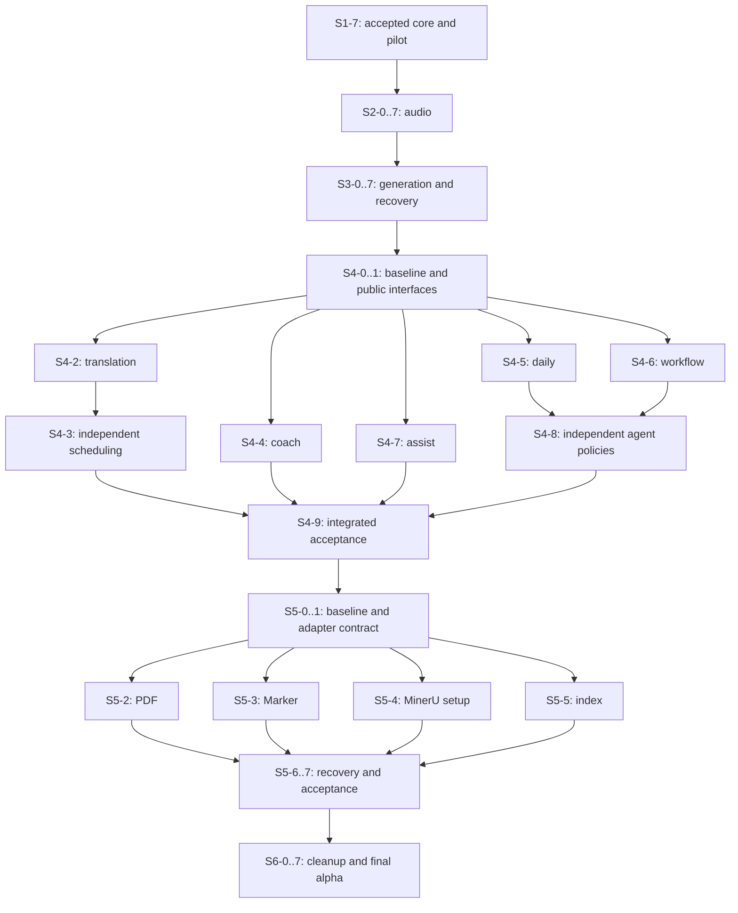
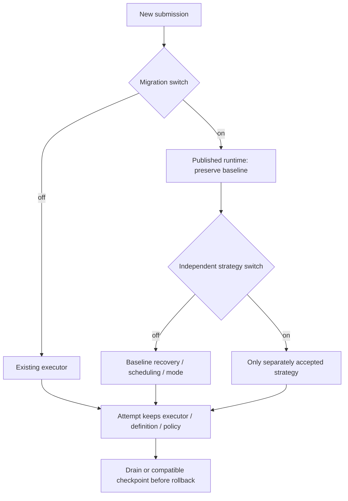

# Unified Job Runtime P2-P6 - Plan

## Goal Capsule

**Objective**：所有既有后台任务都能通过相同的公开入口查询、等待、控制和读取结果；新增普通任务只增加定义、业务执行器和必要详情。

**Means**：按已批准的 P2→P3→P4→P5→P6 顺序分批迁移，实施边界见 KTD1–KTD4。

**Authority**：[方案正文](plan.md)与入口页的已定决策决定产品范围；[代理规则](agent-rules.md)、[合并清单](review-checklist.md)决定实施/合并门禁。本文只细化后续步骤，不能覆盖原约束。

**Execution / landing**：在独立 alpha 分支开发；每个 S 步骤为可独立评审的工作包，接口差额先合并契约与 fixture，功能迁移只使用已发布接口。内核负责人协调公共文件；所有者决定合并和发布。

**Stop conditions**：前置验收未通过、公共接口尚未发布或依赖的 DSH 能力仍待核验时，阻断对应生产实现；允许提前只读研究，不把研究算作步骤完成。

本计划没有执行 P2–P6，也不改变 S1 的实施勾选。P1 仍以 [sprint-1.md](sprint-1.md) 的实际合并与验收为准。

| 阶段 | 步骤 | 数量 | 本阶段交付 |
|---|---|---:|---|
| P2 音频 | S2-0…S2-7 | 8 | 音频全路径接入及 alpha 验收 |
| P3 出题 | S3-0…S3-7 | 8 | 出题家族接入、重启可继续与提交核对 |
| P4 模型任务 | S4-0…S4-9 | 10 | 翻译、为你定制、每日总结、学习流、助手 |
| P5 非模型 | S5-0…S5-7 | 8 | PDF、安装、长配置与索引 |
| P6 清理护栏 | S6-0…S6-7 | 8 | 旧执行清理、通用接入证明与 alpha 总验收 |

后续共 **42** 个工作包，加上 S1-0…S1-7 的 8 个，共 **50** 个。编号表示工作包，不是工时估算；之后拆分只追加新编号，不重编号已领取步骤。

---

## Product Contract

### Summary

将既有任务逐家族接入 P1 已验收的统一运行时，再分别验收已批准的恢复、并发与执行策略改进。
Product Contract unchanged：产品行为和范围仍由 [plan.md](plan.md) 各节及 README 的已定决策拥有；以下 R-ID 只是阶段溯源，不新增产品规则。

### Problem Frame

原方案已有 P2–P6 的迁移顺序，但缺少可领取的工作包、具体依赖和验收证据。后续接手者需要能从一个步骤判断文件边界、旧行为与完成条件。

### Requirements

**任务迁移**

- R1. P2 完成音频家族迁移；范围与顺序绑定 [方案第六节](plan.md#六迁移顺序与阶段验收)，窗口领域语义绑定第二、四节。
- R2. P3 完成出题、补题、选区补题、修题与发布，并交付重启可见、可继续且不重复提交；绑定方案第六节及第五节恢复边界。
- R3. P4 完成翻译、为你定制、每日总结、学习流与助手迁移；翻译解除不必要串行、子代理优先及按天策略按原方案独立验收，既有 #234 行为保留。
- R4. P5 完成 PDF 转换、Marker 安装、MinerU 长配置和检索索引接入；副作用核对与重试承诺绑定方案第四、五、六节。

**共同行为和交付约束**

- R5. P6 删除无使用者的旧执行实现，交付新增普通任务无需增加内核类型分支的证明；必要历史读兼容和例外按方案第六、七、八节审定。
- R6. 全部工作遵守 [DSH 优先与唯一责任边界](plan.md#零dsh-优先复用宿主框架不重新构建)、[代理规则](agent-rules.md)和[审查清单](review-checklist.md)，包括先保持行为、独立策略开关、真实数据、测试/安全/PR 与 alpha 交付约定。

### Scope Boundaries

仅细化批准范围。不新增搜索引擎、会话系统、全能跨进程调度或第二张任务表；实时课堂连接、普通即时设置/导航和合法领域缓存继续按原方案归其子系统。正式版本发布属于后续独立验收。

---

## Planning Contract

### Key Technical Decisions

- KTD1. **一个续编入口，稳定双编号**：S2…S6 是仓库工作包编号，U1…U42 是本文定位编号；正文拥有实施说明，索引只导航。S1 仍在原 sprint 文件，不复制其目标内核。
- KTD2. **先核对实际已有能力**：每阶段基线冻结入口、实际 owner/资源实例、字段写入者和旧特征测试；公共接口缺口先走契约/fixture PR，不能由领域代理补平行实现。Governs R1–R6。
- KTD3. **迁移和改进分开**：新路径接纳开关默认关闭且只影响新提交。新增恢复/自动恢复、配额收敛、翻译调度和分功能 agent-preferred 策略各有独立开关、默认值、验收和回退；在途 Attempt 固定执行者、定义版本和必要策略快照。Governs R6；沿用方案第八节。
- KTD4. **共享文件串行、独立领域并行**：任务 executor/fixture 可按确认的不重叠文件分工；`lib/jobs/**`、`lib/runtime/builtins.js`、`lib/contexts/jobs/**`、`lib/job-contract.js`、领域共同入口/写入器与本目录由负责人整合。不同目录不是资源或保存互不冲突的证据。Governs R6。

### High-Level Technical Design

以下草图说明阶段依赖和开关边界。任务模型、状态与公共接口仍以原方案和已合并契约为准；实际接线按核验后的文件与资源边界确定。

生产入口的阶段门禁按原顺序执行：S1-7 → S2-7 → S3-7 → S4-9 → S5-7 → S6-7。阶段内依赖见各 U 的 Dependencies；基线只读研究可以提前，但仍须在最终 alpha 基线上复核并取得前置验收。

图中的扇出表示依赖就绪，写入并行仍受 KTD4 约束。P4 多条路径共用 `lib/contexts/generation/operations.js` / `lib/runtime/builtins.js` 时由一人整合；P5 PDF、Marker、MinerU setup 同触及 `lib/contexts/audio/convert.js`，不能分给不同代理同时写。索引还可能与资料发布共用资源锁。

### Existing Patterns and Execution-Time Gates

| 已有机制 | 源码与测试入口 | 后续实施边界 |
|---|---|---|
| 音频公共稳定身份和已完成产物复用 | `lib/contexts/jobs/operations.js`、`lib/audio-batch.js`；`tests/job-control-audio.test.mjs`、`tests/audio-batch.test.mjs` | 演进既有 ID/manifest 与 S1 兼容映射，不假设能力从零开始 |
| 窗口领域顺序与文本池 | `lib/audio-import.js` 的 orderedWindows、`lib/audio-pool.js`；`tests/audio-windows.test.mjs` | 领域上下文、排序和保存保留；worker 并发不等于 provider 许可 |
| 覆盖出题已有恢复 | `lib/contexts/generation/coverage-runs.js`、`coverage.recover`；`tests/coverage-run-exec.test.mjs` | 普通出题/case/repair/publish 的同等持久恢复须逐路径补证据 |
| 选区已有提交收据 | `lib/contexts/generation/selection.js`、`lib/contexts/bank/api.js`；`tests/selection-runtime.test.mjs`、`tests/bank-v2.test.mjs` | 复用 operationId/fingerprint/append receipt，不建立平行提交表 |
| 翻译/总结/助手已有执行与写入 | `lib/contexts/generation/translation-jobs.js`、`lib/contexts/notes/daily.js`、`lib/assist.js` / `lib/assist-child.js` | 旧排队、supersede、child 收尾先保持，再审定独立策略 |
| PDF/安装/索引既有副作用引用 | `lib/mineru-job.js`、`lib/marker-install.js`、`lib/retrieval-index.js` | 已完成 chunk、目录 sentinel、contentHash/sourceKey 与远端核对继续权威 |

DSH 证据沿用 [稳定行 ID 能力表](s1-0-dsh-capabilities.md#固定行-id-能力对照)：DSH-01 注册/作用域，02 校验，03 停止/超时，04 模型，05 子代理/导航，06 资源/限流，07 用量，08 存储/恢复，09 事件/通知。每个工作包引用所需行并复核实际安装版本、目标宿主和入口作用域；原表待核验不能代填为本阶段通过。

实际 StudyHub owner/controller、持有请求的真实停止、配额域、持久联合提交与子代理导航等未完成的核验，继续阻断其依赖步骤。字幕/复查/课堂保存的窗口缓存不证明完整输入可恢复；远端引用无法核对不授予自动重发能力。对应证据在实际实施步骤取得，不在本计划伪造。

---

## Implementation Units

每个工作包同时遵守 R6、KTD2–KTD4 和文末 Verification Contract。下列文件是经源码定位的实施入口；`lib/jobs/**` 等公共入口仍以 S1 最终发布路径为准。标为“拟新增”的测试/证据尚不存在，实施者先核对现有覆盖，只补缺口。

**Execution note（适用于各工作包）**：先在旧实现上通过特征测试，再接入新路径；新能力或缺陷先取得失败证据。各单元的具体场景与文末验证门禁共同决定通过条件。

| U / S | 工作包 | 主要文件 | Dependencies |
|---|---|---|---|
| U1 / S2-0 | 全音频基线与所有权表 | `lib/contexts/audio/operations.js` | S1-7 |
| U2 / S2-1 | 可恢复导入与重试完整接入 | `lib/contexts/audio/operations.js` | U1 (S2-0) |
| U3 / S2-2 | 批次与成员协调 | `lib/audio-batch.js` | U2 (S2-1) |
| U4 / S2-3 | 窗口与重复许可责任收敛 | `lib/audio-import.js` | U3 (S2-2) |
| U5 / S2-4 | 字幕导入 | `lib/contexts/audio/operations.js` | U4 (S2-3) |
| U6 / S2-5 | 校对复查与课堂后台校正边界 | `lib/contexts/audio/operations.js` | U5 (S2-4) |
| U7 / S2-6 | 课堂保存 | `lib/contexts/audio/operations.js` | U6 (S2-5) |
| U8 / S2-7 | 音频混跑、回退与 alpha 交付 | `lib/contexts/audio/operations.js` | U7 (S2-6) |
| U9 / S3-0 | 出题家族基线、恢复范围及契约差额 | `lib/contexts/generation/operations.js` | U8 (S2-7) |
| U10 / S3-1 | 先接现有队列、生命周期与模型入口 | `lib/contexts/generation/operations.js` | U9 (S3-0) |
| U11 / S3-2 | 稳定 Step 与领域 checkpoint/fill/reserve 身份 | `lib/batch.js` | U10 (S3-1) |
| U12 / S3-3 | 普通出题与覆盖运行重启继续 | `lib/contexts/generation/operations.js` | U11 (S3-2) |
| U13 / S3-4 | 选区补题与领域 operation 收据接入 | `lib/contexts/generation/selection-jobs.js` | U12 (S3-3) |
| U14 / S3-5 | 草稿修题 | `lib/contexts/generation/operations.js` | U13 (S3-4) |
| U15 / S3-6 | 发布与所有产物提交核对 | `lib/contexts/generation/operations.js` | U14 (S3-5) |
| U16 / S3-7 | 出题全家族集成、回退与 alpha 交付 | `lib/contexts/generation/operations.js` | U15 (S3-6) |
| U17 / S4-0 | 模型任务基线与入口清单 | `lib/contexts/generation/translation-jobs.js` | U16 (S3-7) |
| U18 / S4-1 | 模型任务契约差额与共享接线门禁 | `docs/job-contract.md` | U17 (S4-0) |
| U19 / S4-2 | 翻译先保持原排队行为接入 | `lib/contexts/generation/translation-jobs.js` | U18 (S4-1) |
| U20 / S4-3 | 翻译解除不必要串行的独立策略 | `lib/contexts/generation/translation-jobs.js` | U19 (S4-2) |
| U21 / S4-4 | 为你定制与按天聚合接入 | `lib/contexts/coach/worker.js` | U18 (S4-1) |
| U22 / S4-5 | 每日总结接入并保留替换语义 | `lib/contexts/notes/daily.js` | U18 (S4-1) |
| U23 / S4-6 | 学习流接入并保留领域步骤 | `lib/contexts/workflows/operations.js` | U18 (S4-1) |
| U24 / S4-7 | 助手与既有 child 生命周期接入 | `lib/assist.js` | U18 (S4-1) |
| U25 / S4-8 | 每日总结与学习流的子代理优先策略 | `lib/contexts/notes/daily-generation.js` | U22 (S4-5), U23 (S4-6) |
| U26 / S4-9 | 模型任务混跑与 alpha 验收 | `lib/contexts/jobs/operations.js` | U19 (S4-2), U20 (S4-3), U21 (S4-4), U22 (S4-5), U23 (S4-6), U24 (S4-7), U25 (S4-8) |
| U27 / S5-0 | 非模型任务与副作用基线 | `lib/contexts/audio/convert.js` | U26 (S4-9) |
| U28 / S5-1 | 非模型执行与能力契约差额 | `docs/job-contract.md` | U27 (S5-0) |
| U29 / S5-2 | PDF 云端与本地转换接入 | `lib/contexts/audio/convert.js` | U28 (S5-1) |
| U30 / S5-3 | Marker 安装接入 | `lib/marker-install.js` | U28 (S5-1) |
| U31 / S5-4 | MinerU 长配置与模型准备接入 | `lib/contexts/audio/convert.js` | U28 (S5-1) |
| U32 / S5-5 | 检索索引后台构建接入 | `lib/contexts/generation/retrieval-operations.js` | U28 (S5-1) |
| U33 / S5-6 | 未知副作用与停止恢复集成矩阵 | `lib/mineru-job.js` | U29 (S5-2), U30 (S5-3), U31 (S5-4), U32 (S5-5) |
| U34 / S5-7 | 非模型混跑与 alpha 验收 | `lib/contexts/jobs/operations.js` | U33 (S5-6) |
| U35 / S6-0 | 迁移覆盖与例外清单复核 | `lib/runtime/builtins.js` | U34 (S5-7) |
| U36 / S6-1 | 旧契约、ID 与扩展消费方兼容核对 | `lib/job-contract.js` | U35 (S6-0) |
| U37 / S6-2 | 删除无使用者的旧执行实现 | `lib/runtime/tasks.js` | U36 (S6-1) |
| U38 / S6-3 | 结构与 API 边界护栏 | `tests/architecture-boundaries.test.mjs` | U37 (S6-2) |
| U39 / S6-4 | 新增普通任务的最小接入证明 | `tests/fixtures/unified-runtime-contract.mjs` | U38 (S6-3) |
| U40 / S6-5 | 全家族控制台与兼容回归 | `lib/contexts/jobs/operations.js` | U39 (S6-4) |
| U41 / S6-6 | 最终读兼容与指定版本回退 | `docs/job-contract.md` | U40 (S6-5) |
| U42 / S6-7 | 统一运行时 alpha 总验收与交付 | `docs/plans/unified-job-runtime/README.md` | U41 (S6-6) |

### U1. S2-0

**Goal**：全音频基线与所有权表。

**Requirements**：R1、R6；KTD2–KTD4。

**Dependencies**：S1-7。

**Files / patterns**：`lib/contexts/audio/operations.js`、`lib/contexts/audio/worker.js`、`lib/audio-batch.js`。

**Tests**：复用 `tests/audio-single-characterization.test.mjs`、`tests/audio-batch.test.mjs`、`tests/job-control-audio.test.mjs`。拟新增（只补当前覆盖缺口）`tests/audio-family-characterization.test.mjs`。

**Approach**：为 import/retry/batch/subtitle/review/classroom-save 逐入口记录资源、Call/账本、输入持久性、提交、通知、archive/dismiss/cleanup 责任；补缺口 characterization。现有测试见上表。

**DSH map**：DSH-01 / DSH-03 / DSH-04 / DSH-06 / DSH-07 / DSH-08 / DSH-09；能力与自写边界的实际证据随本步 PR 提交。

**Test scenarios / acceptance**：

- 无效输入在 job/模型请求前拒绝。
- 相同输入的 source ID、顺序、请求数、用量与通知逐项锁定。
- 旧/public retry ID 与 archive/unarchive/dismiss 行为都有 fixture。
- 不能恢复的 subtitle/review/live 输入如实记录，未观察字段不填零。

**Verification / deliverables**：经评审的接入或基线记录、所列回归与新测试证据、字段/调用点去留表；本步 PR、验证 SHA 与下一步交接。

### U2. S2-1

**Goal**：可恢复导入与重试完整接入。

**Requirements**：R1、R6；KTD2–KTD4。

**Dependencies**：U1 (S2-0)。

**Files / patterns**：`lib/contexts/audio/operations.js`、`lib/contexts/audio/worker.js`、`lib/audio-batch.js`。

**Tests**：复用 `tests/audio-retry.test.mjs`、`tests/audio-single-characterization.test.mjs`。拟新增（只补当前覆盖缺口）`tests/unified-runtime-audio-import.test.mjs`。

**Approach**：audio.import/retry、legacy recovery relink、upload 与 manifest 的公共接入；生命周期元字段与领域字段去留表。

**DSH map**：DSH-01 / DSH-03 / DSH-04 / DSH-06 / DSH-07 / DSH-08 / DSH-09；能力与自写边界的实际证据随本步 PR 提交。

**Test scenarios / acceptance**：

- public stable jobId/new attempt 与 legacy record ID 查询兼容。
- 已完成转录/窗口复用、累计与本次用量不重复。
- 输入变化、缺失、版本不兼容/仍存活执行者拒绝恢复。
- 提交已发生但 manifest/终态失败时核对产物，一次完成通知且不重复发布。

**Verification / deliverables**：经评审的接入或基线记录、所列回归与新测试证据、字段/调用点去留表；本步 PR、验证 SHA 与下一步交接。

### U3. S2-2

**Goal**：批次与成员协调。

**Requirements**：R1、R6；KTD2–KTD4。

**Dependencies**：U2 (S2-1)。

**Files / patterns**：`lib/audio-batch.js`、`lib/audio-job.js`、`lib/contexts/audio/worker.js`。

**Tests**：复用 `tests/audio-batch.test.mjs`、`tests/audio-concurrency.test.mjs`。拟新增（只补当前覆盖缺口）`tests/unified-runtime-audio-batch.test.mjs`。

**Approach**：startBatch/executeAudioBatch 委托公共执行与资源；保留 batchDocuments、member 指纹/result digest、skip 与部分失败规则。

**DSH map**：DSH-01 / DSH-03 / DSH-04 / DSH-06 / DSH-07 / DSH-08 / DSH-09；能力与自写边界的实际证据随本步 PR 提交。

**Test scenarios / acceptance**：

- 反向完成仍按提交顺序组装，保留文件边界与长稿分卷。
- 单录音/批次混跑共享同一宿主转录槽且无父持槽等待子死锁。
- 重复 hash 仅处理一次、失败/skip 只重做需要部分。
- 崩溃孤儿结果通过身份/digest 校验后复用，坏结果与变更输入拒绝发布。

**Verification / deliverables**：经评审的接入或基线记录、所列回归与新测试证据、字段/调用点去留表；本步 PR、验证 SHA 与下一步交接。

### U4. S2-3

**Goal**：窗口与重复许可责任收敛。

**Requirements**：R1、R6；KTD2–KTD4。

**Dependencies**：U3 (S2-2)。

**Files / patterns**：`lib/audio-import.js`、`lib/audio-pool.js`、`lib/audio-job.js`、`lib/audio-batch.js`。

**Tests**：复用 `tests/audio-windows.test.mjs`、`tests/audio-pool.test.mjs`、`tests/audio-pool-adaptive.test.mjs`。拟新增（只补当前覆盖缺口）`tests/unified-runtime-audio-windows.test.mjs`。

**Approach**：orderedWindows 保留领域排序/上下文，只替换重复派发/实际许可实现；pool/retry/格式修复去留表；转录 gate 与 atomic writer 的迁移例外更新。

**DSH map**：DSH-01 / DSH-03 / DSH-04 / DSH-06 / DSH-07 / DSH-08 / DSH-09；能力与自写边界的实际证据随本步 PR 提交。

**Test scenarios / acceptance**：

- 乱序完成即 checkpoint、按源序 collect，校对完成后才翻译。
- 一起开始的窗口不读彼此未完成上下文，后续窗口读已完成上下文。
- 取消/致命错误 abort 并 settle siblings，不启动后续窗口，保存成功窗口。
- 429 降额/退避/回升由唯一层负责，实际请求峰值与旧录音/批次上限一致，共享配额改进关时保持基线。

**Verification / deliverables**：经评审的接入或基线记录、所列回归与新测试证据、字段/调用点去留表；本步 PR、验证 SHA 与下一步交接。

### U5. S2-4

**Goal**：字幕导入。

**Requirements**：R1、R6；KTD2–KTD4。

**Dependencies**：U4 (S2-3)。

**Files / patterns**：`lib/contexts/audio/operations.js`、`lib/subtitle-job.js`、`lib/subtitles.js`。

**Tests**：复用 `tests/subtitles.test.mjs`、`tests/subtitle-review-flow.test.mjs`。拟新增（只补当前覆盖缺口）`tests/unified-runtime-subtitles.test.mjs`。

**Approach**：audio.subtitles.import 定义与 executor；复用 prepareSubtitles、subtitleSourceId、finishTranscript。

**DSH map**：DSH-01 / DSH-03 / DSH-04 / DSH-06 / DSH-07 / DSH-08 / DSH-09；能力与自写边界的实际证据随本步 PR 提交。

**Test scenarios / acceptance**：

- SRT/VTT/BCC/timestamped 输入与标签、标点保持。
- 不请求转录、不消耗音频转录额度、不等待转录槽。
- 重复内容与相同文本策略复用，改变文字/策略只失效对应缓存。
- 取消、文本失败与未知用量正确归属；若新增 restart 输入持久化，另开策略测试且默认关，不把窗口缓存当整任务可恢复证明。

**Verification / deliverables**：经评审的接入或基线记录、所列回归与新测试证据、字段/调用点去留表；本步 PR、验证 SHA 与下一步交接。

### U6. S2-5

**Goal**：校对复查与课堂后台校正边界。

**Requirements**：R1、R6；KTD2–KTD4。

**Dependencies**：U5 (S2-4)。

**Files / patterns**：`lib/contexts/audio/operations.js`、`lib/audio-review.js`、`lib/live-correction.js`。

**Tests**：复用 `tests/audio-review.test.mjs`、`tests/live-correction.test.mjs`。拟新增（只补当前覆盖缺口）`tests/unified-runtime-audio-review.test.mjs`。

**Approach**：audio.corrections.review 公共定义；live.correct/background 的后台单元按会话域协调接入、保留 RollingCorrection cursor/version，连接仍归 LiveSession。

**DSH map**：DSH-01 / DSH-03 / DSH-04 / DSH-06 / DSH-07 / DSH-08 / DSH-09；能力与自写边界的实际证据随本步 PR 提交。

**Test scenarios / acceptance**：

- 确认项同时更新原文/对应译文，unsafe/unsure 保留且旧分隔符字节不变。
- 第二批失败/取消保留首批提交，不重复应用。
- 迟到结果或句子版本冲突不能覆盖新句，未知 IDs/无引用笔记拒绝。
- 宿主 child 不可用明确反馈、不伪造会话、不卡住课堂批次覆盖，背景请求只记一次 Call/用量。

**Verification / deliverables**：经评审的接入或基线记录、所列回归与新测试证据、字段/调用点去留表；本步 PR、验证 SHA 与下一步交接。

### U7. S2-6

**Goal**：课堂保存。

**Requirements**：R1、R6；KTD2–KTD4。

**Dependencies**：U6 (S2-5)。

**Files / patterns**：`lib/contexts/audio/operations.js`、`lib/live-job.js`、`lib/live.js`。

**Tests**：复用 `tests/live.test.mjs`、`tests/live-correction.test.mjs`。拟新增（只补当前覆盖缺口）`tests/unified-runtime-live-save.test.mjs`。

**Approach**：proofread live.save executor 与稳定提交 key/校正快照引用；quick save 保留即时领域接口；storeLiveNotes、liveSourceId 复用。

**DSH map**：DSH-01 / DSH-03 / DSH-04 / DSH-06 / DSH-07 / DSH-08 / DSH-09；能力与自写边界的实际证据随本步 PR 提交。

**Test scenarios / acceptance**：

- 活跃课堂、校正未覆盖、背景未完成、空内容均按基线拒绝保存。
- proofread 仍重译修正稿，quick 保留课堂时间线/译文/笔记与课程。
- 重复保存及保存后 checkpoint 崩溃只发布一次，不复活删除/归档会话。
- 取消后台保存不关闭或重建课堂连接，当前转录 gate 等待保持；要取消该等待须另开资源策略开关/验收。

**Verification / deliverables**：经评审的接入或基线记录、所列回归与新测试证据、字段/调用点去留表；本步 PR、验证 SHA 与下一步交接。

### U8. S2-7

**Goal**：音频混跑、回退与 alpha 交付。

**Requirements**：R1、R6；KTD2–KTD4。

**Dependencies**：U7 (S2-6)。

**Files / patterns**：`lib/contexts/audio/operations.js`、`lib/contexts/jobs/operations.js`。

**Tests**：复用 `tests/job-control-audio.test.mjs`、`tests/job-output-audio.test.mjs`。拟新增（只补当前覆盖缺口）`tests/unified-runtime-audio-family.test.mjs`。

**Approach**：完整路径×开关×策略×恢复矩阵、旧旁路移除/剩余表、宿主最小验证、指定回退 SHA、alpha release 收据。

**DSH map**：DSH-01 / DSH-03 / DSH-04 / DSH-06 / DSH-07 / DSH-08 / DSH-09；能力与自写边界的实际证据随本步 PR 提交。

**Test scenarios / acceptance**：

- 同一 baseline fixture 开关关/开产物与可见行为一致，策略改进单独比较。
- 旧/新单录音、batch、字幕、复查、save 混跑无双计数/重试/结算。
- 开关切换不改变在途 attempt，停止接纳/排空或兼容 checkpoint 后回退，分别验证产物可读与未完成可继续。
- 公共控制台控制/游标输出/通知能力真实、无假按钮；verify/产物/宿主/授权质量抽检缺任一项保持待验收。

**Verification / deliverables**：经评审的接入或基线记录、所列回归与新测试证据、字段/调用点去留表；阶段混跑、指定版本回退与 alpha 发布证据。

### U9. S3-0

**Goal**：出题家族基线、恢复范围及契约差额。

**Requirements**：R2、R6；KTD2–KTD4。

**Dependencies**：U8 (S2-7)。

**Files / patterns**：`lib/contexts/generation/operations.js`、`lib/contexts/generation/selection-jobs.js`、`lib/coverage-run.js`。

**Tests**：复用 `tests/generation-lifecycle.test.mjs`、`tests/generation-fill-service.test.mjs`、`tests/coverage-run-exec.test.mjs`。拟新增（只补当前覆盖缺口）`tests/generation-family-characterization.test.mjs`。

**Approach**：入口/实际队列/草稿与 deck 版本/保存授权/检查点/通知表；区分现有 coverage、selection 续做与其他缺口。恢复矩阵逐行列出 plain/mixed/case 首份草稿前、`resumeDraftId`/`extraSourceIds` 补题、target supplement、coverage、selection、`draft.repair`、`draft.publish.start`：持久输入、输入/产物版本、提交引用、继续方式、负责步骤与验证证据。每行都须交付重启可见且可继续；缺口由 S3-2…S3-6 补齐，不能仅以 coverage 样本或“不支持”结论通过 P3。

**DSH map**：DSH-01 / DSH-03 / DSH-04 / DSH-06 / DSH-07 / DSH-08 / DSH-09；能力与自写边界的实际证据随本步 PR 提交。

**Test scenarios / acceptance**：

- 补题仍同草稿/指定题组，已有卡 ID/学习进度与 mergeTarget 不变。
- fillRounds、reserve、coverage budget/pause 与停止条件锁定。
- 已有重启恢复及 ordinary 无同等恢复的边界逐项记录。
- partial/complete/失败、budget 收尾、用户取消优先及 owner 卸载表述不互相混淆。

**Verification / deliverables**：经评审的接入或基线记录、所列回归与新测试证据、字段/调用点去留表；本步 PR、验证 SHA 与下一步交接。

### U10. S3-1

**Goal**：先接现有队列、生命周期与模型入口。

**Requirements**：R2、R6；KTD2–KTD4。

**Dependencies**：U9 (S3-0)。

**Files / patterns**：`lib/contexts/generation/operations.js`、`lib/batch.js`、`lib/generation.js`。

**Tests**：复用 `tests/generation-lifecycle.test.mjs`、`tests/generation-settings-runtime.test.mjs`、`tests/generation-stage-effort.test.mjs`。拟新增（只补当前覆盖缺口）`tests/unified-runtime-generation-queue.test.mjs`。

**Approach**：generate/fill/target supplement 的提交适配与实际 queues(root) 委托；step/call 归属、旧 retry/计量包装去留表。

**DSH map**：DSH-01 / DSH-03 / DSH-04 / DSH-06 / DSH-07 / DSH-08 / DSH-09；能力与自写边界的实际证据随本步 PR 提交。

**Test scenarios / acceptance**：

- 新旧出题/选区/repair/publish 共用一个实际 library 队列，原必要互斥不变。
- 排队取消不启动执行器，观察 wait 到期不取消。
- 所有模型调用经 gateway，档位/执行方式/用量归属唯一，停用 owner 不影响 sibling。
- 已启动 attempt 切换开关不重提，已有 draft checkpoint 语义不随此步改变。

**Verification / deliverables**：经评审的接入或基线记录、所列回归与新测试证据、字段/调用点去留表；本步 PR、验证 SHA 与下一步交接。

### U11. S3-2

**Goal**：稳定 Step 与领域 checkpoint/fill/reserve 身份。

**Requirements**：R2、R6；KTD2–KTD4。

**Dependencies**：U10 (S3-1)。

**Files / patterns**：`lib/batch.js`、`lib/generation.js`、`lib/coverage-run.js`、`lib/contexts/generation/coverage-runs.js`。

**Tests**：复用 `tests/generation-fill-rounds.test.mjs`、`tests/generation-yield.test.mjs`、`tests/generation-rescue.test.mjs`。拟新增（只补当前覆盖缺口）`tests/unified-runtime-generation-checkpoint.test.mjs`。

**Approach**：给既有计划、轮次、分段、author/review/repair/fill/reserve 建稳定 key 与 checkpoint 引用；复用 draft editorial/selection records，保留领域候选与 reserve，公共元信息不另建事实来源。按 S3-0 恢复矩阵冻结持久输入与版本；无安全中间 checkpoint 的路径可验证从头重试，不为同等恢复承诺虚增暂停能力。

**DSH map**：DSH-01 / DSH-03 / DSH-04 / DSH-06 / DSH-07 / DSH-08 / DSH-09；能力与自写边界的实际证据随本步 PR 提交。

**Test scenarios / acceptance**：

- 同逻辑 Job 新 attempt 不改变已完成 Step key，输入/定义改变使相应 checkpoint 无效。
- 首 pass 先保存再 fill，fillRounds=0/1/上限行为与只补 gap 一致。
- 两并行 part 不领取同 reserve target、已拒 objective 不重计划，happy path 无额外请求。
- 乱序回调/旧 attempt 无权提交，partial 用结果字段，不把业务 round 状态当公共生命周期。

**Verification / deliverables**：经评审的接入或基线记录、所列回归与新测试证据、字段/调用点去留表；本步 PR、验证 SHA 与下一步交接。

### U12. S3-3

**Goal**：普通出题与覆盖运行重启继续。

**Requirements**：R2、R6；KTD2–KTD4。

**Dependencies**：U11 (S3-2)。

**Files / patterns**：`lib/contexts/generation/operations.js`、`lib/contexts/generation/coverage-runs.js`、`lib/coverage-run.js`。

**Tests**：复用 `tests/coverage-run-exec.test.mjs`、`tests/generation-rescue.test.mjs`。拟新增（只补当前覆盖缺口）`tests/unified-runtime-generation-recovery.test.mjs`。

**Approach**：演进 coverage.recover/newMarker/resumedMarker，补普通 generation/case、补题与 target supplement 的实际恢复输入；新增 restart continuation 开关默认关。对 S3-0 矩阵中本步负责的每行，验证从头重试或 checkpoint 续做、相同 logicalJob/newAttempt 与领域提交核对。

**DSH map**：DSH-01 / DSH-03 / DSH-04 / DSH-06 / DSH-07 / DSH-08 / DSH-09；能力与自写边界的实际证据随本步 PR 提交。

**Test scenarios / acceptance**：

- 首份草稿前退出，以及 `resumeDraftId`/`extraSourceIds` 补题和 target supplement 中途退出后，任务 interrupted 可见、无自动模型调用；用户继续保留逻辑 ID并建新 attempt，使用原持久输入而非当前 UI 焦点。
- coverage 只重跑在途 round、跳过 done，ordinary 只做未确认单元，恢复不得重复草稿或 scenario material。
- 执行者仍活、source/draft 缺失/变化、schema 不兼容/损坏均拒绝恢复。
- 重复恢复/双继续仅一 active attempt，保留累计用量、原请求数量与 existing objectives。

**Verification / deliverables**：经评审的接入或基线记录、所列回归与新测试证据、字段/调用点去留表；本步 PR、验证 SHA 与下一步交接。

### U13. S3-4

**Goal**：选区补题与领域 operation 收据接入。

**Requirements**：R2、R6；KTD2–KTD4。

**Dependencies**：U12 (S3-3)。

**Files / patterns**：`lib/contexts/generation/selection-jobs.js`、`lib/contexts/generation/selection.js`、`lib/contexts/bank/api.js`。

**Tests**：复用 `tests/selection-jobs.test.mjs`、`tests/selection-runtime.test.mjs`、`tests/bank-v2.test.mjs`。拟新增（只补当前覆盖缺口）`tests/unified-runtime-selection.test.mjs`。

**Approach**：createSelectionJobs 生命周期/网关委托；保留 selectionJobs 的候选、review、operationId/fingerprint；bank append receipt 与公共 Job/Attempt 对应表。

**DSH map**：DSH-01 / DSH-03 / DSH-04 / DSH-06 / DSH-07 / DSH-08 / DSH-09；能力与自写边界的实际证据随本步 PR 提交。

**Test scenarios / acceptance**：

- same operationId/same request 重放，一次 append；不同请求同 ID明确冲突。
- 同 passage/deck 拒绝并发重复，别的 passage/deck 按既有队列。
- review failed 重审候选不重写，version conflict 复用 approved 候选，receipt 存在时先重放而非先拒旧材料。
- cancel 等锁/answer 阶段防新提交，提交后 operation 状态保存失败可由 receipt 对账恢复，保留目标 schedule。

**Verification / deliverables**：经评审的接入或基线记录、所列回归与新测试证据、字段/调用点去留表；本步 PR、验证 SHA 与下一步交接。

### U14. S3-5

**Goal**：草稿修题。

**Requirements**：R2、R6；KTD2–KTD4。

**Dependencies**：U13 (S3-4)。

**Files / patterns**：`lib/contexts/generation/operations.js`、`lib/runtime/jobs.js`。

**Tests**：复用 `tests/generation-repair.test.mjs`、`tests/generation-yield.test.mjs`、`tests/review-integrity.test.mjs`。拟新增（只补当前覆盖缺口）`tests/unified-runtime-draft-repair.test.mjs`。

**Approach**：draft.repair executor 委托队列/生命周期/网关；继续以 draft.save+reviewedCardFingerprint 保留逐卡结果。交付 S3-0 矩阵中的 repair 重启可见与可继续，持久化并核对原草稿/卡/缺陷输入；新增恢复策略独立验收，不能将其留作 P3 之外的可选改进。

**DSH map**：DSH-01 / DSH-03 / DSH-04 / DSH-06 / DSH-07 / DSH-08 / DSH-09；能力与自写边界的实际证据随本步 PR 提交。

**Test scenarios / acceptance**：

- 可修字段遵循缺陷，不修 sourceSupport 等无依据问题，答案不允许移动。
- 每卡独立复审通过才保存，失败其他卡仍保留，partial → result.completeness。
- 草稿被删除/版本改变、旧 attempt 修好迟到不能复活或覆盖。
- 修题开始前、逐卡保存前/后退出均可从相同逻辑 Job 新建 attempt 继续；已完成卡不重复调用，未确认卡重新核验，取消保留已审阅保存而不发布。

**Verification / deliverables**：经评审的接入或基线记录、所列回归与新测试证据、字段/调用点去留表；本步 PR、验证 SHA 与下一步交接。

### U15. S3-6

**Goal**：发布与所有产物提交核对。

**Requirements**：R2、R6；KTD2–KTD4。

**Dependencies**：U14 (S3-5)。

**Files / patterns**：`lib/contexts/generation/operations.js`、`lib/runtime/jobs.js`、`lib/contexts/bank/api.js`。

**Tests**：复用 `tests/publication-context.test.mjs`、`tests/review-integrity.test.mjs`、`tests/bank-v2.test.mjs`。拟新增（只补当前覆盖缺口）`tests/unified-runtime-generation-commit.test.mjs`。

**Approach**：draft.publish.start、supplement 自动发布、case quick publish 的生命周期接入及领域提交核对；扩展原领域 receipt，不能建立第二份产物事实表。交付 S3-0 矩阵中的 publish 重启恢复：持久化发布授权、输入版本和提交引用，恢复前先核对既有产物。

**DSH map**：DSH-01 / DSH-03 / DSH-04 / DSH-06 / DSH-07 / DSH-08 / DSH-09；能力与自写边界的实际证据随本步 PR 提交。

**Test scenarios / acceptance**：

- 保存前核对 draftVersion/target/source/review 指纹与当前 attempt，未知副作用先核对不盲重发。
- 产物提交前、提交后 checkpoint 前、终态/通知前崩溃与重复恢复均不重复 deck/card/source。
- 补题追加原 target、保留 ID/学习记录与剩余 rejected 草稿，不误作新建。
- budget receipt-only finalize 仅在已授权已审阅 checkpoint 上运行，用户取消优先，通知失败不改成功终态。

**Verification / deliverables**：经评审的接入或基线记录、所列回归与新测试证据、字段/调用点去留表；本步 PR、验证 SHA 与下一步交接。

### U16. S3-7

**Goal**：出题全家族集成、回退与 alpha 交付。

**Requirements**：R2、R6；KTD2–KTD4。

**Dependencies**：U15 (S3-6)。

**Files / patterns**：`lib/contexts/generation/operations.js`、`lib/contexts/jobs/operations.js`。

**Tests**：复用 `tests/generation-fill-rounds.test.mjs`、`tests/coverage-run-exec.test.mjs`、`tests/job-output.test.mjs`。拟新增（只补当前覆盖缺口）`tests/unified-runtime-generation-family.test.mjs`。

**Approach**：queue→checkpoint→restart→commit 全链路矩阵、fill/reserve 回归、console/output/action 映射、旧例外清单、回退与 alpha 收据。

**DSH map**：DSH-01 / DSH-03 / DSH-04 / DSH-06 / DSH-07 / DSH-08 / DSH-09；能力与自写边界的实际证据随本步 PR 提交。

**Test scenarios / acceptance**：

- 同 fixtures 新/旧入口与新策略关/开分别验证，请求数、候选/approved 卡、顺序、档位、用量和通知差异可解释。
- generate/fill/selection/repair/publish 混跑既有互斥与同配额资源生效，无新增 jobs/queue/retry/bypass。
- S3-0 恢复矩阵每行都有真实退出/重启证据，任务可见且能继续、一次结算/提交/通知、旧 attempt 迟到不影响新尝试；任一纳入 P3 的路径缺失即保持待验收，不能以 coverage 通过替代整个家族。
- 按固定 tag/SHA 关闭接纳/排空或 checkpoint 后回退，分别声明已完成可读与未完成可继续范围；正式 main 的进度不因 alpha 文档或发布而改变。

**Verification / deliverables**：经评审的接入或基线记录、所列回归与新测试证据、字段/调用点去留表；阶段混跑、指定版本回退与 alpha 发布证据。

### U17. S4-0

**Goal**：模型任务基线与入口清单。

**Requirements**：R3、R6；KTD2–KTD4。

**Dependencies**：U16 (S3-7)。

**Files / patterns**：`lib/contexts/generation/translation-jobs.js`、`lib/contexts/materials/translation-operations.js`、`lib/contexts/coach/worker.js`、`lib/contexts/notes/daily.js`、`lib/contexts/workflows/operations.js`、`lib/assist.js`。

**Tests**：复用 `tests/translation-jobs.test.mjs`、`tests/coach-daily.test.mjs`、`tests/daily-recap.test.mjs`、`tests/workflows.test.mjs`、`tests/assist-host.test.mjs`。拟新增（只补当前覆盖缺口）`tests/model-family-characterization.test.mjs`。

**Approach**：逐入口记录任务身份、实际 queue/owner、内容版本、提示与档位、取消收尾、Call/账本、产物和通知。保留 #234 已有按天聚合，不把它写成尚待发明的能力。

**DSH map**：DSH-01 / DSH-04 / DSH-05 / DSH-07；能力与自写边界的实际证据随本步 PR 提交。

**Test scenarios / acceptance**：

- 同一合成库通过面板和现有工具发起翻译/备题/总结/学习流/助手，锁定相同产物及可见字段。
- 翻译当前等待 queues(root)，每日总结 supersede 旧 generation，助手旧 tasks/child 状态逐项记录。
- 提交后切换当前文档、日期、workflow step、session 或模型设置，不改变已排队/恢复任务的原输入上下文；新提交才取得新的设置。翻译 revision/scope/target/comment、总结 fingerprint/tone/final、助手 ref/digest/session/route 与流程 currentStep 都列入快照核对。
- 没有宿主 child 或缺少模型观测时，记录实际拒绝/回退和 unknown，不能把 fake 成功算宿主能力。

**Verification / deliverables**：P4 行为清单、旧实现通过的特征测试、入口/写入者/旁路表与契约差额。

### U18. S4-1

**Goal**：模型任务契约差额与共享接线门禁。

**Requirements**：R3、R6；KTD2–KTD4。

**Dependencies**：U17 (S4-0)。

**Files / patterns**：`docs/job-contract.md`、`lib/runtime/builtins.js`、`lib/host-capabilities.js`。

**Tests**：复用 `tests/unified-runtime-contract.test.mjs`、`tests/host-ownership.test.mjs`。拟新增（只补当前覆盖缺口）`tests/unified-runtime-model-definitions.test.mjs`。

**Approach**：把各任务的 purpose、feature、可用动作、owner、executionMode 和结果引用对齐已发布内核；缺口先由内核负责人提交契约/fixture 并合并，已有接口满足时不制造空壳接口。

**DSH map**：DSH-01 / DSH-02 / DSH-04 / DSH-05 / DSH-09；能力与自写边界的实际证据随本步 PR 提交。

**Test scenarios / acceptance**：

- 每条旧工具/API/控制台动作都映射已发布能力；不支持的暂停/恢复给出拒绝原因。
- 同库不同 session 保持已有库级查看控制范围；extension owner/domain 隔离不扩大。
- 直接调用、现有 child 执行与 proposed agent-preferred 对同一 Job/Attempt/Step 的归属可校验。

**Verification / deliverables**：能力和调用点矩阵、已合并契约差额或无需扩展的证据、中央接线归属。

### U19. S4-2

**Goal**：翻译先保持原排队行为接入。

**Requirements**：R3、R6；KTD2–KTD4。

**Dependencies**：U18 (S4-1)。

**Files / patterns**：`lib/contexts/generation/translation-jobs.js`、`lib/contexts/materials/translation-operations.js`、`lib/translation.js`、`lib/passage-translation.js`。

**Tests**：复用 `tests/translation-jobs.test.mjs`、`tests/job-control-translation.test.mjs`、`tests/materials-translation.test.mjs`。拟新增（只补当前覆盖缺口）`tests/unified-runtime-translation.test.mjs`。

**Approach**：长译文和选区/资料翻译共用已发布生命周期与网关；仍委托原 queues(root) 和必要资料写锁，保留原分段、复用、修复、档位和保存规则。

**DSH map**：DSH-03 / DSH-04 / DSH-06 / DSH-07；能力与自写边界的实际证据随本步 PR 提交。

**Test scenarios / acceptance**：

- 新旧开关两路对同一文档输出相同段落和已有译文复用结果，不提前改变出题先后顺序。
- 排队取消不调用模型；执行预算停止后不提交迟到译文，观察者 wait 到期不取消任务。
- 资料内容/版本改变使旧 attempt 写回被拒绝，成功段落在后续段失败时仍保留。
- 多个资料入口的实际请求仅由网关计量一次，旧计量和传输 retry 包装按去留表退出。

**Verification / deliverables**：翻译接入 PR、双路径行为与取消/版本/用量证据、旧调用点委托清单。

### U20. S4-3

**Goal**：翻译解除不必要串行的独立策略。

**Requirements**：R3、R6；KTD2–KTD4。

**Dependencies**：U19 (S4-2)。

**Files / patterns**：`lib/contexts/generation/translation-jobs.js`、`lib/runtime/work.js`、`lib/contexts/generation/operations.js`。

**Tests**：复用 `tests/translation-jobs.test.mjs`、`tests/generation-lifecycle.test.mjs`。拟新增（只补当前覆盖缺口）`tests/unified-runtime-translation-scheduling.test.mjs`。

**Approach**：在独立且默认关闭的策略下，把不共享资料/草稿写入的翻译从整库出题等待中解开；必要资源与数据互斥继续委托同一调度责任层。此开关不跟随翻译迁移开启。

**DSH map**：DSH-01 / DSH-06；能力与自写边界的实际证据随本步 PR 提交。

**Test scenarios / acceptance**：

- 策略关闭时保持 S4-0 队列顺序；开启时两个无共同写目标的任务能够重叠执行。
- 相同 document/draft 或保存顺序有依赖时仍互斥，取消等待者不影响在途写入者。
- 同实际配额域新旧混跑总占用不超限，429 双向冷却，其他配额域不误阻塞。
- 运行中切换策略不替换在途 attempt 的执行者或提交计划；关闭后后续派发回到已验收行为。

**Verification / deliverables**：数据依赖/资源键表、独立开关与回退说明、实际重叠/互斥/峰值断言。

### U21. S4-4

**Goal**：为你定制与按天聚合接入。

**Requirements**：R3、R6；KTD2–KTD4。

**Dependencies**：U18 (S4-1)。

**Files / patterns**：`lib/contexts/coach/worker.js`、`lib/contexts/coach/operations.js`、`lib/coach.js`、`lib/coach-daily.js`。

**Tests**：复用 `tests/coach.test.mjs`、`tests/coach-daily.test.mjs`、`tests/coach-daily-ui.test.mjs`。拟新增（只补当前覆盖缺口）`tests/unified-runtime-coach.test.mjs`。

**Approach**：迁移备题执行、控制和调用归属；沿用 coach-daily 的既有按库 writer、日期/批次聚合和卡片投影，领域账本不是新的公共 jobs 表。

**DSH map**：DSH-01 / DSH-04 / DSH-07 / DSH-09；能力与自写边界的实际证据随本步 PR 提交。

**Test scenarios / acceptance**：

- 同日期多批次仍按原规则聚合，历史日期与旧批次 ID 可读控，不变成一个抹掉子任务状态的假运行任务。
- 同一备题 attempt 一次结算，重复事件或恢复不重复计量；跨日调用按实际调用时间入账。
- 取消只停止目标已授权工作，不重置学习记录、已准备卡片或兄弟库任务。
- 面板与已有 coach/job 工具看到一致的能力、结果和失败原因；改变按天策略必须另有独立评审。

**Verification / deliverables**：coach 接入与批次/日期映射、领域聚合回归、公共控制与计量证明。

### U22. S4-5

**Goal**：每日总结接入并保留替换语义。

**Requirements**：R3、R6；KTD2–KTD4。

**Dependencies**：U18 (S4-1)。

**Files / patterns**：`lib/contexts/notes/daily.js`、`lib/contexts/notes/daily-generation.js`、`lib/daily-recap.js`。

**Tests**：复用 `tests/daily-recap.test.mjs`、`tests/daily-recap-tone.test.mjs`、`tests/daily-recap-reader.test.mjs`。拟新增（只补当前覆盖缺口）`tests/unified-runtime-daily-recap.test.mjs`。

**Approach**：把生成执行交给公共生命周期/网关，note 内容与批次检查点仍归领域；本步保持现有执行方式，agent-preferred 留到 S4-8。

**DSH map**：DSH-01 / DSH-04 / DSH-07 / DSH-08 / DSH-09；能力与自写边界的实际证据随本步 PR 提交。

**Test scenarios / acceptance**：

- 相同 day/course/输入 fingerprint 保持复用、force 和 final 行为；大组的批次与总结顺序不变。
- 新一轮 supersede 旧 generation 后，旧 attempt 迟到结果不能覆盖新 note，结束原因不占公共状态。
- 取消/第二批失败保留允许的已保存内容，删除 note 后任务不能复活它。
- 通知失败不改完成终态；同调用的 daily/task 用量不重复，缺失字段保留 unknown。

**Verification / deliverables**：每日总结适配、note/version/fingerprint 所有权、替换/取消/用量回归。

### U23. S4-6

**Goal**：学习流接入并保留领域步骤。

**Requirements**：R3、R6；KTD2–KTD4。

**Dependencies**：U18 (S4-1)。

**Files / patterns**：`lib/contexts/workflows/operations.js`、`lib/workflows.js`、`lib/workflow-teaching.js`、`lib/workflow-skeleton.js`。

**Tests**：复用 `tests/workflows.test.mjs`、`tests/workflow-draft.test.mjs`、`tests/workflow-material.test.mjs`、`tests/workflow-navigation.test.mjs`。拟新增（只补当前覆盖缺口）`tests/unified-runtime-workflows.test.mjs`。

**Approach**：只接入学习流中具有独立等待/控制的后台单元，流程定义、导航、课程/资料与步间依赖仍归 workflows；本步不改变执行模式。

**DSH map**：DSH-01 / DSH-04 / DSH-07 / DSH-08；能力与自写边界的实际证据随本步 PR 提交。

**Test scenarios / acceptance**：

- 相同 workflow/session 的下一步、回看、资料与草稿保存仍按原约束，普通即时导航不生成后台 Job。
- 跨步骤数据依赖和资料/草稿锁不被普通并发工具打乱，公共 Step key 与领域节点对应。
- 取消当前后台步骤不会删除流程 session 或已保存资料，失效 session 的迟到输出被拒绝。
- 工具发起和 UI 发起共用同一持久对象及权限，不能有仅 UI 可控制的迁移任务。

**Verification / deliverables**：workflow 后台单元清单与定义、跨步骤/取消/保存/导航回归、旧旁路去留。

### U24. S4-7

**Goal**：助手与既有 child 生命周期接入。

**Requirements**：R3、R6；KTD2–KTD4。

**Dependencies**：U18 (S4-1)。

**Files / patterns**：`lib/assist.js`、`lib/assist-child.js`、`lib/host-capabilities.js`、`lib/contexts/study/operations.js`。

**Tests**：复用 `tests/assist-host.test.mjs`、`tests/assist-request.test.mjs`、`tests/assist-compat.test.mjs`。拟新增（只补当前覆盖缺口）`tests/unified-runtime-assist.test.mjs`。

**Approach**：把现有助手任务事实投影到同一公共运行时；既有 child 执行仍通过宿主服务，不把私有 child 引用当第二份公共生命周期事实。

**DSH map**：DSH-01 / DSH-03 / DSH-05 / DSH-07 / DSH-09；能力与自写边界的实际证据随本步 PR 提交。

**Test scenarios / acceptance**：

- 已有 mode/ref/runId、输入摘要和结果显示保持一致，重复请求按原策略处理。
- 目标 root/session/owner 取消及卸载传播给真实 child；cleanup 未完成时公共 wait 不提前宣告已收尾。
- 能力不可用或宿主拒绝 owner 时如实拒绝/按既有允许方式回退，不伪造 session 或直接 provider 调用。
- 旧 attempt 输出、已删除对象和不同 domain 均不能写回；parent/child 调用观测边界不重算请求数。

**Verification / deliverables**：助手事实源/child 关联与旧 tasks 索引去留、宿主作用域/取消/卸载证据。

### U25. S4-8

**Goal**：每日总结与学习流的子代理优先策略。

**Requirements**：R3、R6；KTD2–KTD4。

**Dependencies**：U22 (S4-5), U23 (S4-6)。

**Files / patterns**：`lib/contexts/notes/daily-generation.js`、`lib/contexts/workflows/operations.js`、`lib/host-capabilities.js`。

**Tests**：复用 `tests/assist-host.test.mjs`、`tests/daily-recap.test.mjs`、`tests/workflows.test.mjs`。拟新增（只补当前覆盖缺口）`tests/unified-runtime-agent-policy.test.mjs`。

**Approach**：分别为每日总结、学习流制定默认关闭的 agent-preferred 策略；通过公共网关使用已验证宿主子代理，策略与各自迁移开关独立。

**DSH map**：DSH-03 / DSH-04 / DSH-05 / DSH-07 / DSH-09；能力与自写边界的实际证据随本步 PR 提交。

**Test scenarios / acceptance**：

- 两个策略均关闭时保持 S4-0 执行方式；单开其中一个不改变另一功能。
- 合法 parent 与 child 的身份、名称、输出、档位、预算和取消归属可追踪，server 不假设 uiWorkspace 可用。
- agent-preferred 不可用时仅按已批准契约回退并展示原因；agent-required 不可用明确拒绝。
- parent 取消、owner 卸载和 child 迟到结果按当前 attempt 保护；质量/耗时/用量按真实观测抽检，缺失值不补造。

**Verification / deliverables**：分功能执行策略表、独立开关/回退、DSH-05/09 宿主与导航范围证据、授权模型比较。

### U26. S4-9

**Goal**：模型任务混跑与 alpha 验收。

**Requirements**：R3、R6；KTD2–KTD4。

**Dependencies**：U19 (S4-2), U20 (S4-3), U21 (S4-4), U22 (S4-5), U23 (S4-6), U24 (S4-7), U25 (S4-8)。

**Files / patterns**：`lib/contexts/jobs/operations.js`、`lib/runtime/builtins.js`。

**Tests**：复用 `tests/job-contract.test.mjs`、`tests/job-output.test.mjs`、`tests/task-console-browser.test.mjs`。拟新增（只补当前覆盖缺口）`tests/unified-runtime-model-family.test.mjs`。

**Approach**：集成各模型任务与 P2/P3 已迁移任务；按 KTD3/Verification Contract 完成混跑、模式矩阵、权限、质量和回退。

**DSH map**：DSH-01 / DSH-03 / DSH-04 / DSH-05 / DSH-06 / DSH-07 / DSH-08 / DSH-09；能力与自写边界的实际证据随本步 PR 提交。

**Test scenarios / acceptance**：

- 混跑只出现一个公共任务事实来源、一个实际许可/冷却层和一个 Call/账本写入点。
- 面板和既有工具的 list/status/wait/control/output 语义一致，输出截断/缺口按公共契约处理。
- 开关覆盖迁移关/开与独立策略组合，在途 attempt 不重提，旧策略恢复可验证。
- 真实模型固定输入/模型/档位/预算抽检已记录；指定回退版本的启动、产物可读与未完任务继续分别有结论。

**Verification / deliverables**：P4 能力/混跑/抽检/回退证据与 alpha 发布记录，剩余旁路登记。

### U27. S5-0

**Goal**：非模型任务与副作用基线。

**Requirements**：R4、R6；KTD2–KTD4。

**Dependencies**：U26 (S4-9)。

**Files / patterns**：`lib/contexts/audio/convert.js`、`lib/mineru-api.js`、`lib/mineru-job.js`、`lib/marker-install.js`、`lib/contexts/generation/retrieval-operations.js`、`lib/retrieval-index.js`。

**Tests**：复用 `tests/mineru-service.test.mjs`、`tests/marker-install-service.test.mjs`、`tests/wp28-retrieval.test.mjs`。拟新增（只补当前覆盖缺口）`tests/nonmodel-family-characterization.test.mjs`。

**Approach**：盘点云端/本地 PDF、Marker、MinerU 长配置及索引操作的外部进程、真实资源实例、远端引用、目录所有权、manifest 与幂等能力。

**DSH map**：DSH-03 / DSH-06 / DSH-08；能力与自写边界的实际证据随本步 PR 提交。

**Test scenarios / acceptance**：

- 云端上传/创建、轮询/下载、本地转换、安装、模型准备、ingest/delete 分别注明实际副作用和重试层。
- MinerU settings/get/set、plan/status 等即时操作留在原接口；长 setup 与索引才列后台任务。
- 已完成 PDF chunk、Marker 自建目录 sentinel、索引 contentHash/sourceKey 的现有复用与清理边界由旧测试固定。

**Verification / deliverables**：P5 输入/资源/副作用/停止/恢复矩阵、旧特征测试与实际能力差额。

### U28. S5-1

**Goal**：非模型执行与能力契约差额。

**Requirements**：R4、R6；KTD2–KTD4。

**Dependencies**：U27 (S5-0)。

**Files / patterns**：`docs/job-contract.md`、`lib/runtime/builtins.js`、`lib/contexts/audio/convert.js`。

**Tests**：复用 `tests/unified-runtime-contract.test.mjs`、`tests/mineru-api.test.mjs`。拟新增（只补当前覆盖缺口）`tests/unified-runtime-nonmodel-contract.test.mjs`。

**Approach**：复用 S1 发布的非模型执行适配器与已存在 provider/tool 客户端，审定资源键、可观测 Call、停止/超时、未知远端状态和操作引用的契约差额。

通用 submit/retry/resume 仍进入原业务 admission 检查。Marker 安装/卸载保留 `lib/index.js` 的 Settings-only 边界、`confirm: true` 与目录所有权要求；查询、等待、取消分别沿用原授权范围，不套用一条全局限制。

**DSH map**：DSH-02 / DSH-03 / DSH-06 / DSH-07 / DSH-08；能力与自写边界的实际证据随本步 PR 提交。

**Test scenarios / acceptance**：

- 本地 child process、云端请求与安装返回的能力不同，各自暂停/恢复/取消如实声明。
- 同一外部操作仅有一层传输重试，创建/上传副作用只有可核对结果或幂等支持时才允许自动重发。
- 无模型 token 的任务不伪造 token/费用；已观测请求、音频时长等按单位记录，未知保持 unknown。
- 原先无权安装的助手不能通过通用 submit/retry/resume 发起 Marker 安装；拒绝发生在创建 Job 或外部进程前，授权查询/等待/取消能力保持原范围。

**Verification / deliverables**：已合并契约/fixture 差额或无需扩展证明、工具/资源/副作用归属与旧包装去留表。

### U29. S5-2

**Goal**：PDF 云端与本地转换接入。

**Requirements**：R4、R6；KTD2–KTD4。

**Dependencies**：U28 (S5-1)。

**Files / patterns**：`lib/contexts/audio/convert.js`、`lib/mineru-job.js`、`lib/mineru-api.js`、`lib/mineru-local.js`、`lib/mineru-merge.js`、`lib/converted-document.js`。

**Tests**：复用 `tests/mineru-service.test.mjs`、`tests/mineru-local-service.test.mjs`、`tests/mineru-job.test.mjs`、`tests/mineru-adaptive-service.test.mjs`。拟新增（只补当前覆盖缺口）`tests/unified-runtime-pdf-convert.test.mjs`。

**Approach**：委托公共执行、许可与存储；保留 split/upload/parse/download/merge/save、云端 batchId、已完成 chunk、页窗、自适应切分及导入语义。

**DSH map**：DSH-03 / DSH-06 / DSH-07 / DSH-08 / DSH-09；能力与自写边界的实际证据随本步 PR 提交。

**Test scenarios / acceptance**：

- 同一 PDF 和路由的新旧路径页序、合并文本、课程、来源及完成 chunks 一致，不重复上传已确认 chunk。
- 本地取消/请求超时传播到底层进程/请求，真实占用结束后才释放一次许可。
- 创建结果未知先按原 batch/operation 引用核对；无法核对明确反馈，不再盲发创建请求。
- 产物导入后 checkpoint/终态保存失败，重复恢复不重复资料或账本；输入指纹/路由/版本不符拒绝错误复用。

**Verification / deliverables**：PDF 生命周期/manifest 适配、云端与本地故障证据、混跑许可与提交核对。

### U30. S5-3

**Goal**：Marker 安装接入。

**Requirements**：R4、R6；KTD2–KTD4。

**Dependencies**：U28 (S5-1)。

**Files / patterns**：`lib/marker-install.js`、`lib/contexts/audio/convert.js`。

**Tests**：复用 `tests/marker-install.test.mjs`、`tests/marker-install-service.test.mjs`、`tests/marker-install-ui.test.mjs`。拟新增（只补当前覆盖缺口）`tests/unified-runtime-marker-install.test.mjs`。

**Approach**：包装既有 create-venv/install/verify/configure 执行器，安装目录锁与进程收尾委托公共责任层；保留原 Settings-only admission、确认、sentinel 和卸载边界，通用任务操作不能绕过。

**DSH map**：DSH-03 / DSH-06 / DSH-08 / DSH-09；能力与自写边界的实际证据随本步 PR 提交。

**Test scenarios / acceptance**：

- 未确认或目录不是本安装器拥有时按原规则拒绝，不覆盖用户 Python/Marker 环境。
- 未授权助手经原入口或通用 submit/retry/resume 均不能启动安装；有效历史任务 ID 不授予新的安装权限。
- 相同安装目录的新旧任务互斥，取消 pip/venv 子进程的 cleanup 完成前不允许新安装入场。
- verify 失败或 configure 失败显示实际阶段与已有产物，不以通用 retry 无条件重跑安装全程。
- 卸载仍需既有 confirm，且只处理本安装器创建的环境；任务历史清理不触发卸载。

**Verification / deliverables**：安装接入与目录所有权表、四阶段/取消/失败/卸载回归、所支持恢复能力。

### U31. S5-4

**Goal**：MinerU 长配置与模型准备接入。

**Requirements**：R4、R6；KTD2–KTD4。

**Dependencies**：U28 (S5-1)。

**Files / patterns**：`lib/contexts/audio/convert.js`、`lib/mineru-local.js`、`lib/mineru-settings.js`。

**Tests**：复用 `tests/mineru-local-service.test.mjs`、`tests/mineru-settings.test.mjs`、`tests/mineru-local-liveness.test.mjs`。拟新增（只补当前覆盖缺口）`tests/unified-runtime-mineru-setup.test.mjs`。

**Approach**：迁移 mineru.local.setup 这类需独立查询/取消的长工作；即时 settings/plan/status 和服务健康核对保持原职责，配置 writer 与安装/下载资源锁唯一。

**DSH map**：DSH-03 / DSH-06 / DSH-08；能力与自写边界的实际证据随本步 PR 提交。

**Test scenarios / acceptance**：

- 既有 confirm: true 前提和 tier/模型选择保持；仅模型准备成功并核验后启用相应本地配置。
- 取消下载/CLI 执行保留可核对的已完成部分，不宣称后台服务或远端操作已停止。
- 重复 setup 与 PDF/同目录安装冲突按同一资源规则处理；健康未知保持 unknown，不补造 ready。
- settings 写入失败或服务未就绪时保留明确错误和已有配置，不通过通用任务 retry 反复改用户环境。

**Verification / deliverables**：长配置任务清单、setup/健康/配置边界、确认/取消/并存/失败证据。

### U32. S5-5

**Goal**：检索索引后台构建接入。

**Requirements**：R4、R6；KTD2–KTD4。

**Dependencies**：U28 (S5-1)。

**Files / patterns**：`lib/contexts/generation/retrieval-operations.js`、`lib/retrieval-index.js`、`lib/retrieval-host.js`、`packages/studyhub-retrieval/index.js`。

**Tests**：复用 `tests/wp28-retrieval.test.mjs`、`tests/wp28-retrieval-host.test.mjs`、`tests/wp28b-extension.test.mjs`。拟新增（只补当前覆盖缺口）`tests/unified-runtime-retrieval-index.test.mjs`。

**Approach**：将既有 retrieval.index.start/status/cancel 委托公共生命周期，继续调用既有 host/MCP ingest/delete/query；不新增搜索引擎或第二份索引内容。

**DSH map**：DSH-01 / DSH-03 / DSH-06 / DSH-08；能力与自写边界的实际证据随本步 PR 提交。

**Test scenarios / acceptance**：

- 相同 contentHash/sourceKey 复用已有索引，变更资料只更新对应部分，删除保持既有授权范围。
- provider/ingest 工具缺失明确拒绝；取消停止后续 ingest，不把未知的已提交远端写入当作未发生。
- ingest 成功但 manifest 保存前崩溃，先按原内容身份核对，不能无依据重复创建。
- 同库只一个活动构建，其他库按现有 host 资源规则隔离；普通 query/preview 仍是即时调用。

**Verification / deliverables**：索引接入与 manifest/远端内容归属、缓存/取消/核对回归、扩展兼容证据。

### U33. S5-6

**Goal**：未知副作用与停止恢复集成矩阵。

**Requirements**：R4、R6；KTD2–KTD4。

**Dependencies**：U29 (S5-2), U30 (S5-3), U31 (S5-4), U32 (S5-5)。

**Files / patterns**：`lib/mineru-job.js`、`lib/marker-install.js`、`lib/retrieval-index.js`、`lib/contexts/jobs/operations.js`。

**Tests**：复用 `tests/mineru-api.test.mjs`、`tests/mineru-history-service.test.mjs`、`tests/marker-install-service.test.mjs`。拟新增（只补当前覆盖缺口）`tests/unified-runtime-nonmodel-recovery.test.mjs`。

**Approach**：复核已迁移非模型路径在请求已发、结果未知、产物已提交以及 writer 失败各边界的公共停止、恢复与提交核对；演进现有引用，不增加平行结果账本。

**DSH map**：DSH-03 / DSH-06 / DSH-07 / DSH-08 / DSH-09；能力与自写边界的实际证据随本步 PR 提交。

**Test scenarios / acceptance**：

- 远端接受创建但响应丢失时，先核对稳定引用；核对不可用时拒绝盲重发并说明需用户处理的原因。
- 进程仍活/原 owner 未退出时不启动新 attempt；输入、schema、目录或来源版本不匹配时拒绝恢复。
- 产物提交前/后、checkpoint 后终态/通知前崩溃和重复恢复，只发布/入账/通知一次。
- 取消回执与实际 process cleanup 不混淆，queued 取消从等待队列删除，兄弟任务继续有效。
- 逐路径验证副作用前、已提交但 checkpoint 前、停止未确认三种边界；cancel 不触发自动卸载或删除未知所有权的远端内容，已知操作引用保留，未知实际状态不伪造为 stopped/ready。

**Verification / deliverables**：路径×故障点×实际停止/核对能力矩阵、拒绝原因与提交/用量/通知断言。

### U34. S5-7

**Goal**：非模型混跑与 alpha 验收。

**Requirements**：R4、R6；KTD2–KTD4。

**Dependencies**：U33 (S5-6)。

**Files / patterns**：`lib/contexts/jobs/operations.js`、`lib/runtime/builtins.js`。

**Tests**：复用 `tests/task-console-browser.test.mjs`、`tests/mineru-history-ui.test.mjs`、`tests/marker-install-ui.test.mjs`。拟新增（只补当前覆盖缺口）`tests/unified-runtime-nonmodel-family.test.mjs`。

**Approach**：完成非模型与已迁移模型任务的资源/工具/API/UI 兼容、隔离验证、指定版本回退和 alpha 交付。

**DSH map**：DSH-01 / DSH-03 / DSH-06 / DSH-08 / DSH-09；能力与自写边界的实际证据随本步 PR 提交。

**Test scenarios / acceptance**：

- PDF、安装、模型准备、索引与模型任务混跑，不共享不相关限制，不越过共同目录/资料互斥。
- 原工具与公共操作的能力/进度/结果/输出一致，缺失用量不伪装成 0。
- 关闭接纳并排空/保存兼容 checkpoint 后，旧版启动、已有产物可读、未完成任务可继续分别有证据。
- 隔离 CLI/fake MCP/provider 故障测试与目标环境 smoke 记录齐备，未验证的远端能力如实保留限制。

**Verification / deliverables**：P5 完整验收、资源和副作用边界、回退/产物/发布记录与例外表更新。

### U35. S6-0

**Goal**：迁移覆盖与例外清单复核。

**Requirements**：R5、R6；KTD2–KTD4。

**Dependencies**：U34 (S5-7)。

**Files / patterns**：`lib/runtime/builtins.js`、`lib/runtime/tasks.js`、`lib/contexts/jobs/operations.js`。

**Tests**：复用 `tests/architecture-boundaries.test.mjs`、`tests/lib-registries.test.mjs`。

**Approach**：按具体入口和调用者核对 P2–P5 的已合并验收；区分旧执行旁路、只读历史适配、合法 provider 实现、领域缓存/写队列和待清理实验。

**DSH map**：DSH-01 / DSH-06 / DSH-07 / DSH-08；能力与自写边界的实际证据随本步 PR 提交。

**Test scenarios / acceptance**：

- 全部既有后台任务都能追溯已发布定义及唯一执行责任层，尚未迁移者有负责人、理由和后续处置。
- 每个保留例外有实际使用者与允许边界，不能用名称相同或 Map/fetch 字符串判为重复实现。
- 此前试验或放弃方案进入删除清单，不计入交付；历史 v1 可读能力单独登记。

**Verification / deliverables**：入口/调用者/责任层/例外处置矩阵与清理候选，所有者评审通过。

### U36. S6-1

**Goal**：旧契约、ID 与扩展消费方兼容核对。

**Requirements**：R5、R6；KTD2–KTD4。

**Dependencies**：U35 (S6-0)。

**Files / patterns**：`lib/job-contract.js`、`lib/contexts/jobs/operations.js`、`lib/runtime/tasks.js`、`lib/runtime/builtins.js`。

**Tests**：复用 `tests/job-contract.test.mjs`、`tests/runtime-aliases.test.mjs`、`tests/wp28b-extension.test.mjs`。

**Approach**：列清 job.*、旧 ID、extension task 服务及历史控制台读取者，确认其已委托公共接口。清单必须覆盖通知/深链接、archive/dismiss/unarchive、输出游标、manifest reader、仍存活的 legacy/pilot attempt 和固定回退版本；没有消费方和旧记录证据前不能删兼容层，合成新任务通过不证明旧历史已无使用者。

**DSH map**：DSH-01 / DSH-02 / DSH-03 / DSH-08；能力与自写边界的实际证据随本步 PR 提交。

**Test scenarios / acceptance**：

- 同一旧记录由工具/API/UI 读取保持状态、ID 链接、结果和动作语义，未知版本仍明确拒绝。
- extension owner/domain、wait 观察者超时及卸载行为保持，不把私人执行索引当公共第二张表。
- 归档/解除归档/隐藏/永久删除边界各自保持，清理代码不顺带迁移或删除用户历史数据。

**Verification / deliverables**：消费方与保留 reader 清单、别名/旧记录/扩展回归、允许移除的精确入口。

### U37. S6-2

**Goal**：删除无使用者的旧执行实现。

**Requirements**：R5、R6；KTD2–KTD4。

**Dependencies**：U36 (S6-1)。

**Files / patterns**：`lib/runtime/tasks.js`、`lib/runtime/work.js`、`lib/audio-pool.js`、`lib/contexts/generation/operations.js`、`lib/contexts/audio/worker.js`。

**Tests**：复用 `tests/architecture-boundaries.test.mjs`、`tests/host-ownership.test.mjs`。拟新增（只补当前覆盖缺口）`tests/unified-runtime-legacy-delegation.test.mjs`。

**Approach**：只移除 S6-0/1 已确认无使用者的执行、调度、计量和结算包装；保留共享实现、领域顺序/保存队列与仍有历史消费方的只读适配。

**DSH map**：DSH-01 / DSH-03 / DSH-06 / DSH-07 / DSH-09；能力与自写边界的实际证据随本步 PR 提交。

**Test scenarios / acceptance**：

- 实际调用图与运行回归均无残留执行旁路，没有通过拷贝同实现到新文件来假装清理。
- 已迁移任务和旧历史/别名/extension 仍可查询、控制、恢复其已承诺范围。
- 资源许可、传输重试、Call/账本与结算各只有唯一责任层，卸载不残留计时器/订阅。

**Verification / deliverables**：按责任边界的小提交、删除引用与全路径回归证据、更新后的例外表。

### U38. S6-3

**Goal**：结构与 API 边界护栏。

**Requirements**：R5、R6；KTD2–KTD4。

**Dependencies**：U37 (S6-2)。

**Files / patterns**：`tests/architecture-boundaries.test.mjs`、`tests/backend-boundaries.test.mjs`、`tests/client-boundaries.test.mjs`、`tests/lib-registries.test.mjs`。

**Tests**：复用 `tests/architecture-boundaries.test.mjs`、`tests/backend-boundaries.test.mjs`、`tests/client-boundaries.test.mjs`。拟新增（只补当前覆盖缺口）`tests/unified-runtime-boundaries.test.mjs`。

**Approach**：扩展现有模块依赖/API 边界检查，禁止领域任务绕过网关、私自写公共生命周期或叠加公共队列；允许已登记 provider/tool 实现与普通缓存。

**DSH map**：DSH-01 / DSH-04 / DSH-06 / DSH-07；能力与自写边界的实际证据随本步 PR 提交。

**Test scenarios / acceptance**：

- 合成违规依赖、公共状态写入或未登记 retry 被护栏拒绝，定位到实际模块/接口。
- 合法 fetch、领域 reserve/candidate Map、per-file writer 队列和私有 controller 引用不被误伤。
- 保留例外按已审定范围匹配，新增宽泛通配旁路会失败，已有合法扩展接口继续可用。

**Verification / deliverables**：结构护栏及正反例、例外批准与移除规则、可读失败诊断。

### U39. S6-4

**Goal**：新增普通任务的最小接入证明。

**Requirements**：R5、R6；KTD2–KTD4。

**Dependencies**：U38 (S6-3)。

**Files / patterns**：`tests/fixtures/unified-runtime-contract.mjs`、`tests/lib-registries.test.mjs`。

**Tests**：复用 `tests/unified-runtime-contract.test.mjs`、`tests/lib-registries.test.mjs`。拟新增（只补当前覆盖缺口）`tests/unified-runtime-new-kind.test.mjs`。

**Approach**：用一个合成普通任务，仅注册任务定义、业务 executor 与可选详情，证明已发布注册边界足以接入；不为测试增加真实业务功能。

**DSH map**：DSH-01 / DSH-02 / DSH-03 / DSH-07 / DSH-09；能力与自写边界的实际证据随本步 PR 提交。

**Test scenarios / acceptance**：

- 新增任务无需修改内核 kind/type 分支或公共控制台分支，即能 submit/list/status/wait/control/output。
- 成功、失败、排队/运行取消、未知 total、partial、输出截断都由公共能力准确呈现。
- 重复终态、旧 attempt 迟到、owner/domain 隔离及卸载收尾复用现有实现，无专用计量/通知层。
- 任务声明不能覆盖原业务授权；受限任务经通用 submit/retry/resume 仍经过 admission，未授权 Marker 安装在任何进程启动前拒绝，查询/等待/取消仍按既有各自权限。

**Verification / deliverables**：合成 fixture、接入 diff 范围与通用操作/控制台证据、未来开发者最小接入说明。

### U40. S6-5

**Goal**：全家族控制台与兼容回归。

**Requirements**：R5、R6；KTD2–KTD4。

**Dependencies**：U39 (S6-4)。

**Files / patterns**：`lib/contexts/jobs/operations.js`、`lib/job-contract.js`。

**Tests**：复用 `tests/task-console-browser.test.mjs`、`tests/job-output.test.mjs`、`tests/job-control.test.mjs`、`tests/runtime-aliases.test.mjs`。拟新增（只补当前覆盖缺口）`tests/unified-runtime-all-families.test.mjs`。

**Approach**：验收 P2–P5 全家族公开视图、调用时间线、能力、输出、通知和扩展边界，复用现有 UI/浏览器护栏。

**DSH map**：DSH-01 / DSH-07 / DSH-09；能力与自写边界的实际证据随本步 PR 提交。

**Test scenarios / acceptance**：

- 旧历史和新 Job/Attempt 在同一列表中可区分，缺失观测留空，结果/错误/不可用原因能从工具和 UI 读到。
- 游标截断、丢事件重读、通知重投递不重算完成/用量，不以 UI 轮询产生第二份公共状态。
- 涉及 UI 的变化有设计与 100%/150%、1280/420 和 CLS 证据；没有 UI 变化仍执行现有受影响回归。

**Verification / deliverables**：全家族能力/权限/输出与 UI 矩阵、完整 verify 及所需布局证据。

### U41. S6-6

**Goal**：最终读兼容与指定版本回退。

**Requirements**：R5、R6；KTD2–KTD4。

**Dependencies**：U40 (S6-5)。

**Files / patterns**：`docs/job-contract.md`、`lib/job-contract.js`、`lib/contexts/jobs/operations.js`。

**Tests**：复用 `tests/job-contract.test.mjs`、`tests/runtime-aliases.test.mjs`。拟新增（只补当前覆盖缺口）`tests/unified-runtime-rollback-read.test.mjs`。

**Approach**：按已发布格式与确切回退 tag/SHA 验证关闭接纳、在途排空或兼容 checkpoint、旧版启动与历史产物读取；按路径声明不能由旧版继续的范围。

**DSH map**：DSH-02 / DSH-03 / DSH-08 / DSH-09；能力与自写边界的实际证据随本步 PR 提交。

**Test scenarios / acceptance**：

- 回退过程不改变在途 attempt 的身份/执行者/定义/策略，不把新版本未完记录静默丢弃。
- 旧版启动、已完成产物可读、未完成新任务能否继续三项分开记录，不能以启动成功代替全回退。
- 切回 alpha 后旧、新记录与计量/通知/提交收据一致，未知 schema 不被降版改写。

**Verification / deliverables**：固定回退目标、路径×格式兼容矩阵与演练收据、旧版无法继续的明确限制。

### U42. S6-7

**Goal**：统一运行时 alpha 总验收与交付。

**Requirements**：R5、R6；KTD2–KTD4。

**Dependencies**：U41 (S6-6)。

**Files / patterns**：`docs/plans/unified-job-runtime/README.md`、`docs/plans/unified-job-runtime/agent-rules.md`、`docs/job-contract.md`。

**Tests**：复用 `tests/architecture-boundaries.test.mjs`、`tests/task-console-browser.test.mjs`。

**Approach**：汇总实际已合并 PR、SHA、发布接口、DSH 范围、旧例外与模型质量/非模型 smoke/回退证据；按既定 alpha 交付约定验收，不替正式 main 声明完成。

**DSH map**：DSH-01 / DSH-02 / DSH-03 / DSH-04 / DSH-05 / DSH-06 / DSH-07 / DSH-08 / DSH-09；能力与自写边界的实际证据随本步 PR 提交。

**Test scenarios / acceptance**：

- R1–R5 的阶段交付和新增普通任务证明都可追溯，未支持能力与保留 reader 逐项说明。
- 残留实验实现已删除，旁路例外清零或有已审定必要性/责任人，不能新增静默绕行。
- 完整 verify、产物、授权抽检与回退门禁齐备后才记录 alpha 版本/commit；正式版本另行验收。

**Verification / deliverables**：alpha 总验收、最终架构/能力/兼容/接入说明、发布与交接记录。

---

## Verification Contract

| 门禁 | 具体证明 | 适用范围 |
|---|---|---|
| 基线 | 在旧实现上先通过所列特征测试，记录实际源码 SHA、输入/fixture、旧行为与未确认项 | 各阶段 S*-0；以后重放相同 fixture |
| 行为 / 新能力 | 迁移前后同组行为回归；新能力或缺陷先有失败证据，再有实现后通过证据 | 每个功能单元；测试优先用可控 executor、假时钟、fake provider/CLI/MCP |
| 集成 | 表中各场景通过真实操作/领域 writer 的接线；公开任务视图、控制、输出、提交和许可计数不能只用调用记录 stub 代替 | 所有跨层单元 |
| 日常与完整验证 | 开发用 `npm run test:fast`；代码 PR 用 `npm run verify`，保留机器锁；新增浏览器/ffmpeg/外部程序测试登记 `tests/slow-tests.json` | 每个代码 PR 与阶段交付；不得以缩小测试或关锁冒充全绿 |
| 宿主 | 使用隔离的实际目标 DSH、私有 TEMP/TMP/DSH_HOME 与清空的凭据环境，记录实际服务 composition/作用域/版本、停止与卸载收尾 | DSH 行依赖有变化或此前待核验的步骤；不重复声称包级 fake 就是宿主证据 |
| UI / 工具 | 共用公开对象/权限；UI 有改动时先有设计、CLS、100%/150%、1280/420 验证 | 受影响 UI；沿用现有浏览器/边界测试 |
| 模型质量 | 按所有者授权和预算，固定输入、模型、档位及策略，记录质量、耗时、请求数、用量与样本范围 | 受影响模型路径的 alpha 发布；未授权保持发布门禁待验证 |
| 非模型 smoke | 私有合成库/安装目录与可控 CLI/MCP，副作用确认和实际目标环境 smoke 分别记录 | P5；不使用所有者环境或凭据代替隔离测试 |
| 兼容 / 回退 | 固定已存在的 tag/SHA，停止新接纳、排空或兼容 checkpoint，分项验证旧版启动、产物可读和未完任务继续 | 每阶段 alpha 交付及 S6-6；不能虚构未来版本或保证所有远端恰好一次 |
| 审查与交接 | 按 [合并清单](review-checklist.md) 将逐项结论与证据写进 PR；保留实际 SHA、已合并链接、下一步和未确认项 | 每个工作包；文档修改不使实施完成 |

领取与交接记录使用下面字段，写入本阶段实际证据文件（如 `s2-progress.md`，拟新增）：S 编号、状态、负责人、分支、基线 SHA、精确文件范围、前置验收/已合并 PR、验证 SHA/命令/结果、未确认项、下一步。状态沿用 [sprint-1.md](sprint-1.md) 的集合；完成只认已合并且满足验收的证据，不在本文预填测试通过或实施勾选。

---

## Definition of Done

**单步**：Dependencies 的已合并验收可追溯，依赖接口/DSH 范围已验证，列出的行为/集成场景有实际证据，唯一责任层和旧旁路去留明确，负责人交接完成。接口差额未合并不能用空壳代码代替；纯基线/契约核对步骤不必制造业务实现。

**阶段**：本阶段各 S 步骤满足单步标准；新旧混跑和独立策略组合、工具/API/UI、真实模型或非模型 smoke、指定版本回退与 alpha 产物有实际验收。不能把文档分解、fixture 存在或同名服务存在算实施完成。

**P6 总验收**：R1–R5 可逐项追溯；放弃方案和实验代码已删除，重复执行/调度/重试/计量/结算已收敛；新增普通任务证明通过；历史/扩展兼容、保留例外与不支持能力清楚。alpha 的版本/commit 与证据一致，正式版本独立验收。
