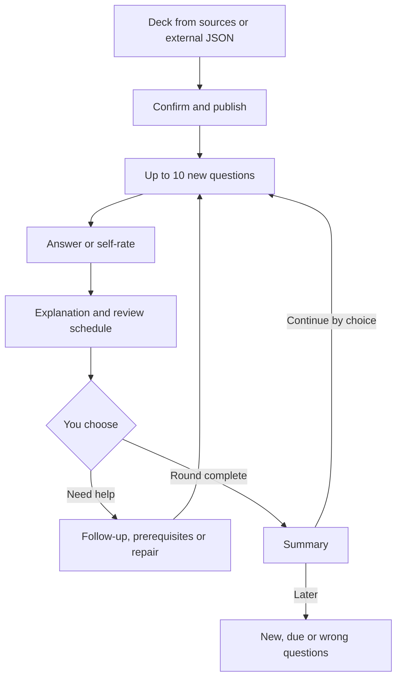

# Course study, Learning flow and study notes

[中文](study-workflows.zh-CN.md)

This page covers three ways to study in StudyHub today:

- [Follow a course](#follow-a-course-from-the-home-page) from the **Study library** home page, one batch at a time.
- [Learn a topic in Learning flow](#learn-a-topic-in-learning-flow): an explanation, a retelling in your own words, practice and a short reflection in one session.
- [Turn questions into a public study note](#turn-questions-into-a-public-study-note) and link it to the article you publish on CSDN.

[Proposed system learning](#proposed-system-learning) at the end is a design. It is not built.

Checked against the code on 2026-10-03.

## Follow a course from the home page

The library remembers your current course. Its name is the home page heading: choose another course there to switch. The current course stays until you change it, including when you continue practice from another course.

This is the **Course study** mode under **Study mode**. The other mode, **Written / oral interview**, practises by job role and does not use the course route below.

### What the main card offers

The main card on the home page offers one action. It shows the first row that applies:

| When | The card offers |
| --- | --- |
| You left a practice session half done. It is the session the sidebar's **Return to question** opens, in any course. | **Continue**. If the session belongs to another course, the card names that course. |
| A course batch is unfinished | **Continue learning** |
| **Today's study** is unfinished | **Continue learning** |
| The current course still has questions to learn or reinforce | **Continue course**, which starts the next batch |
| None of the above | **Start today's study**. When nothing is due, weak or new, it offers **Review ahead** instead. |

A half-done session in an **Inactive** course is not put on the card. It stays in the list of unfinished sessions.

The other ways to start are folded under **Other ways to start**. Depending on the card, they include the next course batch, **Learn before practice · learning flow** (see [Learn a course batch in Learning flow](#learn-a-course-batch-in-learning-flow)), **Due reviews & reinforcement**, personalised questions and weak points. Due reviews keep their own entry, separate from the course batch.

Other unfinished sessions sit under **Plus N unfinished sessions**. Each one names its course when that is not the current course. **End** closes a session and keeps the answers you gave.

### Study the course in batches

Each deck in the course is one chapter, in the deck order of your library. Each batch has two parts:

1. Up to 5 questions you already met in this course that are weak or due.
2. Up to 10 new questions in chapter order. When a chapter runs out, the batch continues into the next one.

The course progress bar on the home page shows where you are. To find the questions about a part of the course by its materials and chapters, and practise exactly those, open **Course outline** under the progress bar (see [Course outline](course-outline.md)). To change the chapter order, open a deck's **Manage deck** page (the deck's **⋯** menu) and use **Move deck up** or **Move deck down**.

The **Study directory** below the card lists the current course, newest published deck first. When the course has more than 3 decks, only the 3 most recent show until you click **View all decks**. Other courses appear after you click **View other courses** or search.

### After you publish a deck

**Save & publish** on a draft starts a round of up to 10 new questions from that deck, in deck order. This applies to generated decks and imported JSON decks.

When a round ends, you choose what comes next. After a round of new questions, **Continue with new questions** starts the next 10 when there are more. After a course batch, the result page shows course progress and offers **Continue to next course batch** and **Learn before practising the next batch**.

Nothing starts by itself unless you turned on **Autopilot** (shortcut A). Autopilot is described on the [study coach page](coach.md).

### Import a JSON deck

When you import a JSON deck under **Create deck › Import JSON deck**, StudyHub suggests a short title and a course. With a model connected, it may also suggest a deck in that course to merge into when you publish. You confirm or change each suggestion. The original title stays stored and shows on the deck's **Manage deck** page. The format and prompts are in [Import JSON decks](json-import.md).

In practice:

- Imported questions carry an **External import** tag. A citation is kept only when its quote matches exactly one of your sources. StudyHub never invents one.
- A question marked **Needs verification** at publication can still be practised normally.
- A question with nothing to grade offers **Skip without scoring**. Skipping records no score and leaves its review progress unchanged. You cannot skip in a mock exam.

### Organise decks

- **Organise & add › Organise decks** next to the **Study directory** heading asks a model for up to 8 merge suggestions among the current course's decks. Nothing changes until you click **Confirm merge** on a suggestion. Without a model, merge by hand on the **Manage deck** page.
- A merge keeps every question with its ID, answer history, review schedule, prerequisite links and note links. Learning flow sessions keep the same questions in scope. Outside Learning flow, an unfinished practice session that contains moved questions ends, and its answers are kept.
- **Split by topic** on the **Manage deck** page moves the questions of the chosen topics into a new deck in the same course. Both decks must keep at least one question.
- You cannot merge or split a deck while it has a draft being edited or repaired. Restore an archived deck first.

## Learn a topic in Learning flow

**Learning flow** (sidebar, **Every day** group) guides one study session. It is optional: the home page, decks and outlines work the same without it.

Completing a step records the activity only. Question grades and SM-2 review schedules are saved as usual, and nothing marks you as having mastered a topic.

### Start a session

1. Open **Learning flow**.
2. Under **What do you want to study today?**, write one sentence of up to 500 characters.
3. Click **Start learning**.

StudyHub then picks topics from your current course:

- With a model connected, AI picks up to 12 topics and orders them foundations first.
- If you set up the search extension, topics whose questions cite pages that match your sentence come first. See [Large textbooks](large-documents.md).
- Without a model, StudyHub matches your words against topic and deck names.
- If nothing matches, the session starts with the course's largest topics.

The top of the session page says which course the topics came from, how they were chosen and how many questions are in scope. Your sentence is saved as the goal, so the session opens at the first content step.

**Build an outline in the background if this scope has none** is on by default and remembered on this device. The session starts at once. When the outline is ready, it appears folded at the top of the session page and is saved as an ordinary knowledge outline.

To come back later, click the session shown after **Continue where you left off** at the top of the Learning flow page, or **Continue learning** next to the session under **Study records**.

### Steps in a session

The table describes a session started from a sentence. Such a session leaves out the outline step when no outline matches the scope, and the practice step when the scope has no questions.

| Step | What you do | What to know |
| --- | --- | --- |
| **Knowledge outline** | Read how the concepts connect | Appears only when a matching outline existed at the start |
| **Concepts and examples** | Read the explanation | It is written when you arrive. **Another example**, **Break it down**, **Prerequisites** and **Improve explanation** add or rewrite text; **Undo last rewrite** brings back the previous version. **Add my specific question** asks about one point. |
| **Active recall** | Close the material and retell it in writing, or click **I retold it aloud** | You need a retelling to complete this step. **Ask AI to review my retelling** (Ctrl/⌘ + Enter) lists what you covered, up to 4 gaps and one guiding question. It is feedback, not a grade. **Revisit the explanation** goes back, and the explanation then covers those gaps first. |
| **Practice** | Answer questions from the scope on the normal practice page | 10 questions by default. Answers are graded and scheduled as usual. **Back to learning flow** returns you. The step completes once every question is answered; **Practise again** starts another round. |
| **Reflection and next steps** | Choose what fits, such as **The main ideas are clear** or **I need more examples**, or write a summary | You need a choice or some text to complete this step |

### Move through a session

- The main button at the bottom completes the step and moves on. Under **Needs review, skipping & step order** you can record **Needs reinforcement** or **Skip this step** instead. Each outcome is recorded as what it is; a skip never counts as completion.
- Click any step you have done to look at it again. The step marked **Current progress · return here** takes you back. Moving between steps records nothing.
- **Save & pause** pauses the session and **Continue learning** resumes it. Your notes are saved when you continue to the next step or go back with the button at the top. Text you have typed but not saved is kept on this device.
- Each step has a section that asks DSH's main chat for help, such as **Ask the main chat for an explanation**. **Save notes & send to main chat** prepares the request there for you to send. What the main chat writes is added to the step. Up to 10 earlier versions stay under **Previous versions**, and **Restore this version** brings one back. The request tells the main chat not to write your answers or judge whether you have mastered a topic.
- **Switch course** at the top of a session started from a sentence picks topics again in another course and keeps your notes. Once you have answered a practice question, it offers to start a new session for that course instead, and this session stays as it was.
- Finished and unfinished sessions stay under **Study records**. **Delete** removes a session's notes and progress; your practice history stays.

### Learn a course batch in Learning flow

On the home page, **Other ways to start › Learn before practice · learning flow** opens a session for the next course batch's new questions. You read an explanation of those questions, retell it and then practise exactly that batch.

When the session ends, it offers **Continue to next course batch** and **Learn before practising the next batch too**.

### Build your own flow

Open **Advanced: customise learning steps** on the Learning flow page.

- You can save up to 5 flows. Each has 1–16 steps built from six components: **Set a goal**, **Knowledge outline**, **Concepts and examples**, **Active recall**, **Practice** and **Reflection and next steps**.
- Each step has a name, instructions and optional preset material in Markdown. A **Practice** step also has a question count from 1 to 50.
- Each step has two branches, **After completing or skipping** and **When more review is needed**. Each branch goes to **Continue to the next step**, **Stay on this step**, **End this study session** or a numbered step. Every step must be reachable from the first one.
- To begin, use **Start from a suggestion** (**Edit & save this flow**), **＋ Build my own** or **Build with the main chat**. The suggested flow does not take one of your 5 places until you save it.
- Editing a flow changes later sessions only; a session keeps the copy it started with. Deleting a flow keeps its sessions.
- **Use** starts a custom flow. Choose topics and questions (optional), fill in **What will you study?**, and link an outline if you like. **Generate knowledge outline** asks the main chat to draft one from the questions you chose. Then click **Enter learning portal**. With no questions chosen, the session uses the linked outline's questions; with neither, it starts with reading, explanation and retelling.

### What calls a model

Model calls are billed by your provider. Without a connected model, the page says so: name matching still works, and explanations, retelling feedback and background outlines are unavailable.

- Picking topics: one call each time you start from a sentence or switch course.
- Explanations: when you arrive at **Concepts and examples**, and each time you use one of its help buttons.
- Retelling feedback: only when you ask for it.
- Background outline: only when the option is on and no outline matches.
- Answering and review scheduling make no model calls.

What each call sends is listed in [Token usage](token-usage.md).

## Turn questions into a public study note

A study note is an article built from questions you choose. You publish it on CSDN yourself; StudyHub then keeps a link to it.

1. Open **Study notes** and click **＋ Turn questions into a note**. Write a **Note title**, search for questions, tick 1–30 of them and click **Create note draft**. During practice you can also choose **More › Write a note**; if that question already has a note draft, it opens that draft instead of making another one with the same title.
2. Write in **Edit Markdown**. **Live preview** renders formulas with libraries bundled in StudyHub, so nothing is downloaded.
3. Optional: **Draft explanation with AI** writes the article in the background, and the result arrives in your **Inbox**. You can keep studying meanwhile. The model gets each question with its topic, objective, answer, explanation, common misconception and your latest result. It is asked to use generic examples, with no slides, handouts, courses or personal information. A draft that still mentions slides, handouts or a file path is rejected, and you write the public version yourself.
4. Under **Public CSDN profile and article link**, enter your profile address in the form `https://blog.csdn.net/<username>` and click **Save profile**. You do this once.
5. Click **Copy content & open CSDN**. StudyHub saves the draft, notes which articles your profile already shows, copies the Markdown and opens the CSDN editor. Review and publish the article there.
6. Back in StudyHub, click **Find published article**:
   - If exactly one article with the same title appeared after step 5, it is linked automatically.
   - If there are several, the time cannot be confirmed, or an older article has the same title, choose a candidate with **Confirm this article** or paste the link and click **Link manually**. The link must belong to your saved profile.

Once linked, the library keeps the title, the linked questions, the public link and the time. It deletes the Markdown body and any copy on this device. A published note cannot be edited; create a new draft instead. Questions linked to a note show **Note draft** or **Published note** in practice.

StudyHub stores only your public profile address. It never asks for your CSDN password or cookies, and it reads only your public profile page.

## Current learning loop and its limits

The loop StudyHub supports today:

1. Get a deck: generate one from your sources, or import JSON that an external AI wrote from them.
2. Check the draft and confirm its title and course, then **Save & publish**.
3. Practise up to 10 new questions.
4. Answer, or flip a card and rate yourself.
5. Read the explanation; SM-2 schedules the next review.
6. When you need it, ask for help, a prerequisite question or a repair.
7. Read the round summary, then continue by choice or come back later.

Limits of today's behaviour:

- **Today's study** orders due, then weak, then new questions (up to 10 new and 20 in all). It places unlearned prerequisites before the questions that need them, so it can pull in prerequisites without being asked. That differs from the preference for prerequisites only on request, so the proposed design below must not reuse this queue unchanged.
- Personalised questions, step-by-step explanations, Learning flow, the oral exam and the knowledge outline all exist. None of them, alone or together, certifies evidence for every required core concept. Learning flow records what you report doing, not mastery.

## Proposed system learning

Everything in this section is a design. None of it is implemented; the code still runs the course study and interview flows above. Learning flow is a smaller, optional feature, built separately; it does not implement this design.

The rules and the development breakdown are in the [development plan](plans/2026-09-27-1945-feat-evidence-based-learning-plan.md). Its status at hand-over is in the [handoff](handoffs/2026-09-27-learning-workflow-redesign.md).

**Who it is for.** A learner close to zero background, with five decks generated from five Platform Engineering PDFs. The contents of those PDFs have not been checked, so this is a workflow design, not a coverage report. The owner chose external practicals for the first version: the learner works in their own environment and submits results. StudyHub would not include an execution environment.

### Entry and modes

- **Course study** and **Written / oral interview** stay. The learner chooses system learning explicitly and sets only the scope, starting point and goal. The default goal is the known "close to zero background; understand and apply". Nothing already confirmed is asked again.
- The main button would be **Continue system learning**, with one sentence of reason, for example "First see how a request reaches the service; the release troubleshooting later depends on it."
- Published questions can be studied at once. With JSON only, the page says "Decks ready; source coverage not verified". Linking the original PDFs starts a scope audit in the background. The learner never has to review every question before starting.
- A round would hold at most 5 learning tasks; one practical may take a whole round. The current 10-new-question rounds stay. The next round always starts by the learner's choice.
- Publishing while in system learning returns to the current system task or the entry point. It does not start a 10-question round.

### The eight steps

| Step | What the learner sees and does | What the system does in the background | Passing and falling back |
| --- | --- | --- | --- |
| 1. Define the scope | A short course goal and a note of which sources still need checking; adds original PDFs if needed | Extracts goals per section, merges them across sources, matches questions, marks unsure diagrams and points with no task | Learning works without sources. The scope is called a candidate, never full core coverage. |
| 2. Minimal prerequisite check | A few small checks to find the current level; "I don't know" and "later" are allowed | Separates "not checked yet", real gaps and environment blocks; prepares the smallest remediation | Remediation starts only when the learner clicks to fill the gap, and returns to the original place. Skipping still shows the gap. |
| 3. See the whole case | First one understandable process, then a few concepts and relationships | Maps the five decks onto one course storyline; concepts without questions still show | The learner can say in their own words what problem is being solved; if not, back to the matching prerequisite |
| 4. Understand one unit | Watch a worked example, fill in steps, explain why, then work alone | Reduces help step by step and records the stage and help used | A dimension advances only when its required grading items pass. Finishing an explanation is not learning it. |
| 5. Recall and retain | Answer with the material closed; retest at least 24 hours after the concept was last studied | Records explanations, hints and practice across questions with times; SM-2 still schedules the cards | A correct answer right after reteaching counts only as current performance. A delayed failure returns to the weak point. |
| 6. Transfer and tell apart | Answer changed constraints, counterexamples, faults or cross-chapter questions before seeing feedback | Checks task families, hidden states and rubrics, so that rewording alone does not count | Only unseen tasks count as transfer evidence. A learner who can only solve the original keeps practising new situations. |
| 7. External practical | Read the goal, environment and acceptance items; work in their own environment and submit results | Checks the submission is complete, reviews it against the criteria and lists the fewest items to resubmit | States the real evidence level, such as "submission reviewed". An environment failure is not treated as not understanding the concept. |
| 8. Final and delayed checks | See what each core point still lacks; the next round picks one concrete task | Combines dimensions per point; handles due retests, newer failures and scope version changes | The scope counts as accepted only when every required point has valid evidence. A high average never cancels a missing item. |

Steps 4–7 repeat for each unit, with short recall of the local part of the outline in between. Steps 5 and 8 continue across days. The eight steps are not eight pages to open in turn, nor the linear order of the five PDFs.

### Before and after

| Aspect | Today | Proposed | Migration |
| --- | --- | --- | --- |
| Main line | Deck or topic and card order; the newest course content first | Advances by goals, prerequisites and evidence gaps | The new route is optional; course study stays |
| Scope | Topics and outline seen from the existing questions | A separate ledger of the sources, so missing core points show too | Existing questions link to the new concept IDs without being regenerated |
| First understanding | Often starts with a question and the explanation after it | Worked example, then partly done, then an independent check | Reuses the existing explanation and question components |
| Missing prerequisites | Follow-ups and links when stuck; some paths pull questions in automatically | Minimal check, explicit remediation entry, a limit, return to the same place | Does not reuse the path queue that pulls prerequisites automatically |
| Mastery | Recent performance and SM-2 intervals; topics as weighted totals | Understanding, recall, transfer and practical work accepted separately per goal | Old statistics are labelled estimated mastery; history is never cleared |
| Transfer | Personalised variants, keyword sorting of question stems, oral follow-ups | Unseen task families, changed constraints, reasons and grading criteria | Old variants stay as practice; new tasks can count as independent checks |
| Remembering the outline | Browse structure and order; practise from nodes | Adds hidden nodes, relationship completion, ordering and fault tracing | Reuses the canvas; acceptance is recorded separately |
| Real use | Mostly questions and discussion | External practicals, submitted results, item-by-item review, resubmission | No executor is added, and no claim is made to have watched it run |
| Completion | End of a round, question mastery, sampled exam scores | Every required point in the current scope has all its required evidence | Existing exams stay; a high sampled score is not full coverage |
| Effort for the learner | Switching between decks, outlines, follow-ups and exams | One current task, one reason and an expandable list of gaps | No new row of buttons that must be used |

### Daily use

- Opening the page resumes any unfinished task first. Otherwise it suggests one due core retest, a current blocker or a new unit, and the learner can pick another.
- A task shows only the current question and the main action. Explanations and help expand on request.
- Remediation counts toward the round's budget and never recurses without end: by default at most 3 local steps, then a separate foundations unit is suggested.
- The end of a round shows what evidence was added, what each core point still lacks and the one next task. Browsing the outline or generating notes never counts as acceptance.
- Content not yet learned or assessed is never shown as a red failure. Model grading in progress, environment blocks and wrong answers each have their own state. Closing the page and coming back continues the same task.

### Platform Engineering example

The tasks below only show the structure. The real scope depends on checking the five sources.

1. Use the provided sample service to learn "request, process, port and log", and predict where a request goes.
2. Watch a delivery demonstration, fill in the missing test and release steps, then explain what evidence to look at when it fails.
3. Change a configuration or access condition, predict the result, then verify it in the external environment and report whether prediction and observation agree.
4. Turn the process into a template another developer can reuse, explaining defaults, settings, limits and what users gain.
5. The next day, draw the simplified chain from memory, give the troubleshooting order for a new fault and submit the revised result.

"Can run the sample" covers only part of these goals. "Can explain the limits and verify under changed conditions" needs further evidence.

### Progress and evidence

- An example line on the home page: "12/18 core points in the current scope accepted; 4 need independent checks, 2 need practicals. 1 diagram page in the sources still needs checking." These figures are an example, not real user data.
- Clicking a point shows the required dimensions, the evidence for and against, whether help was used, the latest check and the source version.
- One practical can support several points, each graded separately. Oral answers, outline tasks and ordinary questions never imply that all prerequisites are mastered.
- Evidence thresholds, denominator rules, expiry and migration are defined by the Evidence Policy and requirements R2–R15 in the plan.

### Exceptions and recovery

| Situation | What the learner sees | Recovery |
| --- | --- | --- |
| A PDF is missing or a scanned diagram was not recognised | The scope still needs checking, and what can be studied now | The audit runs later in the background; existing questions are not blocked |
| The model fails or grading is incomplete | The submission is saved and not yet assessed | Retry the same submission or switch to another task; it is never marked wrong automatically |
| Sources or goals change | Which core points are new or need checking again | The session keeps a version snapshot; the new scope applies after an explicit switch or from the next round. Old results count for the old version only; withdrawn tasks keep their answers and move to a new entry. |
| Prerequisites keep going deeper | The round's budget and a way back | Remediation pauses and a separate foundations unit is suggested, instead of recursing |
| The practical environment does not run | An environment block and the fewest checks to run | Progress is kept, and environment errors are told apart from knowledge errors |
| A duplicate submission or late feedback | One submission record with its version | An outdated result never replaces a newer submission, and points are not added twice |
| Questions are slain, or decks merged or split | Concepts and history stay; missing assessment tasks show when needed | The required denominator is never quietly reduced, and organising decks loses no progress |

### Delivery boundary

The eight-step system is not delivered. The plan splits development into three phases:

- P0, coverage and trustworthy progress;
- P1, the zero-background learning loop;
- P2, external practicals and final acceptance.

Units U1–U9, acceptance examples AE1–AE16 and the test files are listed in the plan.

## Code boundaries (for developers)

- `lib/focus.js` holds the current course and the order of new questions. `lib/course-route.js` builds chapters and course batches.
- `lib/deck-organization.js` merges, splits and reorders decks and moves every reference to the moved questions. `lib/deck-merge-suggestions.js` checks model suggestions; they never change the library directly.
- `lib/blog-notes.js` holds note state and question links. `lib/adapters/csdn-public.js` only reads public CSDN pages.
- `lib/workflows.js` and `lib/workflow-contract.js` hold Learning flow templates, sessions and components. `lib/workflow-guide.js`, `lib/workflow-teaching.js` and `lib/workflow-skeleton.js` hold the model-backed parts.
- Operations live in `lib/contexts/<domain>/operations.js` and own persistence and rules. `lib/service.js` is only a compatibility facade; see [Architecture](architecture.md). `ui/` shows state and collects your confirmation; it never decides merges, grading or link safety.
- The home-page rules above follow owner decisions F-006 and F-023 in [user feedback](user-feedback-intake.md).
