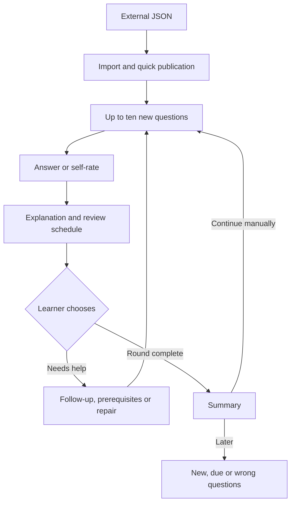

# StudyHub learning workflows and data boundaries

[中文 and the original planning document](study-workflows.zh-CN.md)

The first sections describe the current classroom and interview-oriented implementation. **Proposed System Learning** is a design, not a delivered feature.

## Following a course

The library remembers a current course. Home prioritizes that course's three most recently published decks and up to ten unseen questions. Due review has a separate entry.

When practice is unfinished, the main card offers **Continue** for the same run as the sidebar's return-to-question action—whether a course batch, deck, topic, or prepared practice, and regardless of course. Starting a fresh batch becomes a secondary link; other unfinished runs collapse below. Runs from another course show that course name without changing the current course automatically.

External JSON import suggests a short title, course, and possible merge destination for confirmation. The original title remains stored. Publication begins up to ten new questions from the published deck; after the round, the learner chooses whether to continue.

**Organize decks** only suggests merges among the current course's decks. The service merges after explicit confirmation, retaining card IDs, answers, review schedules, prerequisites, and note links. Topic-based splitting moves cards and inherits the course.

## Public study notes

Choose questions to create an article. Drafts use Markdown with bundled local editing and formula preview. Generation receives the associated concepts, but public text uses general examples without slide/handout details or personal information. Background results arrive in the inbox.

Publication on CSDN is manual. StudyHub stores a public blog homepage, not credentials or cookies. Save before copying the article/opening the publication page. After confirming a public URL, the library keeps its title, question links, URL, and time rather than the long article body.

A newly published, uniquely identifiable same-title article can link automatically. Older same-name articles, multiple candidates, or uncertain publication times require candidate confirmation or a manually entered URL.

## Current data boundaries

Course focus and new-question order belong to `lib/focus.js`; merge/split/reference migration belongs to `lib/deck-organization.js`. `lib/blog-notes.js` handles notes and card links; the CSDN adapter queries public pages only. Services own persistence and rules; the UI shows state and collects confirmation rather than deciding merges, grading, or link safety.

External JSON decks retain an external-import label without fabricated citations. Gradable flagged questions can still be studied; ungradable ones can be skipped without updating review progress.

## Current Learning Loop

External AI produces JSON from material → import a draft and confirm its destination → quick publish → practice up to ten new questions → answer or self-rate → view explanation and review scheduling → explicitly request help, prerequisites, or repair as needed → see the round summary → manually continue or return later.

Home prioritizes recent content; due review is separate. Another general study path orders due, weak, and new cards and can pull in prerequisites. That existing queue is not equivalent to the proposed zero-background course: some prerequisite behavior differs from an explicit-remediation-only preference.

Prepared questions, staged explanations, oral simulation, and knowledge graphs already exist but do not jointly certify evidence for every required core concept.

## Proposed System Learning

Everything in this section is proposed and not implemented. The design targets a learner near zero background with five decks generated from five Platform Engineering PDFs. The source contents have not been audited, so this is a workflow example rather than an established coverage report. Proposed practical exercises take place externally; no execution environment is built into the plugin.

### Entry and modes

Classroom and interview modes would remain. Selecting system learning would establish scope, starting point, and goal without asking again for known information. One **Continue system learning** action would explain why the next task matters.

Published questions would remain usable immediately. JSON-only courses would say that decks are ready but source coverage is unverified; explicitly linking original PDFs would enable background scope auditing. Individual manual review would not be required to begin.

A proposed round would contain at most five learning tasks, with an experiment allowed to occupy a whole round. Existing classroom ten-question rounds would remain. Continuing always requires the learner's choice. Quick publication while already in system mode would return to that mode rather than opening a classroom round.

### Eight steps

| Step | Learner activity | Proposed evidence and recovery |
| --- | --- | --- |
| 1. Define scope | Read goals and unchecked-source notices; optionally add PDFs | Merge candidate objectives across sources and map questions; missing material does not prevent learning or justify a complete-coverage claim |
| 2. Minimal prerequisite diagnosis | Try small checks, with unknown/later available | Distinguish undiagnosed gaps from environment blocks; remediation begins only by choice and returns to the original task |
| 3. Understand an overall case | See an understandable process and a few concepts/relationships | Map decks to a course narrative; concepts lacking questions remain visible; explain the problem in one's own words |
| 4. Understand one unit | Study a demonstration, fill steps, explain reasons, then work independently | Reduce scaffolding with performance; only required grading criteria advance the checked dimension; finishing an explanation is not mastery |
| 5. Recall and retain | Answer without the solution, then retest at least 24 hours after the concept's latest learning | Track teaching/hints/practice across questions; SM-2 still handles cards; immediate success after reteaching is not delayed retention |
| 6. Transfer and discriminate | Predict changed constraints, counterexamples, faults, or cross-topic outcomes before feedback | Use unseen task families and explicit rubrics; cosmetic rewording does not establish transfer |
| 7. External experiment | Work in one's own environment and submit artifacts against acceptance criteria | Grade submission completeness and evidence; describe artifact review accurately without claiming to observe execution; separate environment failures from concept errors |
| 8. Integrated and delayed checks | See missing evidence per core point and select one next task | Require valid evidence for every mandatory point; averages cannot cancel missing dimensions; handle due retests, newer failures, and scope versions |

Steps 4–7 repeat per unit, interleaving local graph recall. Steps 5/8 span days. These are not eight mandatory pages or a linear PDF order.

### Intended changes and migration

The proposed route would progress by goals, prerequisites, and evidence gaps rather than only deck/card order. A source ledger would expose missing concepts while existing cards link to stable concept IDs without forced regeneration. Initial teaching would use worked, partially completed, and independent exercises.

Remediation would be minimal, explicit, bounded, and return to the original position rather than reusing an automatic prerequisite queue unchanged. Existing mastery statistics would remain as estimates while understanding, recall, transfer, and practical work gain separate evidence. Existing variants would remain practice rather than automatically becoming independent assessments.

The graph would add hidden nodes, relationship completion, ordering, reconstruction, and fault tracing to current reading/navigation. External experiments would use submission review without an executor. Existing exams would remain; sample scores would not establish total coverage. The interface would offer one current task and an expandable explanation of gaps.

### Daily use and progress

Unfinished work would resume first. Otherwise, one due concept retest, blocker, or new unit would be suggested, with another choice available. Help expands on demand. Remediation counts toward the round budget, normally at most three local steps before recommending a separate foundations unit.

A round summary would distinguish new evidence, remaining gaps, and one next task. Graph browsing and generated notes would not count as certification. Unlearned or unassessed content would not appear as failed; pending model grading, environment blocks, and incorrect answers would have separate states.

An illustrative dashboard might say “12/18 core points accepted; four need independent checks, two need experiments; one diagram page still needs checking.” These are example figures, not real user results. Each point would show required dimensions, evidence/gaps, help exposure, latest verification, and source version. One experiment could support several points, graded separately, without automatically crediting all prerequisites.

### Platform Engineering example

An illustrative sequence would follow a request through process/port/logs, complete a demonstrated delivery pipeline, predict a configuration change and verify it externally, create a reusable template explaining defaults and limits, then reconstruct the chain from memory the next day and diagnose a new fault. Actual scope still requires source review. Running a sample demonstrates only part of these goals.

### Exceptions and delivery boundary

Missing PDFs or unreadable diagrams would leave scope unverified without blocking existing questions. Model failures would retain submissions as unassessed for retry, not mark them wrong. Source/goal changes would use explicit version snapshots and keep old evidence tied to its scope. Excessive prerequisite depth would stop bounded remediation and offer a separate foundations unit.

Environment failures would retain progress. Duplicate/late results would not duplicate credit or replace newer submissions. Removed questions, merges, and splits would preserve concept history rather than silently reducing the required denominator.

The eight-step system is not delivered. The original design divides work into coverage/trustworthy progress, the zero-background loop, and external practical/integrated checks. Complete historical planning details and references remain in the Chinese companion.
