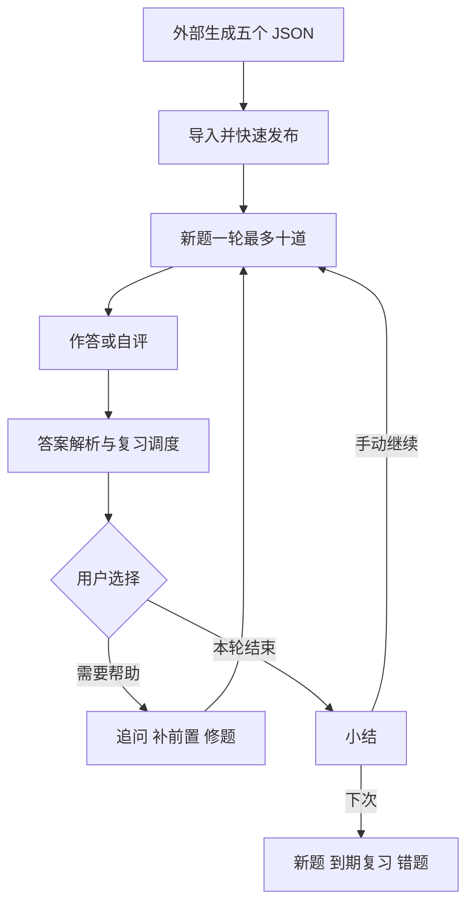

[English](study-workflows.md)

# StudyHub 学习流程与数据边界

更新：2026-09-27。本文前半部分描述当前实现；`Proposed System Learning` 起为拟议工作流，尚未实现。
新行为的规则和开发拆分以 [统一开发计划](plans/2026-09-27-1945-feat-evidence-based-learning-plan.md) 为准；接续状态见 [本次 handoff](handoffs/2026-09-27-learning-workflow-redesign.md)。

## 课堂跟学

学习库保存当前课程。首页优先展示该课程最近发布的三个题组和最多十道未学新题；到期复习从独立入口进入。有没做完的练习时，首页主卡先给「接着做」，指向侧栏「回到题目」的那一轮（不论是课程批次、题组、主题还是「为你定制」，也不论属于哪门课），开新一批降为主卡旁的链接，其余未完成的练习收在「另有 N 组练习未完成」里。练习属于标题以外的课程时，主卡和折叠行都标出课程名；当前课程不会因此自动切换（F-023）。导入外部 JSON 时，系统建议短标题、课程和可能并入的题组，用户可修改并确认。原始标题仍保存在题组中。发布后立刻进入新发布题组的十道新题；完成一轮后由用户选择是否继续下一批。

“整理题组”只提出当前课程现有题组的合并建议。用户逐条确认后，题组服务才执行合并。卡片 ID、作答记录、复习计划、前置关系及笔记卡片关联一并迁移。拆分按主题移动卡片，并继承原课程。

## 公开学习笔记

用户主动挑选题目创建一篇文章。笔记草稿保存 Markdown，编辑器和公式预览在本地打包运行。生成文章时提供题目涉及的知识点，但公开文本使用通用案例，不包含 PPT、讲义细节或个人信息。后台生成结果送达信箱。

用户在 CSDN 自行发布。StudyHub 只保存公开博客主页，不使用账号密码或 Cookie。复制文章并打开发布页之前先保存草稿；确认公开链接后，本地只保存文章标题、题目关联、公开链接和时间，不再存长篇正文。若刚发布的新文章可从公开主页唯一确认且标题相同，则自动关联；旧同名、多候选或发布时间无法确认时，用户确认候选或手填链接。

## 代码边界

- `lib/focus.js` 负责课程焦点和新题排序；`lib/deck-organization.js` 负责题组合并、拆分和引用迁移。
- `lib/blog-notes.js` 负责笔记状态与题目关联；`lib/adapters/csdn-public.js` 只查询公开网页。
- `lib/service.js` 编排应用操作与持久化；`ui/` 展示状态并收集用户确认，不决定合并、判分或链接安全规则。

外部 JSON 题组标记“外部导入”，不要求伪造原文引用。可判分的问题题照常学习；无法判分的题允许跳过且不修改复习进度。

## Current Learning Loop

当前课堂主流程为：外部 AI 根据资料生成 JSON → 导入草稿并确认归属 → 快速发布 → 立即开始最多 10 道新题 → 答题/翻卡与反馈 → 用户主动请求帮助、补前置或修题 → 本轮小结 → 手动继续或以后复习。
首页最近内容优先；到期复习有独立入口。另有通用学习路径，会按到期、薄弱和新题排序，并可能拉入前置；它与用户“不在答错后强制插前置”的交互期望并不完全等价。新系统路线不能直接把这个队列当作零基础课程。
陪学备题、逐步讲解、口头模拟和图谱已经存在，但并未形成逐核心知识点的统一证据验收。

## Proposed System Learning

对象：接近零基础、已导入五份 Platform Engineering PDF 所生成的五个题组的学习者。
这些材料的真实内容尚未核查；以下是产品流程设计，不是已经成立的课程覆盖报告。
首版实操已由用户选择为外部完成并提交成果，插件不内置执行环境。

### Entry and Modes

课堂跟学、面试准备保留。学习者主动选择“系统学习”后，仅需确定课程范围、起点和目标；这里默认采用已知的“接近零基础、理解并能应用”。不重复问已经确认的信息。
主按钮为“继续系统学习”，旁边一句理由，例如“先弄清请求如何到达服务，后面的发布排错会用到”。
题目已发布即可学习。只有 JSON 时显示“题组已就绪，资料覆盖待核对”；关联原始 PDF 后才后台做范围审计。用户无须逐题审完才能开始。
默认每轮最多 5 个学习任务；一次实操可以独占一轮。课堂原有的 10 道新题规则继续保留。轮末必须手动选择下一轮。
已在系统学习模式时，快速发布后回到系统任务或入门入口，不再自动开启课堂的十题轮次。

### Eight Steps

| 步骤 | 学习者看到和操作什么 | 系统在后台做什么 | 过关与失败返回 |
| --- | --- | --- | --- |
| 1. 确定范围 | 看简短的课程目标与“哪些资料待核对”；必要时补原始 PDF | 分段提取目标、跨资料归并、匹配题目、标出图表不确定性和缺任务点 | 无资料仍能学；只称候选范围，不宣称全部核心覆盖 |
| 2. 最小前置诊断 | 用几个小检查确认当前台阶，允许“不知道/稍后” | 区分未诊断、基础缺口与环境阻塞，给出最小补救包 | 用户点“先补基础”才进入；补完回原位置；跳过仍显示缺口 |
| 3. 看整体案例 | 先看一个能理解的过程，再看少量概念与关系 | 把五个题组映射到同一课程主线；无题概念仍显示 | 能用自己的话说清要解决的问题；不懂则回到相应前置 |
| 4. 理解一个单元 | 看示范、补步骤、解释原因，再独立做 | 按表现逐步减少提示，保存阶段和帮助使用记录 | 必需评分项通过才推进对应维度；讲解完成不等于学会 |
| 5. 回忆并保持 | 合上答案说出/写出，距该知识点最近一次学习至少 24 小时后复测 | 跨题记录相关讲解、提示和练习的时间，SM-2 继续管卡片 | 刚重讲后换题答对只算当前表现；延迟失败回到相应薄弱点 |
| 6. 迁移与辨析 | 面对变约束、反例、排错或跨章节问题，先回答再看反馈 | 检查任务族、未展示状态和 rubric，避免仅换词 | 通过陌生任务才记相应迁移证据；只会原题则继续练新情境 |
| 7. 外部小实验 | 读目标/环境/验收项，在自己的环境完成后交成果 | 校验提交完整性，按标准审阅并给出最少补交项 | 标明“提交物审阅通过”等实际证据级别；环境失败不冒充概念不懂 |
| 8. 综合与延迟验收 | 看每个核心点还缺什么，下一轮只选一个具体任务 | 汇总逐点维度，处理复测到期、较新失败和范围版本变化 | 全部必学点均有有效证据才称本范围已验收；任何缺项不能被高平均分抵消 |

第 4–7 步按单元循环，期间穿插局部图谱回忆；第 5/8 步跨日继续。八步不对应八个必须逐一打开的页面，也不对应五个 PDF 的线性顺序。

### Before and After

| 方面 | 当前工作流 | 优化后的目标 | 迁移策略 |
| --- | --- | --- | --- |
| 学习主线 | 题组/主题及卡片顺序，课堂最新内容优先 | 系统路线按目标、前置和证据缺口推进 | 新路线可选，课堂逻辑保留 |
| 范围 | 从已有题目看主题与图谱 | 原资料独立台账，遗漏核心点也可见 | 已有卡片关联到新知识点，不强制重生成 |
| 首次理解 | 常从做题和答后解释开始 | 示例→半完成→独立检查 | 复用现有讲解和题卡组件 |
| 前置不会 | 卡住后追问/关联，部分路径自动拉题 | 最小诊断、明确补救入口、限量、原位返回 | 不直接复用自动拉前置的 path 队列 |
| 掌握状态 | 最近表现和 SM-2 间隔推算，主题按加权值汇总 | 理解/回忆/迁移/实操按目标分别验收 | 旧统计称估计熟练度；历史不清零 |
| 举一反三 | 定制变式、题干关键词分类、口头追问 | 未见任务族＋变约束＋理由和评分依据 | 原变式继续练习，新增独立验收资格 |
| 图谱入脑 | 浏览结构、顺序、节点练题 | 阅读之外加入遮挡、补关系、排序、故障推演 | 复用画布，验收状态单独记录 |
| 实际应用 | 题目与讨论为主 | 外部实验、成果提交、逐项审阅、重交 | 不增加执行器，不声称观察了外部运行 |
| 完成标准 | 轮次结束、题目熟练度、抽样考试成绩 | 当前范围每个必学点有全部所需有效证据 | 旧考试保留；抽样高分不等于全覆盖 |
| 使用负担 | 自己在题组、图谱、追问、考试间切换 | 一个当前任务＋一句原因＋可展开缺口 | 不再增加一排必须使用的新按钮 |

### Daily Use

进入后优先恢复未完成任务。没有未完成任务时，推荐一个到期核心复测、当前阻塞点或新单元；用户可以更换。
任务中只有当前问题和主操作，解释/帮助按需要展开。前置补救计入本轮预算，不无限递归；默认最多 3 个局部台阶，再深则建议单独基础单元。
轮末显示“本轮新增了什么证据、哪个核心点仍缺什么、下次做哪件事”，不会把图谱浏览或生成笔记算成验收。
未学和未评估不涂成红色失败；处理中的模型评分、环境阻塞和真正答错分别显示。关闭页面后继续原任务。

### Platform Engineering Example

以下任务仅示范结构，实际知识范围需由五份资料核对决定。

1. 先用提供的示例服务认识“请求、进程、端口和日志”，能预测一次请求会走到哪里。
2. 看一次交付示范，补全遗漏的测试/发布步骤，再解释失败时应该查看什么证据。
3. 改变配置或访问条件，先预测结果，再在外部环境验证；报告预测与观察是否一致。
4. 将流程整理成另一个开发者可以重复使用的模板，说明默认值、可配置项、限制和使用者收益。
5. 隔天凭记忆画出简化链路，面对一个新故障指出排查顺序，并提交修订成果。

“会运行示例”只覆盖其中一部分目标；“会解释限制并能在变更条件下验证”需要额外证据。

### Progress and Evidence

首页示例文案：“当前范围 12/18 个核心点已验收；4 个待独立检查，2 个待实操。资料范围仍有 1 页图表待核对。”数字是示例，不是实际用户数据。
点击一个点能看到所需维度、通过/缺失依据、是否有帮助、最近一次验证及来源版本。
同一实验可支撑多个点，但各点评分独立；口头回答、图谱任务和普通题目都不会自动推断所有前置已掌握。
具体证据门槛、分母规则、失效与迁移由计划中的 Evidence Policy 和 R2–R15 定义。

### Exceptions and Recovery

| 场景 | 用户看到什么 | 恢复行为 |
| --- | --- | --- |
| 缺 PDF / 扫描图未识别 | 范围待核对及可继续学习的内容 | 后台补审计，不阻塞旧题 |
| 模型失败或评分不完整 | 已保存提交，暂未评估 | 重试同一提交或换已有任务，不能自动记失败 |
| 资料/目标更新 | 哪些核心点新增或需复验 | 当前会话保留版本快照，显式切换或下一轮采用新范围；旧任务结果仅计旧版，已撤销任务保留回答并转新入口 |
| 补前置越来越深 | 本轮预算与可返回入口 | 暂停补救，推荐独立基础单元，不强行递归 |
| 实验环境跑不起来 | 环境阻塞及最少诊断项 | 保留进度，区分环境与知识错误 |
| 重复提交或迟到反馈 | 唯一提交记录及对应版本 | 过期结果不覆盖新提交，得分不重复增加 |
| 斩题/题组合并/拆分 | 知识点和历史保留，必要时显示缺评估任务 | 不暗减必学分母，不因整理题组丢进度 |

### Delivery Boundary

本节是设计方案。当前代码仍运行前文的课堂/面试流程，八步系统学习尚未交付。
三阶段开发依次是 P0 覆盖与可信进度、P1 零基础循环、P2 外部实操与综合验收；实施单元 U1–U9、AE1–AE16 和测试文件均在统一开发计划中。
