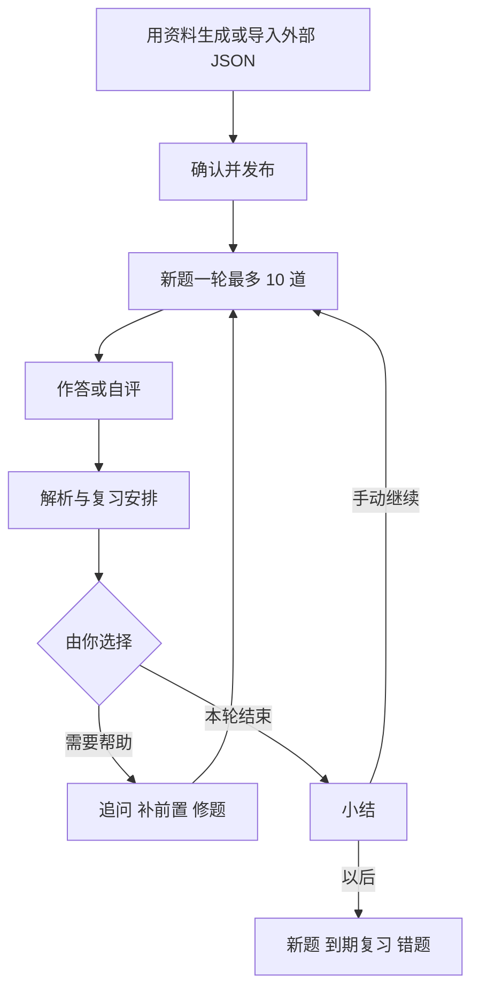

[English](study-workflows.md)

# 课堂跟学、学习流与学习笔记

本文介绍 StudyHub 目前的三种学习方式：

- [按课程跟学](#按课程跟学)：从「学习库」首页按课程一批一批往下学。
- [用学习流学一个主题](#用学习流学一个主题)：一次学习里先看讲解，再用自己的话复述，然后练题、回顾。
- [把题目写成公开笔记](#把题目写成公开笔记)：自己发到 CSDN 后，把文章链接关联回题目。

文末的[拟议：系统学习](#proposed-system-learning)是设计方案，尚未实现。

核对日期：2026-10-03，以当前代码为准。

## 按课程跟学

学习库会记住当前课程。首页标题就是课程名，点标题即可换课程。当前课程会一直保留到你主动切换；接着做别的课程的练习，也不会自动改变当前课程。

这是「学习模式」里的「课堂跟学」。另一种模式「笔试 / 面试」按岗位方向练习，不使用下面的课程路线。

### 首页主卡给什么

首页主卡只给一个主按钮，按下表从上往下取第一条符合的：

| 情况 | 主卡给出 |
| --- | --- |
| 有做到一半的练习，也就是侧栏「回到题目」会打开的那一轮，不论属于哪门课 | 「接着做」。练习属于别的课程时，主卡标出课程名 |
| 课程的这一批还没做完 | 「接着学」 |
| 「今日学习」还没做完 | 「继续学习」 |
| 当前课程还有要学或要巩固的题 | 「继续课程」，开始下一批 |
| 以上都没有 | 「开始今日学习」；没有到期、薄弱或未学的题时改为「提前巩固」 |

属于「未激活」课程的半截练习不上主卡，只留在下方的未完成列表里。

其余入口收在「其他开始方式」里，随主卡内容不同，可能包括课程下一批、「先讲后练 · 学习流」（见[用学习流学课程的下一批](#用学习流学课程的下一批)）、「到期复习与巩固」、为你定制的题和薄弱题。到期复习始终有自己的入口，与课程批次分开。

其他没做完的练习收在「另有 N 组练习未完成」里；不属于当前课程的会标出课程名。点「结束」会结束这一轮，已答的记录保留。

### 按批学完一门课

课程里的每个题组算一章，章的顺序就是学习库里题组的顺序。每一批分两部分：

1. 先巩固这门课里学过、但现在薄弱或到期的题，最多 5 道。
2. 再按章的顺序学新题，最多 10 道；一章学完就接着进入下一章。

首页的课程进度条显示学到哪里。展开「课程路线」能看到每一章的进度，点「从这一章学」就从那一章开始一批。要调整章的顺序，在题组的「⋯」菜单里打开「管理题组」，用「上移题组」「下移题组」。

主卡下方的「学习目录」列出当前课程，最新发布的题组在前。题组超过 3 个时只显示最近 3 个，点「查看全部题组」展开全部。点「查看其他课程」或搜索后，才会列出其他课程。

### 发布题组之后

在草稿里点「保存并发布」，会立刻按题组顺序开始这个题组的一轮新题，最多 10 道。用资料生成的题组和导入的 JSON 题组都是这样。

一轮结束后，下一步由你来选。学完一轮新题，如果还有新题，可以点「继续下一批新题」再学 10 道。学完课程的一批，结果页会显示课程进度，并给出「继续课程下一批」和「先讲后练下一批」。

除非你打开了「自动驾驶」（快捷键 A），否则不会自动开始下一步。自动驾驶详见[陪学说明](coach.zh-CN.md)。

### 导入 JSON 题组

在「创建题组 › 导入 JSON 题组」导入时，StudyHub 会建议一个短标题和所属课程。连接模型后，还可能建议发布时并入同一课程里的某个题组。每一项都由你确认或修改。原标题仍然保存，显示在「管理题组」页的「导入原标题」后。格式和提示词见[导入 JSON 题组](json-import.zh-CN.md)。

练习时：

- 导入的题会带「外部导入」标记。外部引用只有在原文片段唯一匹配学习库里的某份资料时才保留，StudyHub 不会伪造引用。
- 发布检查时标为「待核对」的题，照常可以练习。
- 缺少可判分内容的题会给出「跳过此题，不计成绩」。跳过不记录成绩，也不改变这道题的复习进度。模拟考试里不能跳过。

### 整理题组

- 在学习目录标题旁点「整理与添加 › 整理题组」，模型会针对当前课程的题组给出最多 8 条合并建议。只有你在某条建议上点「确认合并」后才会合并。没有可用模型时，可以在「管理题组」页手动合并。
- 合并后，每道题的 ID、作答记录、复习计划、前置关系和笔记关联都保留。学习流里的学习范围仍指向同样的题。学习流以外，包含被移动题目的未完成练习会结束，已答记录保留。
- 在「管理题组」页用「按主题拆分」，可以把所选主题的题移到同一课程下的新题组。拆分后两个题组都必须至少有一道题。
- 题组有正在编辑或修复的草稿时，不能合并或拆分。已归档的题组要先恢复。

## 用学习流学一个主题

「学习流」在侧栏的「每天」分组里，用来带你完成一次学习。它是可选的：不用学习流，首页、题组和知识骨架也照常可用。

完成一步只记录这次活动。题目的判分和 SM-2 复习安排照常独立保存，学习流不会据此认定你已经掌握。

### 开始一次学习

1. 打开「学习流」。
2. 在「今天想学什么？」下面写一句话，最多 500 字。
3. 点「开始学」。

StudyHub 会从当前课程里挑主题：

- 连接了模型时，AI 最多挑 12 个主题，按先学基础的顺序排好。
- 设置了检索扩展时，题目引用了与这句话匹配页面的主题排在前面，见[大教材](large-documents.zh-CN.md)。
- 没有模型时，按主题名和题组名匹配你写的词。
- 都没有匹配时，先学这门课题量最多的主题。

学习页顶部会写明主题来自哪门课、是怎么挑的、范围里有多少题。你写的这句话记为本次目标，所以学习直接从第一个内容步骤开始。

「没有现成的知识骨架时，在后台按本次范围生成一份」默认勾选，记在本机。学习会立刻开始，不用等骨架；骨架生成后折叠显示在学习页顶部，同时保存为一份普通的知识骨架。

以后回来接着学，点学习流页顶部「上次学到一半」后面的那次学习，或在「学习记录」里点这次学习旁的「继续学习」。

### 学习的各个步骤

下表说明用一句话开始的学习。这种学习里，没有匹配的知识骨架时不出现骨架步骤；范围里没有题时不出现练习步骤。

| 步骤 | 你要做什么 | 说明 |
| --- | --- | --- |
| 「知识骨架」 | 看概念之间怎样连起来 | 只有开始时就有匹配的骨架才会出现 |
| 「概念与例子」 | 读讲解 | 进入这一步时自动生成。「换个例子」「拆开讲」「补前置」「改进讲解」会补充或改写讲解，「撤销上次改写」恢复上一版。「补充我的具体疑问」可以只问一个点 |
| 「主动复述」 | 合上材料，用自己的话写下复述，或点「我已口头复述」 | 有复述才能完成这一步。「请 AI 看看我的复述」（Ctrl/⌘ + Enter）会列出讲到的要点、最多 4 个缺口和一个引导问题。这是建议，不是判分。「回到讲解补一补」会回到讲解，并先针对这些缺口补讲 |
| 「题目练习」 | 在普通刷题页练本次范围的题 | 默认 10 道。作答照常判分，并进入复习安排。点「回到学习流」回来。全部题答完才能完成这一步，「再练一轮」会另开一轮 |
| 「总结与下一步」 | 选符合实际的回顾，如「已理清主线」「还需要例子」，或写几句总结 | 有选项或文字才能完成这一步 |

### 在学习中前进与回看

- 底部的主按钮完成这一步并进入下一步。也可以展开「还需巩固、跳过与步骤安排」，选「还需巩固」或「跳过本步」。每种结果都如实记录，跳过不算完成。
- 点任何走过的步骤可以回去看。标着「当前进度 · 回到这里」的那一步带你回到原来的进度。来回跳转不记录活动，也不改记录。
- 「保存并暂停」暂停这次学习，「继续学习」恢复。进入下一步或点顶部按钮返回时，笔记会保存；还没保存的输入暂存在本机。
- 每一步都有请主对话帮忙的区域，例如「请主对话帮我讲清楚」。点「保存笔记并交给主对话」会把请求放进 DSH 的主对话，由你确认发送。主对话写的内容会补到这一步。最多保留 10 个旧版本，在「之前的版本」里点「恢复这一版」即可换回。请求里会要求主对话不替你作答，也不评定你是否掌握。
- 用一句话开始的学习，可以在顶部用「换课程」在另一门课里重新挑主题，之前写的笔记都保留。一旦有了练习作答，它会改为提议为那门课开始一次新的学习，这次学习保持原样。
- 学完和没学完的都留在「学习记录」里。「删除」会删掉这次学习的笔记和进度，练习历史保留。

### 用学习流学课程的下一批

在首页点「其他开始方式 › 先讲后练 · 学习流」，会为课程下一批的新题开一次学习：先讲这批题涉及的概念，再复述，最后练的正好是这批题。

学完后，结束页给出「继续课程下一批」和「下一批也先讲后练」。

### 自己编排学习流

在学习流页展开「高级：自定义学习步骤」。

- 最多保存 5 条学习流。每条 1–16 步，由六种组件组成：「明确目标」「知识骨架」「概念与例子」「主动复述」「题目练习」「总结与下一步」。
- 每一步可以设名称、学习要求和预置材料（Markdown，可选）。「题目练习」还可以设题数，1–50 道。
- 每一步有两个分支：「完成或跳过后」和「还需巩固时」。分支可以选「按顺序进入下一步」「留在当前步骤」「结束本次学习」或某个编号的步骤。每一步都必须能从第一步走到。
- 可以从「从一条建议开始」点「编辑并保存这条流程」，也可以点「＋ 自己拼一条」或「和主对话一起拼」。建议的流程在你保存之前不占 5 条名额。
- 修改学习流只影响以后开始的学习；每次学习保留开始时的流程副本。删除学习流，已开始的学习记录仍然保留。
- 点「使用」开始一条自定义学习流：选主题和题目范围（可选），填「这次学什么」，可以关联知识骨架。「生成知识骨架」会请主对话按所选题目起草一份。最后点「进入学习 Portal」。没选题目时使用所关联骨架的题目范围；两者都没有时，从阅读、讲解和复述开始。

### 哪些操作调用模型

调用模型按服务商计费。没有连接模型时，页面会直接说明：按名称匹配仍然可用，讲解、复述反馈和后台骨架不可用。

- 挑主题：每次用一句话开始或「换课程」时调用一次。
- 讲解：进入「概念与例子」时，以及每次使用它的帮助按钮时。
- 复述反馈：只在你请 AI 查看时。
- 后台骨架：只在勾选了该选项、且没有匹配的骨架时。
- 作答和复习安排不调用模型。

每次调用发送哪些内容，见 [token 用量与估算](token-usage.md)。

## 把题目写成公开笔记

学习笔记是用你挑的题写成的一篇文章。文章由你自己发到 CSDN，之后 StudyHub 保存这篇文章的链接。

1. 打开「学习笔记」，点「＋ 挑题成文」。填「笔记标题」，搜索题目并勾选 1–30 道，点「创建笔记草稿」。练习时也可以在「更多」里选「写笔记」；这道题已经有笔记草稿时，会直接打开它，不会再建一份同名的。
2. 在「编辑 Markdown」里写正文。「实时预览」用 StudyHub 自带的库渲染公式，不需要联网下载。
3. 可选：点「AI 起草解析」在后台起草，完成后结果送到「信箱」，期间可以继续学习。模型收到每道题的题干、主题、学习目标、答案、解析、常见误区和你最近一次的作答结果。它被要求使用通用案例，不写 PPT、讲义、课程或个人信息。起草结果仍含 PPT、讲义或文件路径等线索时会被拒绝，需要你手动写公开版。
4. 在「CSDN 公开主页与文章链接」里填写 `https://blog.csdn.net/用户名` 格式的公开主页，点「保存主页」。这一步只需做一次。
5. 点「复制内容并打开 CSDN」。StudyHub 会先保存草稿，记下公开主页上已有哪些文章，然后复制 Markdown 并打开 CSDN 编辑器。在 CSDN 审阅并发布。
6. 回到 StudyHub，点「查找已发布文章」：
   - 如果第 5 步之后正好出现一篇同名新文章，会自动关联。
   - 如果有多篇候选、无法确认发布时间，或者只找到较早的同名文章，在候选里点「确认这篇文章」，或粘贴文章链接后点「手动关联」。链接必须属于已保存的公开主页。

关联后，学习库只保留标题、关联的题目、公开链接和时间，删除 Markdown 正文以及本机暂存的副本。已发布的笔记不能再修改，需要新建草稿。练习时，关联了笔记的题会显示「笔记草稿」或「已发布笔记」。

StudyHub 只保存你的公开主页地址，不要 CSDN 账号密码或 Cookie，也只读取公开主页。

## 当前学习循环与局限

目前的学习循环：

1. 得到一个题组：用资料生成，或导入外部 AI 根据资料写的 JSON。
2. 检查草稿，确认标题和课程，点「保存并发布」。
3. 练最多 10 道新题。
4. 作答，或翻卡后自评。
5. 看解析，SM-2 安排下次复习。
6. 需要时主动请求帮助、补前置题或修题。
7. 看本轮小结，再由你选择继续，或以后再复习。

目前的局限：

- 「今日学习」按到期、薄弱、新题的顺序排题（新题最多 10 道，总共最多 20 道），并把没学过的前置题排在需要它的题前面。所以它可能在你没要求时拉入前置题，这和“只在主动请求时补前置”的偏好不完全一致。下文拟议的系统学习不能直接沿用这个队列。
- 为你定制的题、逐步讲解、学习流、口试和知识骨架都已经有了，但无论单独还是合起来，都没有对每个必学核心点做证据验收。学习流记录的是你自己报告的活动，不是掌握程度。

## 拟议：系统学习

本节全部是设计方案，没有实现；当前代码运行的仍是上文的课堂跟学和面试准备流程。学习流是另外做的一个更小的可选功能，并不是这份设计的实现。

规则和开发拆分以[统一开发计划](plans/2026-09-27-1945-feat-evidence-based-learning-plan.md)为准，交接时的状态见[本次 handoff](handoffs/2026-09-27-learning-workflow-redesign.md)。

**适用对象**：接近零基础、已用五份 Platform Engineering PDF 生成五个题组的学习者。这些资料的真实内容尚未核查，下面是产品流程设计，不是已经成立的课程覆盖报告。首版实操由用户选定为外部完成：学习者在自己的环境里完成并提交成果，插件不内置执行环境。

### 入口与模式

- 「课堂跟学」和「笔试 / 面试」保留。学习者主动选择“系统学习”后，只需确定课程范围、起点和目标；目标默认采用已知的“接近零基础、理解并能应用”。已经确认的信息不再重复询问。
- 主按钮为“继续系统学习”，旁边一句理由，例如“先弄清请求如何到达服务，后面的发布排错会用到”。
- 题目发布后即可学习。只有 JSON 时显示“题组已就绪，资料覆盖待核对”；关联原始 PDF 后才在后台做范围审计。不需要逐题审完才能开始。
- 每轮最多 5 个学习任务，一次实操可以独占一轮。课堂原有的 10 道新题规则继续保留。下一轮必须由学习者手动开始。
- 已在系统学习模式时，发布后回到系统任务或入门入口，不再自动开启课堂的 10 题一轮。

### 八个步骤

| 步骤 | 学习者看到和操作什么 | 系统在后台做什么 | 过关与失败返回 |
| --- | --- | --- | --- |
| 1. 确定范围 | 看简短的课程目标与“哪些资料待核对”；必要时补原始 PDF | 分段提取目标、跨资料归并、匹配题目，标出图表不确定性和缺任务的点 | 没有资料也能学；只称候选范围，不宣称覆盖全部核心 |
| 2. 最小前置诊断 | 用几个小检查确认当前台阶，允许“不知道”和“稍后” | 区分未诊断、基础缺口与环境阻塞，给出最小补救包 | 用户点“先补基础”才进入；补完回原位置；跳过仍显示缺口 |
| 3. 看整体案例 | 先看一个能理解的过程，再看少量概念与关系 | 把五个题组映射到同一条课程主线；没有题的概念仍显示 | 能用自己的话说清要解决的问题；说不清则回到相应前置 |
| 4. 理解一个单元 | 看示范、补步骤、解释原因，再独立做 | 按表现逐步减少提示，保存阶段和帮助使用记录 | 必需评分项通过才推进对应维度；讲解完成不等于学会 |
| 5. 回忆并保持 | 合上答案说出或写出；距该知识点最近一次学习至少 24 小时后复测 | 跨题记录相关讲解、提示和练习的时间，SM-2 继续管卡片 | 刚重讲后换题答对只算当前表现；延迟复测失败回到相应薄弱点 |
| 6. 迁移与辨析 | 面对变约束、反例、排错或跨章节问题，先回答再看反馈 | 检查任务族、未展示状态和评分标准，避免只是换词 | 通过陌生任务才记相应迁移证据；只会原题则继续练新情境 |
| 7. 外部小实验 | 读目标、环境和验收项，在自己的环境完成后提交成果 | 校验提交是否完整，按标准审阅并给出最少补交项 | 标明“提交物审阅通过”等实际证据级别；环境失败不当作概念不懂 |
| 8. 综合与延迟验收 | 看每个核心点还缺什么，下一轮只选一个具体任务 | 汇总逐点各维度，处理到期复测、较新的失败和范围版本变化 | 全部必学点都有有效证据才称本范围已验收；任何缺项都不能被高平均分抵消 |

第 4–7 步按单元循环，期间穿插局部骨架回忆；第 5、8 步跨日继续。八步不对应八个必须逐一打开的页面，也不对应五份 PDF 的线性顺序。

### 现在与拟议对比

| 方面 | 现在 | 拟议 | 迁移方式 |
| --- | --- | --- | --- |
| 学习主线 | 按题组、主题及卡片顺序，课堂最新内容优先 | 按目标、前置和证据缺口推进 | 新路线可选，课堂逻辑保留 |
| 范围 | 从已有题目看主题和骨架 | 原资料单独建台账，遗漏的核心点也可见 | 已有题目关联到新的知识点 ID，不强制重新生成 |
| 首次理解 | 常从做题和答后解析开始 | 示例 → 半完成 → 独立检查 | 复用现有讲解和题卡组件 |
| 前置不会 | 卡住后追问或关联，部分路径自动拉题 | 最小诊断、明确的补救入口、限量、回到原位 | 不直接复用会自动拉前置的路径队列 |
| 掌握状态 | 按最近表现和 SM-2 间隔推算，主题按加权值汇总 | 理解、回忆、迁移和实操按目标分别验收 | 旧统计称为估计熟练度，历史不清零 |
| 举一反三 | 定制变式、按题干关键词分类、口头追问 | 未见过的任务族、变约束、说明理由并有评分依据 | 原变式继续用于练习，新任务才有独立验收资格 |
| 记住骨架 | 浏览结构和顺序，从节点练题 | 阅读之外加入遮挡节点、补关系、排序和故障推演 | 复用画布，验收状态单独记录 |
| 实际应用 | 以题目和讨论为主 | 外部实验、提交成果、逐项审阅、可重交 | 不增加执行器，不声称观察到了外部运行 |
| 完成标准 | 一轮结束、题目熟练度、抽样考试成绩 | 当前范围每个必学点都有所需的全部有效证据 | 原有考试保留；抽样高分不等于全覆盖 |
| 使用负担 | 自己在题组、骨架、追问和考试之间切换 | 一个当前任务、一句原因，缺口可展开查看 | 不再增加一排必须使用的新按钮 |

### 日常使用

- 进入后先恢复未完成的任务。没有未完成任务时，推荐一个到期的核心复测、当前阻塞点或新单元，用户可以更换。
- 任务中只显示当前问题和主操作，解释和帮助按需展开。
- 补前置计入本轮预算，不无限递归：默认最多 3 个局部台阶，再深就建议单独学一个基础单元。
- 轮末显示“本轮新增了什么证据、哪个核心点还缺什么、下次做哪件事”。浏览骨架或生成笔记都不算验收。
- 未学和未评估的内容不涂成红色失败；模型评分处理中、环境阻塞和真正答错分别显示。关闭页面后回来，继续原来的任务。

### Platform Engineering 示例

以下任务只示范结构，实际知识范围要等五份资料核对后确定。

1. 先用提供的示例服务认识“请求、进程、端口和日志”，能预测一次请求会走到哪里。
2. 看一次交付示范，补全遗漏的测试和发布步骤，再解释失败时应该查看什么证据。
3. 改变配置或访问条件，先预测结果，再在外部环境验证，报告预测与观察是否一致。
4. 把流程整理成另一位开发者可以重复使用的模板，说明默认值、可配置项、限制和使用者收益。
5. 隔天凭记忆画出简化链路，面对一个新故障指出排查顺序，并提交修订后的成果。

“会运行示例”只覆盖其中一部分目标；“会解释限制并能在变更条件下验证”需要额外证据。

### 进度与证据

- 首页示例文案：“当前范围 12/18 个核心点已验收；4 个待独立检查，2 个待实操。资料范围仍有 1 页图表待核对。”这些数字是示例，不是真实用户数据。
- 点开一个核心点，能看到所需维度、通过和缺失的依据、是否用过帮助、最近一次验证以及来源版本。
- 同一个实验可以支撑多个核心点，但各点分别评分。口头回答、骨架任务和普通题目都不会自动推断所有前置已经掌握。
- 具体的证据门槛、分母规则、失效与迁移，由计划中的 Evidence Policy 和 R2–R15 定义。

### 异常与恢复

| 场景 | 用户看到什么 | 恢复方式 |
| --- | --- | --- |
| 缺 PDF，或扫描图没有识别出来 | 范围待核对，以及现在能继续学的内容 | 稍后在后台补审计，不阻塞已有题目 |
| 模型失败或评分不完整 | 提交已保存，暂未评估 | 重试同一份提交，或换一个已有任务；不会自动记为失败 |
| 资料或目标更新 | 哪些核心点是新增的，哪些需要重新验证 | 当前会话保留版本快照，显式切换或从下一轮起采用新范围；旧任务结果只计入旧版本，已撤销的任务保留回答并转到新入口 |
| 补前置越来越深 | 本轮预算和可以返回的入口 | 暂停补救，推荐单独的基础单元，不强行递归 |
| 实验环境跑不起来 | 环境阻塞和最少的诊断项 | 保留进度，区分环境问题和知识错误 |
| 重复提交或反馈迟到 | 唯一的提交记录及对应版本 | 过期结果不覆盖新提交，得分不重复增加 |
| 斩题、题组合并或拆分 | 知识点和历史保留，必要时显示缺少的评估任务 | 不暗中减少必学分母，不因整理题组丢失进度 |

### 交付边界

八步系统学习尚未交付。计划把开发分为三个阶段：

- P0：覆盖与可信进度；
- P1：零基础学习循环；
- P2：外部实操与综合验收。

实施单元 U1–U9、验收示例 AE1–AE16 和测试文件都列在计划里。

## 开发者参考：代码边界

- `lib/focus.js` 负责当前课程和新题排序；`lib/course-route.js` 负责分章和课程批次。
- `lib/deck-organization.js` 负责题组的合并、拆分和排序，并迁移所有指向被移动题目的引用。`lib/deck-merge-suggestions.js` 校验模型给出的合并建议，建议本身不会直接改动学习库。
- `lib/blog-notes.js` 负责笔记状态与题目关联；`lib/adapters/csdn-public.js` 只读取 CSDN 公开网页。
- `lib/workflows.js` 和 `lib/workflow-contract.js` 负责学习流的流程、学习记录和组件；`lib/workflow-guide.js`、`lib/workflow-teaching.js`、`lib/workflow-skeleton.js` 负责需要模型的部分。
- 各领域操作在 `lib/contexts/<领域>/operations.js` 中，负责持久化与规则。`lib/service.js` 只是兼容外观层，见[架构说明](architecture.md)。`ui/` 只展示状态并收集你的确认，不决定合并、判分或链接是否安全。
- 上文首页规则依据[用户反馈记录](user-feedback-intake.md)中的 F-006 和 F-023。
